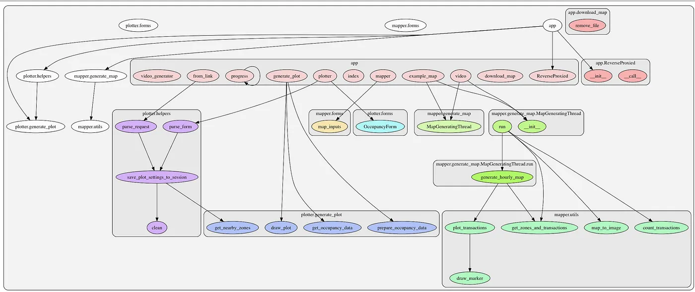

# Excavation

!!! info
    - In this document I'll be taking notes and documenting the process of getting back into this project. 
    - As it has been 4 months since I last looked at it, it's just a faded memory and I while I must re-discover, define and improve upon the workflow that I had before.
    - I call this an 'excavation' since it feels a bit like looking at & trying to understand some hieroglyphs or scrolls/texts from ancient times (4-6 months ago)


## **Tasks**

### **1. Re-understanding the project**

- [x] **1.1** Read through each of the three entry points to the program (`generate_report` function, `ranker.py`, and `create_schedule` function).
- [ ] **1.2** Write comments on what each line or block of code seems to be doing.
    - ***Note:*** I already wrote docstrings for every function inside `analyze_data.py` which has 35 functions in it and is the most complex module in the project with 1.7k lines (although that includes the docstrings/comments).
- [ ] **1.3** Map the data flow: What data is read/written? What data is passed between functions?
    - ***Note:*** This part is quite tricky, yet I think it's essential to have some visual bigger picture overview. I need to think of a structured approach to this... Stepping through the code has helped to understand it a bit better but not yet well enough to explicitly clarify the entire process/workflow from start to finish. I will try out various tools for generating call graphs as my manual approach was too chaotic. One approach to generating a call graph that I just found is **pygraph**: [https://medium.com/parkbee/quick-simple-call-graphs-in-python-eaa583d0e1b2](https://medium.com/parkbee/quick-simple-call-graphs-in-python-eaa583d0e1b2). (**17.08.23:** I tried following that online guide but it failed to install one of its dependencies, **graphviz**. Will try and solve this problem). Here is an example of pygraph's output for another project: 

### **2. Create Pseudocode for Existing Logic:**

- [ ] **2.1** Break down `generate_report` function into pseudocode.
- [ ] **2.2** Break down `ranker.py` script into pseudocode.
- [x] **2.3** Break down `create_schedule` function into pseudocode.

### **3.Organize the Code:**

- [ ] **3.1** Create a new `main.py` file as the entry point to the program instead of it being spread across multiple files as it is now.
- [ ] **3.2** Re-organize related functions into separate Python modules (files) with the control flow centralized in `main.py`.
- [ ] **3.3** In `main.py`, import the necessary modules and define the flow of the program.

### **4. Refactor the Code:**

- [ ] **4.1** Identify and eliminate global variables, replacing them with function parameters and return values where necessary.
- [ ] **4.2** Identify repeated code blocks and move them into separate functions.
    - (**DRY principle** - Don't Repeat Yourself).
- [ ] **4.3** Simplify complex functions by breaking them down into smaller functions with single responsibilities.
- [ ] **4.4** Update function names and variables to be more descriptive, following a consistent naming convention.
- [ ] **4.5** Add error handling (e.g., `try`/`except` blocks) to gracefully handle potential issues during execution.

### **5. Add New Metrics:**

- [ ] **5.1** Define and document what the two new metrics are and how they should be calculated.
- [ ] **5.2** Identify where in the existing code these metrics should be calculated.
- [ ] **5.3** Write functions to calculate these new metrics.
- [ ] **5.4** Test the new metrics with sample data to ensure they are calculated correctly.
- [ ] **5.5** Integrate these metrics into the report generated by the program.

### **6. Testing and Debugging:**

- [ ] **6.1** Write test cases for the key functions to ensure they work as expected.
- [ ] **6.2** Run the program with various inputs and verify the outputs.
- [ ] **6.3** Debug any issues that arise during testing.

### **7. Documentation:**

- [ ] **7.1** Write a `README.md` file explaining what the project does, how to set it up, and how to run it.
- [ ] **7.2** Add more comments throughout the code explaining the purpose and functionality of each function and major code block.

---

## **Journal**

### **16.08.2023**

After looking at and stepping through some of my code, I figured out that the `create_schedule` function in the `scheduler` module is one of the entry points to this program. It assumes that the `top_indicators.xlsx` file is populated, and that is done by running the ranker and I manually did that. For now I'll focus on the scheduler and later I'll go back to the ranker which is the second entry point to this program.

Here is the pseudocode for `create_schedule`:

```
FUNCTION create_schedule(next_week, custom_date, update_news_and_tick_data):
    1. READ Excel file "reports/top_indicators.xlsx" INTO variable "top_indicators"
    2. INITIALIZE empty list "indicators"

    3. FOR each "index" and "row" in "top_indicators":
        3.1 APPEND tuple (inv_id, haawks_id_str, symbol, higher_dev, inv_title) TO "indicators"
    4. END FOR

    5. CALL function scrape_economic_calendar with "indicators", "next_week" and "custom_date"
       and STORE result INTO "upcoming_events"
    6. STORE length of "upcoming_events" INTO "no_of_events"

    7. INITIALIZE "weekdays_html" with keys as days of the week and values as empty strings

    8. IF "update_news_and_tick_data" is True:
        8.1 PRINT message about updating news and tick data for upcoming events
        8.2 FOR each "index" and "event" in "upcoming_events":
            8.2.1 EXTRACT relevant fields from "event"
            8.2.2 PRINT progress message
            8.2.3 CALL function update_indicator_history with "haawks_id_str"
            8.2.4 PRINT message about importing ticks
            8.2.5 CALL function import_ticks_for_indicator with "haawks_id_str" and "symbol"
        8.3 END FOR
    9. END IF

    10. PRINT message about analyzing and generating recommended triggers for events

    11. FOR each "index" and "event" in "upcoming_events":
        11.1 EXTRACT relevant fields from "event"
        11.2 PRINT progress message
        11.3 CALCULATE "dt_gmt" and formatted date strings "datetime_et_str" and "datetime_str"
        11.4 CALL function get_triggers_vars with "haawks_id_str", "symbol", "higher_dev" 
             and STORE result INTO "triggers_vars"
        11.5 CALL function get_day with "dt_gmt" and STORE result INTO "day"
        11.6 IF "triggers_vars" is "Not enough data" OR "lowest_c_3_val too low":
            11.6.1 SET "event_html" to an empty string
        11.7 ELSE:
            11.7.1 CALL function render_event_html with arguments "title", "datetime_str", 
                    "datetime_et_str", "symbol", "triggers_vars" and STORE result INTO "event_html"
        11.8 END IF
        11.9 APPEND "event_html" to the appropriate day in "weekdays_html"
    12. END FOR

    13. INITIALIZE "template_vars" dictionary with various date and events details

    14. CALL function generate_weekly_schedule with "template_vars"
    
END FUNCTION
```


### **17.08.2023**

- [ ] blah
- [ ] blah
    - [x] blah