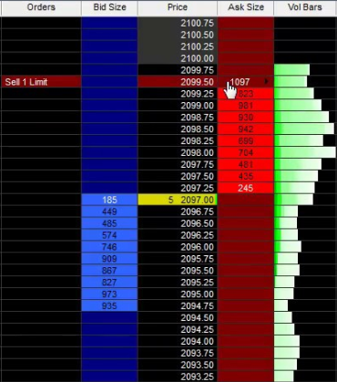
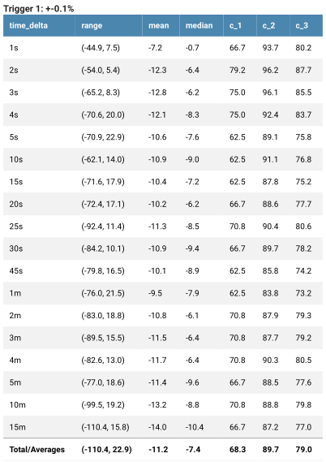
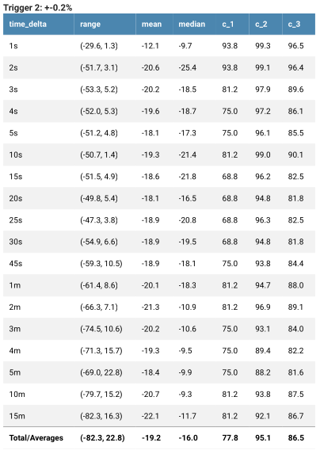
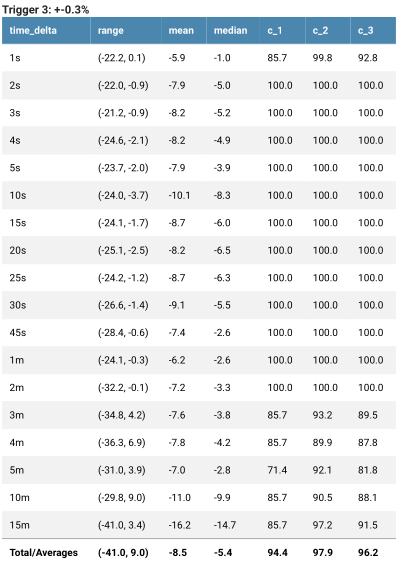
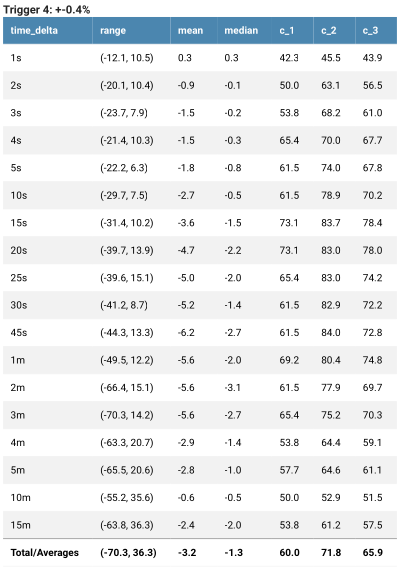
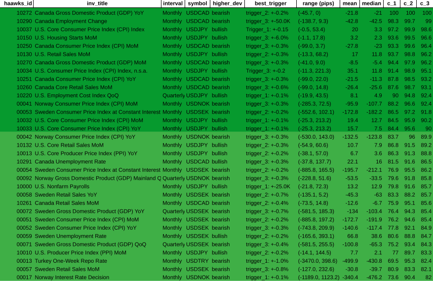
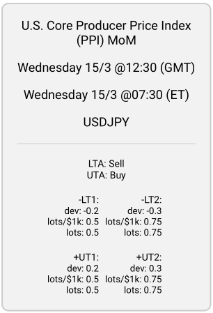

# **News Trading System Explained**

## **1. Intro**

In this document I will outline the system I'm developing for trading economic news indicators on the forex market. The main principle is that there are various scheduled economic statistics which are released on a regular basis that impact the market's prices. If you know what the release figures are, then you can make informed predictions on which way the price will move. Since the price reacts very quickly, it's important to enter the trade as quickly as possible to capture the movement.

## **2. What this system is not**

The majority of trading strategies rely on technical analysis (TA), which involves examining price charts and using indicators like RSI and MACD to forecast price movement based solely on historical data. However, this approach often leads to long-term losses for approximately 95% of traders who exclusively use TA. To achieve consistent success in the market, traders must establish a unique edge, which cannot be accomplished through TA alone.

## **3. How I found out about this strategy**

If you go on youtube or google and search for videos about algorithmic trading advice, practically all of them will be about technical analysis. Not only that, but the general advice given is to turn off your trading algorithm during news events because it causes 'unpredictable' price movements. However, it's only unpredictable through the paradigm of technical analysis. After seeing this many times it got me thinking:

### **Why does the price still move if everybody is saying to turn off their trading bots during these news events?**

It's only possible for the price to move when people trade, so clearly there are some people trading the news. But who? If you try to find out, you won't find much information anywhere on the internet, and so it can be inferred that most likely the people who are trading and therefore causing these prices to move during news events are institutional traders, not retail traders.

## **4. What kind of news moves the market?**

Market-moving news typically happens because of economic indicators found on websites like `investing.com/economic-calendar/`.

 The most crucial figures are the Actual and Forecast numbers, where market movement occurs if the Actual number deviates from the Forecast. For example, with Canada's monthly GDP, a higher than expected Actual number is bullish for the Canadian dollar (CAD), causing its price to rise, while a lower than expected number is bearish, causing its price to fall. In currency pairs like USD/CAD, the base currency (USD) and quote currency (CAD) react differently to news: positive news for the base currency causes the price to increase, while negative news results in a decrease; positive news for the quote currency causes the price to decrease, and negative news leads to an increase.
 

  Trading currency pairs involves speculating on the direction of the exchange rate, with profit or loss determined by the difference between entry and exit prices, and the size of the position (an open trade).

## **5. What the price is and why it moves**

In the forex market, the current price of a currency pair is determined by the bids and asks in the order book. The order book is a real-time display of all buy and sell orders for a particular currency pair at various price levels.

- When a trader places a buy limit order, they create a bid in the orderbook, which represents the highest price they are willing to pay for the currency pair. 
- When a trader places a sell limit order, they create an ask in the orderbook, which represents the lowest price they are willing to accept for the currency pair.

The order book contains all bids and asks in real-time, arranged by price level. The best bid is the highest price at which a buyer is willing to purchase the currency pair, while the best ask is the lowest price at which a seller is willing to sell the currency pair.

The current price of the currency pair is always based on two prices: the best ask and the best bid. The current market price displayed on a price-ticker is usually the mid-point between the best ask and the best bid. However, this is not the price your orders will be filled at. The best bid represents the highest price at which someone is willing to buy the currency pair, while the best ask represents the lowest price at which someone is willing to sell the currency pair. Therefore, the current market price for actually executing a trade is the highest price someone is willing to pay (best bid) and the lowest price someone is willing to sell (best ask) at a given moment in time. There is usually a gap between the best ask and best bid known as the 'spread'.

## **6. Order types**

- **Market orders** execute immediately at the best available price, with market buy orders at the best ask and market sell orders at the best bid. 
- **Limit orders**, on the other hand, fill when the market price reaches a specified level. 

The current price of a forex instrument is determined by the intersection of bids and asks in the order book, with the best bid and best ask establishing the current market price. This price represents the highest someone is willing to pay (best bid) and the lowest someone is willing to sell (best ask) at any given moment.

## **7. How the price is measured**

One pip (short for "percentage in point" or "price interest point") is supposedly the smallest unit of price movement for a currency pair. It represents the fourth decimal place in most currency pairs, except for some currency pairs that have a different decimal place.

For example, if the EUR/USD currency pair is trading at 1.2000 and then rises to 1.2001, this is a movement of one pip. Similarly, if the USD/JPY currency pair is trading at 108.00 and then falls to 107.99, this is a movement of one pip.

Pips are used to calculate the profit or loss of a trade in forex. The size of the trade, the number of pips gained or lost, and the currency pair being traded all determine the amount of profit or loss. Therefore, understanding the concept of pips is essential for forex traders to calculate potential profits and losses accurately.

However, it's worth noting that many forex brokers use 'fractional pips' or 'pipettes' (also called 'points'), which represent a fifth decimal place, to provide more precise pricing for currency pairs. In that case the real smallest unit of price movement is 1 point. Ten points are equal to one pip.

## **8. Lots**

Lot size, or position size, must be specified for every buy or sell order in forex trading. The lot size directly impacts potential profit or loss, as it determines the position size and value of each pip. For EUR/USD, 1 lot has a pip-value of $10 (This amount varies by currency pair). So, a 20-pip movement in a 1-lot EUR/USD trade results in a $200 profit, while the same movement in a 0.1 lot trade (Where 1 pip = $1) would result in a $20 profit. Traders must carefully consider their lot size in relation to their strategy and risk tolerance.

## **9. Spread**

The spread in forex represents the difference between the bid and ask prices of a currency pair, essentially serving as the cost of trading. Influenced by factors such as market volatility, liquidity, and supply and demand, the spread is typically measured in pips and determined by liquidity providers like banks and financial institutions. During economic news events, the bid-ask spread may widen and liquidity decrease, leading to increased volatility and slippage, which can make it challenging for traders to enter or exit positions quickly and efficiently, raising the risk of losses. Thus, employing a strategy like a 5-pip trailing stop loss can help mitigate these risks.

## **10. Liquidity**

Liquidity in forex trading refers to the abundance and availability of buy and sell orders for a specific currency pair, allowing for efficient transactions with minimal price impact and reduced costs. The forex market, with over $6 trillion daily trading volume, is highly liquid, resulting in a robust order book and favorable trading conditions. High liquidity leads to tight bid-ask spreads, lower transaction costs, and minimal price movements when entering or exiting positions. Factors affecting liquidity include geopolitical events, economic data releases, market sentiment, and trading hours. Major currency pairs like EUR/USD, USD/JPY, and GBP/USD exhibit higher liquidity, providing better trading opportunities, faster execution, and reduced price impact for traders.

## **11. Stoploss (SL)**

A stop loss is a parameter in an order used to help limit potential losses on an open position. It can be set and updated at any time when the order is open. It works by setting a specific price level at which the trade will be automatically closed out if the market moves against the position, helping to minimize losses. It's a common risk management tool used by traders to help protect their capital and manage risk.

### **Trailing Stoploss (TSL)**

A trailing stop loss is a type of stop loss that follows the price movement of an asset in a specified direction, allowing traders to lock in profits while also limiting potential losses. It works by maintaining a set distance from the current market price, and if the price starts to move against the position, the order will be triggered and the position will be closed out. It's a useful tool in fast-moving markets where price movements can be volatile and unpredictable.

For example, if the price moves 10 pips and you have a trailing stoploss of 5 pips, then the stoploss would be set at 5 pips from the trade entry price. If the price moves 20 pips and you have a TSL of 5 pips, then the stoploss would be set at 15 pips from the trade entry price.

The trailing stoploss is constantly being updated if the price moves further from the entry price until it eventually reverses and the stoploss stops being updated, then eventually the order gets closed at whatever price the stoploss is set to.

## **12. Volatility**

In forex trading, volatility refers to the amount of fluctuation in the price of a currency pair over a certain period of time. High volatility can provide opportunities for larger profits but also increases the risk of losses. Low volatility limits trading opportunities but also reduces the risk of losses.

Compared to forex, volatility in Bitcoin and other cryptocurrencies is generally higher and more unpredictable. This is because the crypto market is still relatively new and has a smaller market capitalization, which means it can be more easily influenced by events such as regulatory changes or market sentiment.

## **13. Latency/Speed**

- Because the price usually moves in under a second after these events are released, it's necessary to be as fast as possible to enter the trade before the price moves. That can only be achieved by running a computer program on a server that's co-located with the broker you are trading with.
- **Co-location** means when you have a server that's physically in the same building as the broker's server. This means the latency i.e. the time it takes for data to travel from one point to another on the internet will be lower

  - Think of it like sending a letter in the mail. If you live far away from the person you're sending the letter to, it will take longer for the letter to arrive compared to if they live just down the street. Similarly, if you're sending data over the internet and the server you're sending it to is located far away, it will take longer for the data to get there compared to if the server is located nearby.
  - This delay in data transfer is what we call ping/latency. It's measured in milliseconds (ms) and can be influenced by a variety of factors, such as distance, network congestion, and the quality of the internet connection.
  - In the context of trading, low latency is important because it allows traders to execute trades faster and take advantage of market opportunities before others can.
  - Most forex brokers have their servers located in one of the Equinix datacenters around the world. The main two are in London (Equinix LD4) and New York (Equinix NY4)
- A fast, low-latency news feed is also required to get the news faster than the price moves. One service provider for this is Haawks, who have low-latency subscriptions with many of the institutions who release the news in the USA, Canada and a few other countries, such as the US Bureau of Labor Statistics (BLS), Bureau of Economic Analysis (BEA), US Department of Commerce, US Census Bureau, Statistics Canada, Bank of Canada, Statistics Norway, Norges Bank, SCB - Statistics Sweden, and more

  - Haawks news-feed is available on both Equinix LD4 & NY4 datacenters

## **14. Slippage**

Slippage occurs when there's a difference between the expected price of a trade and the price at which it's executed, often caused by rapid market changes or high volatility during events like news releases. In low-latency trading, delays between trade initiation and execution can result in market prices moving away from the expected level. To minimize slippage, traders can use a low-latency connection to their broker's server through co-location and ensure fast trade execution. For news trading, a low-latency news feed, such as the one provided by haawks, is essential to executing trades quickly and reducing slippage.

## **15. Forex Brokers**

Forex brokers serve as intermediaries between traders and the forex market by providing access, executing trades, and offering leverage. They are necessary for individual traders to access and participate in the market. There are three primary types of forex brokers: Straight Through Processing (STP), Electronic Communication Network (ECN), and Market Makers. STP and ECN brokers provide direct market access, allowing clients to trade with each other and routing orders to liquidity providers. They earn profits through commissions or markups on spreads, ensuring a more transparent and less conflicting relationship with clients. Market Makers create a market for clients by taking the opposite side of their trades, profiting from the spread. This model can lead to potential conflicts of interest and less transparency compared to STP and ECN brokers.

## **16. Trading Software**

### **MetaTrader 4**

MetaTrader 4 (MT4) is a popular trading platform used by traders to access and trade financial markets. It was developed by MetaQuotes Software and released in 2005.

MT4 provides traders with a range of tools and features to help them analyze the markets, develop and execute trading strategies, and manage their trades. Some of the key features of MT4 include:

- **Charting and technical analysis tools:** MT4 provides traders with a range of charting tools and indicators to help them analyze market trends.
- **Automated trading:** MT4 allows traders to develop and automate their trading strategies using Expert Advisors (EAs), which are computer programs that can execute trades based on pre-defined rules and conditions.
- **Mobile trading**: MT4 is available as a mobile app, allowing traders to access their accounts and trade on the go.

### **Haawks News Trader**

  <iframe width="1265" height="496" src="https://www.youtube.com/embed/ZevwBfZjp6g" title="US Consumer Price Index (CPI) 10 November 2022 - Haawks G4A Low-Latency News Trading Data Feed" frameborder="0" allow="accelerometer; autoplay; clipboard-write; encrypted-media; gyroscope; picture-in-picture; web-share" allowfullscreen></iframe>

The haawks news trader software comes with the haawks subscription. It connects to the haawks news feed and enters trades (Market Orders)  in MetaTrader 4 when certain conditions are met which are set by the user.

For each event, there are 6 trigger levels which can be configured:

- **-LT1**
- **-LT2**
- **-LT3**
- **+UT1**
- **+UT2**
- **+UT3**
- '**LT**' stands for 'Lower Trigger' and is triggered when the actual number is lower than the forecast number.
- '**UT**' stands for 'Upper Trigger' and is triggered when the actual number is higher than the forecast number.
- There is also '**LTA**' & '**UTA**' which stands for **Lower Trigger Action** & **Upper Trigger Action**. These can be set to either '**Buy**' or '**Sell**' depending on whether a higher deviation is bullish or bearish.

  - For example, for US Nonfarm Payrolls, a higher news deviation is bullish (positive) for USDJPY and a lower news deviation is bearish (negative) for USDJPY. Therefore, you would set 'LTA' to 'Sell' and 'UTA' to 'Buy'
  - For Canada GDP, a higher news deviation is bearish (negative) for USDCAD and a lower news deviation is bullish (positive) for USDCAD. Therefore you would set 'LTA' to 'Buy' and 'UTA' to Sell
- '-LT1', '-LT2', '-LT3', '+UT1', '+UT2' & '+UT3' each have their own deviation levels and lot sizes which can be set. This means that when the actual price comes out, the haawks news trader will calculate the deviation by subtracting the forecast number from the actual number. Then, it checks all of your triggers to see which one it matches. If it matches one of your triggers, it will open a new trade in MetaTrader 4 in the direction specified by 'LTA' & 'UTA', using the lot size specified for that trigger.

  - For example, for trading Canada GDP MoM, the triggers could be set like this:
    - -LT1: -0.1  |  0.5 lots
    - -LT2: -0.2  |  1 lot
    - -LT3: -0.3  |  1.5 lots
    - +UT1: +0.1  |  0.5 lots
    - +UT2: +0.2  |  1 lot
    - +UT3: +0.3  |  1.5 lots
    - Then, let's say the forecast is 0.1 and the actual number is -0.1. This would make a deviation of -0.2 so '-LT2' would be triggered and it would open a trade of 1 lot in the buy direction because 'LTA' is set to 'Buy' for Canada GDP
  - In another example for trading US Nonfarm Payrolls, the triggers could be set like this:
    - -LT1: -25  |  0.5 lots
    - -LT2: -50  |  1 lot
    - -LT3: -90  |  1.5 lots
    - +UT1: +25  |  0.5 lots
    - +UT2: +50  |  1 lot
    - +UT3: +90  |  1.5 lots
    - Then, let's say the forecast is 205 and the actual number is 311. That would make a deviation of +106 so '+UT3' would be triggered and it would open a trade of 1.5 lots in the buy direction because 'UTA' is set to 'Buy' for US Nonfarm Payrolls.

## **17. Historic Data Analysis**

In order to have a more informed and robust trading plan, I created a data analysis program which gets the historic news figures from investing.com, then gets the historic price (tick) data for the relevent trading pair at the exact time of each news release up to 15 minutes after each release, then generates metrics/statistics such as:

- the mean average pip movements
- the median pip movements
- the range of pip movements
- Three correlation scores (c_1, c_2 & c_3)

It then generates a pdf report for that indicator (e.g. Nonfarm Payrolls or Canada GDP) and trading symbol (e.g. USDJPY or USDCAD).

Here are screenshots of the pdf report generated for Canada GDP MoM (Month over month):

Normally the correlation score gets higher as the deviation gets higher. The calculations for each trigger works like this:

1. The program gets the historic news data from investing.com from January 2017 and after

2. For each release date & time, it then downloads historic price data (tick data) from 5 minutes before release time until 15 minutes after release time. Tick data usually costs money but there is a forex broker called Dukascopy who provide it for free which is where this program gets the data from. It shows the ask and bid prices at timestamps for every time the price moved which is usually multiple times per second. This comes as a .csv file which is a table:
   

3. For specified times after each release (time deltas) i.e.

    - 1 second
    - 2 seconds
    - 3 seconds
    - 4 seconds
    - 5 seconds
    - 10 seconds
    - 15 seconds
    - 20 seconds
    - 25 seconds
    - 30 seconds
    - 45 seconds
    - 1 minute
    - 2 minutes
    - 3 minutes
    - 4 minutes
    - 5 minutes
    - 10 minutes
    - 15 minutes
    - the program gets the ask & bid prices at those times after each release, then calculates the pip movements relative to the price at the time of the release.

4. For each release, it checks which trigger level it matches.

    - If the deviation is above a pre-defined level (e.g. trigger_1: +-0.1%) and below the trigger above it (e.g. trigger_2: +-0.2%) then it is added to the input data for that trigger (trigger_1).
    - If it the last trigger e.g. trigger_4, then any data above that is added to the input data for that trigger

5. For each time delta (e.g. 1s, 2s, 3s, etc) it calculates:

    - The **range** of all pip movements at that time (e.g. from -5 pips to +45 pips)
    - The **mean** average of all pip movements at that time (e.g. 15 pips). Calculated by adding up all of pip movements for each release in the current trigger, then dividing by the amount of them.
    - The **median** average. Calculated by sorting all the pip movements from lowest to highest, then finding the one exactly in the middle.
    - **Correlation 1 Score (c_1)**
        - The percentage of times the price moved in the expected direction.
        - `positive_count` = How many times the price (pip) movement is more than or equal to zero.
        - `negative_count` = How many times the price movement is less than zero
        - Every indicator has an expected direction based on whether there's bullish (positive) or bearish (negative) news. This information was saved earlier from investing.com.
            - If the price movement is expected to be **positive** then:
              `c_1 = positive_count ÷ (positive_count + negative_count)`
            - If the price movement is expected to be **negative** then:
              `c_1 = negative_count ÷ (positive_count + negative_count)`
   - **Correlation 2 Score (c_2)**
       - The percentage of pips which moved in the expected direction.
       - `positive_sum` = All pips which moved in a positive direction added up
       - `negative_sum` = All pips which moved in a negative direction added up. Because this number is negative, it is multiplied by -1 to become a positive number so that it works with the formula below:
           - If the price is expected to be **positive** then:
           `c_2 = positive_sum ÷ (positive_sum + negative_sum )`
           - If the price is expected to be **negative** then:
           `c_2 = negative_sum ÷ (positive_sum + negative_sum)`
   - **Correlation 3 Score (c_3)**
       - This is the mean average of c_1 & c_2
       - `c_3 = (c_1 + c_2) ÷ 2`
        
6. The total/averages are then calculated for each trigger:

      - **range:** the lowest number for any of the time deltas to the highest number for any of the time deltas
      - **mean:** Add up the mean values for every time delta then divide by the number of time deltas (18)
      - **median:** Add up the median values for every time delta then divide by 18
      - **c_1:** Add up the c_1 values for every time delta then divide by 18
      - **c_2:** Add up the c_2 values for every time delta then divide by 18
      - **c_3:** Add up the c_3 values for every time delta then divide by 18

## **18. Ranking every indicator**

Once I was able to create this analysis for individual indicators, then I decided to run the it on every indicator from haawks which has news data on investing.com and tick data from dukascopy available. That totals to 95 indicators which isn't all of them but it's still quite a lot.

I wrote a script in python called `ranker.py` which runs the analysis on each indicator and then finds the best trigger for each of them i.e. the trigger with the highest total/average c_3 score, then adds that to a list and outputs the results to an excel file called `ranker_results.xlsx`.

Then, I ordered them from highest c_3 to lowest c_3. There are:

- 15 indicators with a c_3 above 90
- 23 indicators with a c_3 between 80-90
- 23 indicators with a c_3 between 70-80
- 30 indicators with a c_3 below 70

The correlation (c_3) score can be thought of as a representation of how predictable each indicator has been historically (Based on data from January 2017 to February 2023). This implies that the indicator has a higher probability of moving in the expected direction when the c_3 score is higher. That is the hypothesis anyway, but this can only be confirmed by testing the strategy.

## **19. Generating trading plans**

Utilizing the c_3 score as a predictability measure, it is reasonable to place larger trades with bigger lot sizes when the c_3 score is higher. The following lot sizes are suggested for different c_3 score ranges:

- **80-85**: 0.5 lots per $1000 account balance
- **85-90**: 0.75 lots per $1000
- **90-95**: 1 lot per $1000
- Above **90**: 1.5 lots per $1000

A script examines the ranker results for indicators with a c_3 score above 80, cross-references the investing.com economic calendar to identify upcoming news releases within the week, and generates recommended trigger deviations and lot sizes as inputs for the haawks news trader program.

These recommendations create a weekly schedule of trigger recommendations for various indicators. The 'lots/$1k' and 'lots' values are the same when assuming an account balance of $1000. If the account balance were $2000, the 'lots' would be double the amount of 'lots/$1k'. This trading plan generation process helps traders make informed decisions based on the predictability of news releases and their potential impact on the market.

# **20. Conclusion**

That is essentially where I'm at with the development of this project (as of 19/03/2023). I believe that trading these events with lot sizes proportional to the correlation score should make profit.

However, there are still some things which can be improved. For example, I have been emailing the creator of the haawks news trader program who has been trading the news for years. He was interested in my work, but one thing he said is that the reliability/predictability of indicators can change over time. The example he gave was Sweden's CPI, which according to him was good to trade about 3 years ago but now it's unreliable.

To solve this problem, I am planning to create another correlation score which is weighted more towards recent events instead of how it is now with all the events from 2017-2023 equally weighted. That would mean that if the all-time correlation score (what I currently have) is high, but for more recent events, the correlation score is lower, then it would use a smaller lot size.

This can be achieved by using an EMA (exponential moving average). Moving averages, including the Simple Moving Average (SMA) and the Exponential Moving Average (EMA), are commonly used technical indicators in forex trading. 
- They calculate the average price of an asset over a specific period of time, with the SMA giving equal weight to each data point and the EMA giving more weight to recent price data points. 
- This difference makes the EMA more sensitive to recent price changes and often used for shorter-term trading strategies, while the SMA is typically used for longer-term analysis.
- Both types have an input called the 'period,' which specifies the number of previous data points used in their calculations, such as the last 10 price levels for technical analysis or the c_3 scores for the last 10 releases for each trigger.

Although EMAs are commonly used for price analysis (Like in the video above), I will instead be applying it to the correlation scores for each trigger. This will make the correlation score more sensitive to recent events and should better reflect how the indicator has performed recently.

!!! update
    **[31/03/2023]** Now it uses the lowest score out of the regular **c_3**, and also the **c_3_ema5**, **c_3_ema10** & **c_3ema15**, then bases the lot size calculation on that with higher lots used when there's a higher correlation score.

The creator of the haawks news trader program can modify the program to accept triggers from a database, allowing for full automation. Instead of generating a weekly PDF report with recommended triggers and manually inputting them into the program, a database could handle this automatically. However, the current recommendations sometimes have higher deviations with lower correlation scores, and when this occurs, it would be preferable to omit those triggers.

To address this inconsistency, the haawks news trader program could be modified to allow deviations to fall between two values, rather than just above or below one value. This would enable trades to be made only when deviations fall within a specific range. Applying an Exponential Moving Average (EMA) to correlation scores could further enhance the trading strategy. It's essential to observe the performance of this approach, making adjustments as needed over time.

