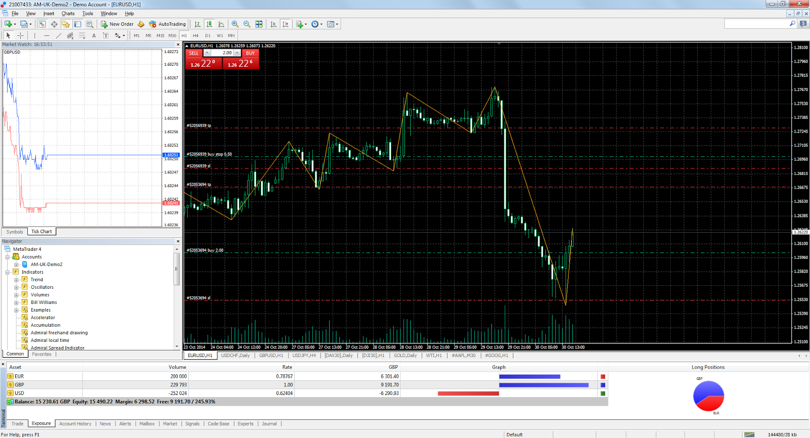

# **News Trading System Explained**

## **1. Intro**

In this document I will outline the system I'm developing for trading economic news indicators on the forex market. The main principle is that there are various scheduled economic statistics which are released on a regular basis that impact the market's prices. If you know what the release figures are, then you can make informed predictions on which way the price will move. Since the price reacts very quickly, it's important to enter the trade as quickly as possible to capture the movement.

## **2. What this system is not**

It's worth noting that the vast majority of trading strategies involve technical analysis (TA). That essentially means looking at the price charts and adding indicators such as RSI, MACD and others to predict which way the price will move. This is based entirely on the historic price and nothing more, and most traders who use only technical analysis lose in the long term. Probably about 95% of traders are using technical analysis and about 95% of traders lose. The only way to consistently win in the market is to have an edge, and this is impossible with only TA.

## **3. How I found out about this strategy**

If you go on youtube or google and search for videos about algorithmic trading advice, practically all of them will be about technical analysis. Not only that, but the general advice given is to turn off your trading algorithm during news events because it causes 'unpredictable' price movements. However, it's only unpredictable through the paradigm of technical analysis. After seeing this many times it got me thinking:

### **Why does the price still move if everybody is saying to turn off their trading bots during these news events?**

It's only possible for the price to move when people trade, so clearly there are some people trading the news. But who? If you try to find out, you won't find much information anywhere on the internet, and so it can be inferred that most likely the people who are trading and therefore causing these prices to move during news events are institutional traders, not retail traders.

## **4. What kind of news moves the market?**

If you go to `investing.com/economic-calendar/` you will find a big list of news events which have an impact on the market. These are also known as 'economic news indicators':

For most events, there are three figures: Actual, Forecast & Previous

- **Actual**
  This is the figure that is released at the sceduled release time
- **Forecast**
  This number represents the average/consensus of predictions that economists around the world have made
- **Previous**
  This is the number from the previous release

The most important ones are the Forecast and Actual numbers. What actually causes the market to move is when the Actual number deviates from the forecast. If we look at Canada's monthly GDP as an example:

Each time the actual number was higher than the forecast, the number is shown in green. Each time it was lower than the forecast, it is shown in red.

For GDP, a higher than expected number is positive a.k.a. 'bullish' for the underlying currency which in this case is the Canadian dollar (CAD). Therefore, a higher deviation should make the price of CAD go up, and a lower than expected number is negative a.k.a. 'bearish' which should make the price go down. If there is no deviation i.e. the actual number is the same as the forecast, then there's no trade setup.

If you were actually going to trade this event, then the currency pair/symbol to use would be USDCAD. In any currency pair there are two currencies: the base currency and the quote currency. Sometimes it is written with a '/' between the currencies e.g. USD/CAD.

The base currency is the first one, which is USD in USD/CAD, and the quote currency is the second one, which is CAD. The price of USDCAD is the amount of CAD you need to buy 1 USD.

- The exchange rate can be affected by various factors, such as changes in interest rates, economic indicators, geopolitical events, and market sentiment. These factors can influence the demand and supply of the currencies in the pair, and therefore affect their relative value and the exchange rate.
- In the USDJPY pair, USD is the base currency so the exchange rate tells you how many JPY you need to buy 1 USD. If the exchange rate is 110.00, you need to spend 110 JPY to buy 1 USD. Positive news for USD can make the exchange rate go up, while negative news can make it go down. You can trade USDJPY by going long (buying) or short (selling), depending on your view of the market
- In the USDCAD pair, USD is also the base currency and CAD is the quote currency, so the exchange rate tells you how much CAD you need to buy 1 USD. For example, if the exchange rate is 1.25, you need to spend 1.25 CAD to buy 1 USD. This means that if you have 100 CAD, you can only buy 80 USD if the exchange rate is 0.80. Positive news for CAD can make the exchange rate go down, while negative news can make it go up. As with USDJPY, you can trade USDCAD by going long or short, depending on your view of the market
  - When the underlying currency is the **base currency** in the pair (e.g. **USD** in **USD**/JPY) and there is:
    - **positive news:** the price goes up
    - **negative news:** the price goes down
  - When the underlying currency is the **quote currency** in the pair (e.g. **CAD** in USD/**CAD**) and there is:
    - **positive news:** the price goes down
    - **negative news:** the price goes up
- When you trade a currency pair, you are speculating on the direction of the exchange rate. If you think that the base currency will appreciate against the quote currency, you can buy the pair (go long). If you think that the base currency will depreciate against the quote currency, you can sell the pair (go short). The profit or loss you make depends on the difference between the entry and exit (a.k.a. open and close) price of the trade, and the size of your position (Position just means an open trade).

## **5. What the price is and why it moves**

In the forex market, the current price of a currency pair is determined by the bids and asks in the order book. The order book is a real-time display of all buy and sell orders for a particular currency pair at various price levels.

When a trader places a buy limit order, they create a bid in the orderbook, which represents the highest price they are willing to pay for the currency pair. When a trader places a sell limit order, they create an ask in the orderbook, which represents the lowest price they are willing to accept for the currency pair.

The order book contains all bids and asks in real-time, arranged by price level. The best bid is the highest price at which a buyer is willing to purchase the currency pair, while the best ask is the lowest price at which a seller is willing to sell the currency pair.

The current price of the currency pair is always based on two prices: the best ask and the best bid. The current market price displayed on a price-ticker is usually the mid-point between the best ask and the best bid. However, this is not the price your orders will be filled at. The best bid represents the highest price at which someone is willing to buy the currency pair, while the best ask represents the lowest price at which someone is willing to sell the currency pair. Therefore, the current market price for actually executing a trade is the highest price someone is willing to pay (best bid) and the lowest price someone is willing to sell (best ask) at a given moment in time. There is usually a gap between the best ask and best bid known as the 'spread'.

## **6. Order types**

- **Market orders** are executed immediately at the best available price, either at the best ask for a market buy order or at the best bid for a market sell order. The current market price, or mid-price, is the price at which the best bid and best ask intersect in the order book, but it does not necessarily reflect the price at which a market order will be executed.
  - If a trader places a market order to **buy** the currency pair (***Market Buy Order***), their order will be filled at the current best **ask** price.
  - For a ***Market Sell Order***, their order will be filled at the current best **bid** price.
- **Limit orders** are filled when the market price reaches a specified price level

If there are more buyers than sellers at a particular price level, the price of the currency pair may rise as buyers compete to purchase the currency. Conversely, if there are more sellers than buyers at a particular price level, the price of the currency pair may fall as sellers compete to sell the currency.

In summary, the current price of a forex instrument is determined by the intersection of the bids and asks in the order book. The order book displays all buy and sell orders for the currency pair at various price levels, and the best bid and best ask determine the current market price, which is the highest price someone is willing to pay (best bid) and the lowest price someone is willing to sell (best ask) at a given moment in time.

## **7. How the price is measured**

One pip (short for "percentage in point" or "price interest point") is supposedly the smallest unit of price movement for a currency pair. It represents the fourth decimal place in most currency pairs, except for some currency pairs that have a different decimal place.

For example, if the EUR/USD currency pair is trading at 1.2000 and then rises to 1.2001, this is a movement of one pip. Similarly, if the USD/JPY currency pair is trading at 108.00 and then falls to 107.99, this is a movement of one pip.

Pips are used to calculate the profit or loss of a trade in forex. The size of the trade, the number of pips gained or lost, and the currency pair being traded all determine the amount of profit or loss. Therefore, understanding the concept of pips is essential for forex traders to calculate potential profits and losses accurately.

However, it's worth noting that many forex brokers use 'fractional pips' or 'pipettes' (also called 'points'), which represent a fifth decimal place, to provide more precise pricing for currency pairs. In that case the real smallest unit of price movement is 1 point. Ten points are equal to one pip.

## **8. Lots**

For every buy or sell order, the amount of lots (a.k.a. lot size or position size) must be specified. One lot refers to the standard trading size for a particular currency pair. The size of a lot varies by currency pair and can range from 1,000 units of the base currency to 100,000 units or more. For example, a standard lot for the EUR/USD currency pair is 100,000 units of the euro.

The lot size you trade with has a direct impact on the amount of profit or loss you can make from a given amount of pips. This is because the profit or loss from a trade is calculated based on the size of the position you take, which is determined by the lot size.

For example, let's say you buy 1 lot of EUR/USD at 1.2000 and the price rises to 1.2020, which is a movement of 20 pips. If you close the trade at this price, you would make a profit of $200, as one standard lot of EUR/USD is worth $100,000 and each pip is worth $10. If you buy 0.1 lots of EUR/USD and the price moves 20 pips, then you would make a profit of $20 as each pip is worth $1.

The lot size you trade with is an important factor to consider when calculating potential profits and losses in forex trading because it has has a direct impact on the amount of profit or loss you can make from a given amount of pips. Traders must carefully consider their lot size in relation to their trading strategy and risk tolerance.

## **9. Spread**

The spread in forex refers to the difference between the bid price and the ask price of a currency pair. The bid price is the price at which a buyer is willing to buy the currency pair, while the ask price is the price at which a seller is willing to sell the currency pair.

The spread is essentially the cost of trading and is typically measured in pips. The spread is determined by the liquidity providers, such as banks and other financial institutions, and is influenced by various factors such as market volatility, liquidity, and supply and demand.

For example, if the bid price for EUR/USD is 1.2000 and the ask price is 1.2002, the spread is 2 pips. This means that a trader who wants to buy EUR/USD will have to pay the ask price of 1.2002, while a trader who wants to sell EUR/USD will receive the bid price of 1.2000.

During economic news events, the bid-ask spread often widens and the available liquidity decreases, as there may be fewer market participants willing to buy or sell the currency pair at the prevailing prices.

The decrease in liquidity during economic news events can cause increased volatility and slippage, as the bid-ask spread widens and it becomes more difficult to execute trades at the desired price levels. This can make it more challenging for traders to enter or exit positions quickly and efficiently, which can increase the risk of losses.

For that reason, this strategy uses a 5 pip trailing stoploss, which means the price only has to move 5 pips to breakeven and anything above that is profit.

## **10. Liquidity**

In the context of forex trading and the order book, liquidity refers to the abundance and availability of buy and sell orders for a specific currency pair, which enables traders to efficiently execute transactions with minimal impact on market prices and reduced transaction costs. The foreign exchange market is the most liquid market globally, with a daily trading volume exceeding $6 trillion. High liquidity in the forex market leads to a robust and efficient order book, which in turn affects trading conditions and opportunities for traders.

A highly liquid forex market has a large number of buyers and sellers actively participating in trading. As a result, the order book is filled with numerous buy and sell orders at various price levels. This abundance of orders allows traders to easily enter and exit positions without causing significant price movements or affecting the currency pair's market price. In a liquid market, the order book has tight bid-ask spreads, which means the difference between the highest price a buyer is willing to pay (bid) and the lowest price a seller is willing to accept (ask) is minimal. Tight spreads lower the overall transaction costs for traders, making it more cost-effective to trade.

In contrast, low liquidity in the forex market results in a sparse order book with fewer buy and sell orders. This can lead to wider bid-ask spreads, increased slippage (the difference between the expected price of a trade when creating an order vs. the price at which it is actually executed/filled), and a higher likelihood of price gaps (sudden jumps in the market price without any trades occurring in between). These factors can increase transaction costs and create more volatile trading conditions.

The forex market's liquidity is affected by several factors, such as geopolitical events, economic data releases, market sentiment, and trading hours. The most liquid currency pairs are the major pairs, such as EUR/USD, USD/JPY, and GBP/USD, which have tighter spreads and more stable prices compared to less liquid pairs or exotic currencies. High liquidity in the forex market ultimately provides better trading opportunities, faster execution, and reduced price impact for traders.

## **11. Stoploss (SL)**

A stop loss is a parameter in an order used to help limit potential losses on an open position. It can be set and updated at any time when the order is open. It works by setting a specific price level at which the trade will be automatically closed out if the market moves against the position, helping to minimize losses. It's a common risk management tool used by traders to help protect their capital and manage risk.

### **Trailing Stoploss (TSL)**

A trailing stop loss is a type of stop loss that follows the price movement of an asset in a specified direction, allowing traders to lock in profits while also limiting potential losses. It works by maintaining a set distance from the current market price, and if the price starts to move against the position, the order will be triggered and the position will be closed out. It's a useful tool in fast-moving markets where price movements can be volatile and unpredictable.

For example, if the price moves 10 pips and you have a trailing stoploss of 5 pips, then the stoploss would be set at 5 pips from the trade entry price. If the price moves 20 pips and you have a TSL of 5 pips, then the stoploss would be set at 15 pips from the trade entry price.

The trailing stoploss is constantly being updated if the price moves further from the entry price until it eventually reverses and the stoploss stops being updated, then eventually the order gets closed at whatever price the stoploss is set to.

## **12. Volatility**

In forex trading, volatility refers to the amount of fluctuation in the price of a currency pair over a certain period of time. High volatility can provide opportunities for larger profits but also increases the risk of losses. Low volatility limits trading opportunities but also reduces the risk of losses.

Compared to forex, volatility in Bitcoin and other cryptocurrencies is generally higher and more unpredictable. This is because the crypto market is still relatively new and has a smaller market capitalization, which means it can be more easily influenced by events such as regulatory changes or market sentiment.

## **13. Latency/Speed**

- Because the price usually moves in under a second after these events are released, it's necessary to be as fast as possible to enter the trade before the price moves. That can only be achieved by running a computer program on a server that's co-located with the broker you are trading with.
- **Co-location** means when you have a server that's physically in the same building as the broker's server. This means the latency i.e. the time it takes for data to travel from one point to another on the internet will be lower

  - Think of it like sending a letter in the mail. If you live far away from the person you're sending the letter to, it will take longer for the letter to arrive compared to if they live just down the street. Similarly, if you're sending data over the internet and the server you're sending it to is located far away, it will take longer for the data to get there compared to if the server is located nearby.
  - This delay in data transfer is what we call ping/latency. It's measured in milliseconds (ms) and can be influenced by a variety of factors, such as distance, network congestion, and the quality of the internet connection.
  - In the context of trading, low latency is important because it allows traders to execute trades faster and take advantage of market opportunities before others can.
  - Most forex brokers have their servers located in one of the Equinix datacenters around the world. The main two are in London (Equinix LD4) and New York (Equinix NY4)
- A fast, low-latency news feed is also required to get the news faster than the price moves. One service provider for this is Haawks, who have low-latency subscriptions with many of the institutions who release the news in the USA, Canada and a few other countries, such as the US Bureau of Labor Statistics (BLS), Bureau of Economic Analysis (BEA), US Department of Commerce, US Census Bureau, Statistics Canada, Bank of Canada, Statistics Norway, Norges Bank, SCB - Statistics Sweden, and more

  - Haawks news-feed is available on both Equinix LD4 & NY4 datacenters

## **14. Slippage**

Price slippage refers to the difference between the expected price of a trade and the price at which the trade is actually executed.

In low-latency trading, where traders use high-speed computer algorithms to execute trades quickly, price slippage can occur when market conditions change rapidly or when there is high volatility e.g. news events. This can result in a delay between the time the trade is initiated and the time it is executed, during which time the market price may have moved away from the expected price.

For example, if a trader places an order to buy a currency pair at a certain price and there is a sudden shift in the market, the actual execution price may be higher than the expected price. This difference in price is known as price slippage.

Slippage cannot be completely avoided
when trading with MT4 but it can be reduced by having a low-latency connection to the broker's server (which is achieved by having a co-located server), as well as fast trade execution. In the context of news trading, having a low-latency news feed like the one provided by haawks is essential to execute the trade as quickly as possible and avoid slippage.

## **15. Forex Brokers**

Forex brokers are companies that provide traders with access to the foreign exchange market, where currencies are bought and sold. These brokers act as intermediaries between the traders and the market, executing trades on their behalf and providing them with a platform to access the market.

Forex brokers are necessary for several reasons:

1. ***Access to the market:*** Forex brokers provide traders with a platform to access the forex market, which is otherwise not available to individual traders. Without a broker, traders would not be able to access the market directly.
2. ***Execution of trades:*** Forex brokers execute trades on behalf of traders. When a trader wants to buy or sell a currency pair, they place an order with their broker, who then executes the trade in the market. The broker ensures that the trade is executed at the best possible price and in a timely manner.
3. ***Leverage:*** Forex brokers offer leverage, which allows traders to control a large position with a relatively small amount of capital. With larger lot sizes possible, this can increase the value of one pip, therefore increasing the profit & loss of each pip. This allows traders to potentially make larger profits than they would be able to with their own capital. However, it is important to note that leverage can also increase the potential risk of losses.

Overall, forex brokers are necessary for traders to access the forex market and execute trades. They provide a platform, execute trades and offer leverage.

### **Types of brokers**

There are three main types of forex broker profit models: STP, ECN, and Market Maker.

1. **Straight Through Processing (STP):**
    - An STP broker is a type of Forex broker that provides its clients with Direct Market Access or DMA. This means that the broker does not act as a market maker, but forwards client orders directly to liquidity providers. A liquidity provider is usually a large financial institution, e.g. a bank or another broker, which provides pricing and liquidity on the Forex market.
    - When a client places an order with an STP broker, the broker will route the order to a liquidity provider that offers the best available price at that moment. This allows the client to receive competitive pricing and execution, as they are accessing the real market. The broker earns its profit by charging a commission or markup on the spread.
    - For example, if the bid price for EUR/USD is 1.1000 and the ask price is 1.1001, the spread is 1 pip. When a client places an order with an STP broker, the broker will typically add a small markup to the spread in order to earn a profit. The markup is typically transparent and disclosed to the client before the trade is executed.
2. **Electronic Communication Network (ECN):**

    - An ECN broker is similar to an STP broker in that it provides direct market access to its clients. However, an ECN broker also allows clients to trade with each other. This means that clients can act as both buyers and sellers in the market, and the broker does not act as a counterparty to their trades. Like with STP, the also broker earns its profit by charging a commission on each trade.

3. **Market Maker:**

    - A market maker is a type of forex broker that creates a market for its clients by taking the opposite side of their trades. This means that when a client buys a currency pair, the broker sells that same currency pair to the client, and vice versa. The broker earns its profit by pocketing the difference between the bid and ask price, also known as the spread. Market makers may also engage in other trading practices to manage their risk, such as hedging their positions in the interbank market.

In summary, STP and ECN brokers provide direct market access to their clients and earn their profits by charging a commission or markup on the spread. Market makers, on the other hand, create a market for their clients by taking the opposite side of their trades and earn their profits by pocketing the spread.

The market maker model involves the broker taking the opposite side of their clients' trades, which means that the broker profits from their clients' losses. This creates a potential conflict of interest between the broker and their clients because the broker may be incentivized to manipulate prices or take actions that benefit the broker's bottom line rather than the client's best interests. For example, a market maker may widen the spread or delay order execution to increase their profits.

In contrast, STP and ECN models provide direct market access to clients, which means that the broker does not take the opposite side of their clients' trades. Instead, the broker acts as an intermediary and passes the orders on to liquidity providers or other traders in the market. This eliminates the potential conflict of interest between the broker and their clients because the broker does not profit from their clients' losses.

The STP and ECN models are generally considered to be more transparent because they allow clients to see the actual market depth and participate in price discovery. This means that clients can see the bid and ask prices of other market participants and place their orders accordingly, which can help to ensure fair pricing and prevent price manipulation.

## **16. Trading Software**

### **MetaTrader 4**

MetaTrader 4 (MT4) is a popular trading platform used by traders to access and trade financial markets. It was developed by MetaQuotes Software and released in 2005.

MT4 provides traders with a range of tools and features to help them analyze the markets, develop and execute trading strategies, and manage their trades. Some of the key features of MT4 include:

- **Charting and technical analysis tools:** MT4 provides traders with a range of charting tools and indicators to help them analyze market trends.
- **Automated trading:** MT4 allows traders to develop and automate their trading strategies using Expert Advisors (EAs), which are computer programs that can execute trades based on pre-defined rules and conditions.
- **Mobile trading**: MT4 is available as a mobile app, allowing traders to access their accounts and trade on the go.

### **Haawks News Trader**

  <iframe width="1265" height="496" src="https://www.youtube.com/embed/ZevwBfZjp6g" title="US Consumer Price Index (CPI) 10 November 2022 - Haawks G4A Low-Latency News Trading Data Feed" frameborder="0" allow="accelerometer; autoplay; clipboard-write; encrypted-media; gyroscope; picture-in-picture; web-share" allowfullscreen></iframe>

The haawks news trader software comes with the haawks subscription. It connects to the haawks news feed and enters trades (Market Orders)  in MetaTrader 4 when certain conditions are met which are set by the user.

For each event, there are 6 trigger levels which can be configured:

- **-LT1**
- **-LT2**
- **-LT3**
- **+UT1**
- **+UT2**
- **+UT3**
- '**LT**' stands for 'Lower Trigger' and is triggered when the actual number is lower than the forecast number.
- '**UT**' stands for 'Upper Trigger' and is triggered when the actual number is higher than the forecast number.
- There is also '**LTA**' & '**UTA**' which stands for **Lower Trigger Action** & **Upper Trigger Action**. These can be set to either '**Buy**' or '**Sell**' depending on whether a higher deviation is bullish or bearish.

  - For example, for US Nonfarm Payrolls, a higher news deviation is bullish (positive) for USDJPY and a lower news deviation is bearish (negative) for USDJPY. Therefore, you would set 'LTA' to 'Sell' and 'UTA' to 'Buy'
  - For Canada GDP, a higher news deviation is bearish (negative) for USDCAD and a lower news deviation is bullish (positive) for USDCAD. Therefore you would set 'LTA' to 'Buy' and 'UTA' to Sell
- '-LT1', '-LT2', '-LT3', '+UT1', '+UT2' & '+UT3' each have their own deviation levels and lot sizes which can be set. This means that when the actual price comes out, the haawks news trader will calculate the deviation by subtracting the forecast number from the actual number. Then, it checks all of your triggers to see which one it matches. If it matches one of your triggers, it will open a new trade in MetaTrader 4 in the direction specified by 'LTA' & 'UTA', using the lot size specified for that trigger.

  - For example, for trading Canada GDP MoM, the triggers could be set like this:
    - -LT1: -0.1  |  0.5 lots
    - -LT2: -0.2  |  1 lot
    - -LT3: -0.3  |  1.5 lots
    - +UT1: +0.1  |  0.5 lots
    - +UT2: +0.2  |  1 lot
    - +UT3: +0.3  |  1.5 lots
    - Then, let's say the forecast is 0.1 and the actual number is -0.1. This would make a deviation of -0.2 so '-LT2' would be triggered and it would open a trade of 1 lot in the buy direction because 'LTA' is set to 'Buy' for Canada GDP
  - In another example for trading US Nonfarm Payrolls, the triggers could be set like this:
    - -LT1: -25  |  0.5 lots
    - -LT2: -50  |  1 lot
    - -LT3: -90  |  1.5 lots
    - +UT1: +25  |  0.5 lots
    - +UT2: +50  |  1 lot
    - +UT3: +90  |  1.5 lots
    - Then, let's say the forecast is 205 and the actual number is 311. That would make a deviation of +106 so '+UT3' would be triggered and it would open a trade of 1.5 lots in the buy direction because 'UTA' is set to 'Buy' for US Nonfarm Payrolls.

## **17. Historic Data Analysis**

In order to have a more informed and robust trading plan, I created a data analysis program which gets the historic news figures from investing.com, then gets the historic price (tick) data for the relevent trading pair at the exact time of each news release up to 15 minutes after each release, then generates metrics/statistics such as:

- the mean average pip movements
- the median pip movements
- the range of pip movements
- Three correlation scores (c_1, c_2 & c_3)

It then generates a pdf report for that indicator (e.g. Nonfarm Payrolls or Canada GDP) and trading symbol (e.g. USDJPY or USDCAD).

Here are screenshots of the pdf report generated for Canada GDP MoM (Month over month):

Normally the correlation score gets higher as the deviation gets higher. The calculations for each trigger works like this:

1. The program gets the historic news data from investing.com from January 2017 and after
2. For each release date & time, it then downloads historic price data (tick data) from 5 minutes before release time until 15 minutes after release time. Tick data usually costs money but there is a forex broker called Dukascopy who provide it for free which is where this program gets the data from. It shows the ask and bid prices at timestamps for every time the price moved which is usually multiple times per second. This comes as a .csv file which is a table:
   
3. For specified times after each release (time deltas) i.e.

    - 1 second
    - 2 seconds
    - 3 seconds
    - 4 seconds
    - 5 seconds
    - 10 seconds
    - 15 seconds
    - 20 seconds
    - 25 seconds
    - 30 seconds
    - 45 seconds
    - 1 minute
    - 2 minutes
    - 3 minutes
    - 4 minutes
    - 5 minutes
    - 10 minutes
    - 15 minutes
    - the program gets the ask & bid prices at those times after each release, then calculates the pip movements relative to the price at the time of the release.
4. For each release, it checks which trigger level it matches.

   - If the deviation is above a pre-defined level (e.g. trigger_1: +-0.1%) and below the trigger above it (e.g. trigger_2: +-0.2%) then it is added to the input data for that trigger (trigger_1).
   - If it the last trigger e.g. trigger_4, then any data above that is added to the input data for that trigger
5. For each time delta (e.g. 1s, 2s, 3s, etc) it calculates:

   - The **range** of all pip movements at that time (e.g. from -5 pips to +45 pips)
   - The **mean** average of all pip movements at that time (e.g. 15 pips). Calculated by adding up all of pip movements for each release in the current trigger, then dividing by the amount of them.
   - The **median** average. Calculated by sorting all the pip movements from lowest to highest, then finding the one exactly in the middle.
   - **Correlation 1 Score (c_1)**
     - The percentage of times the price moved in the expected direction.
     - `positive_count` = How many times the price (pip) movement is more than or equal to zero.
     - `negative_count` = How many times the price movement is less than zero
     - Every indicator has an expected direction based on whether there's bullish (positive) or bearish (negative) news. This information was saved earlier from investing.com.
       - If the price movement is expected to be **positive** then:
         `c_1 = positive_count ÷ (positive_count + negative_count)`
       - If the price movement is expected to be **negative** then:
         `c_1 = negative_count ÷ (positive_count + negative_count)`
   - **Correlation 2 Score (c_2)**
     - The percentage of pips which moved in the expected direction.
     - `positive_sum` = All pips which moved in a positive direction added up
     - `negative_sum` = All pips which moved in a negative direction added up. Because this number is negative, it is multiplied by -1 to become a positive number so that it works with the equation below.
     - If the price is expected to be **positive** then:
       `c_2 = positive_sum ÷ (positive_sum + negative_sum )`
     - If the price is expected to be **negative** then:
       `c_2 = negative_sum ÷ (positive_sum + negative_sum)`
   - **Correlation 3 Score (c_3)**
     - This is the mean average of c_1 & c_2
     - `c_3 = (c_1 + c_2) ÷ 2`
6. The total/averages are then calculated for each trigger:

   - **range:** the lowest number for any of the time deltas to the highest number for any of the time deltas
   - **mean:** Add up the mean values for every time delta then divide by the number of time deltas (18)
   - **median:** Add up the median values for every time delta then divide by 18
   - **c_1:** Add up the c_1 values for every time delta then divide by 18
   - **c_2:** Add up the c_2 values for every time delta then divide by 18
   - **c_3:** Add up the c_3 values for every time delta then divide by 18

## **18. Ranking every indicator**

Once I was able to create this analysis for individual indicators, then I decided to run the it on every indicator from haawks which has news data on investing.com and tick data from dukascopy available. That totals to 95 indicators which isn't all of them but it's still quite a lot.

I wrote a script in python called `ranker.py` which runs the analysis on each indicator and then finds the best trigger for each of them i.e. the trigger with the highest total/average c_3 score, then adds that to a list and outputs the results to an excel file called `ranker_results.xlsx`.

Then, I ordered them from highest c_3 to lowest c_3. There are:

- 15 indicators with a c_3 above 90
- 23 indicators with a c_3 between 80-90
- 23 indicators with a c_3 between 70-80
- 30 indicators with a c_3 below 70

The correlation (c_3) score can be thought of as a representation of how predictable each indicator has been historically (Based on data from January 2017 to February 2023). This implies that the indicator has a higher probability of moving in the expected direction when the c_3 score is higher. That is the hypothesis anyway, but this can only be confirmed by testing the strategy.

## **19. Generating trading plans**

Since the c_3 score is like a predictablity score, it makes sense to place larger trades when which uses larger lot sizes when the c_3 score is higher. I came up with the following lot sizes for each c_3 score:

- between **80** and **85**: **0.5** lots per $1000 account balance
- between **85** and **90**: **0.75** lots per $1000
- between **90** and **95**: **1** lot per $1000
- above **90**: **1.5** lots per $1000

I wrote another script which looks at the ranker results for any indicators with a c_3 score above 80, then checks the investing.com economic calendar to see if any of those are scheduled to be released in the next week.

Then, for each indicator which will be released in the next week, it generates recommended trigger deviations and lot sizes as inputs for the haawks news trader program like this:

So the weekly schedule will be a bunch of trigger recommendations like the one above:

In the above example, '**lots/$1k**' and '**lots**' are the same because it assumed an account balance of $1000. If the account balance was $2000, then the '**lots**' would be double the amount of '**lots/$1k**'

# **20. Conclusion**

That is essentially where I'm at with the development of this project (as of 19/03/2023). I believe that trading these events with lot sizes proportional to the correlation score should make profit.

However, there are still some things which can be improved. For example, I have been emailing the creator of the haawks news trader program who has been trading the news for years. He was interested in my work, but one thing he said is that the reliability/predictability of indicators can change over time. The example he gave was Sweden's CPI, which according to him was good to trade about 3 years ago but now it's unreliable.

To solve this problem, I am planning to create another correlation score which is weighted more towards recent events instead of how it is now with all the events from 2017-2023 equally weighted. That would mean that if the all-time correlation score (what I currently have) is high, but for more recent events, the correlation score is lower, then it would use a smaller lot size.

This can be achieved by using an EMA (exponential moving average). Moving averages are used in technical analysis by applying them to price data.

There are different types of moving averages:

- **SMA (Simple Moving Average)** is a commonly used technical indicator in forex trading that calculates the average price of an asset over a specific period of time. It is called "simple" because it gives equal weight to each data point in the calculation. Traders use SMAs to identify trends and potential entry and exit points for trades.
- **EMA (Exponential Moving Average)** is also a commonly used technical indicator in forex trading that calculates the average price of an asset over a specific period of time. However, unlike the SMA, the EMA gives more weight to recent price data points, making it more sensitive to recent price changes. This means that the EMA may respond more quickly to changes in the market compared to the SMA. As a result, traders often use EMAs for shorter-term trading strategies, while SMAs are typically used for longer-term analysis.
- Both types have an input called the '**period**' which specifies how many previous data points back it uses in its calculation. For example, an SMA or EMA with a period of 10 would look at the past 10 data points (e.g. the last 10 price levels for technical analysis, or in our case the c_3 scores for the last 10 releases for each trigger)

Here is a video which shows the difference between SMAs & EMAs:

<iframe width="560" height="315" src="https://www.youtube.com/embed/Ijheqz9OHZU" title="YouTube video player" frameborder="0" allow="accelerometer; autoplay; clipboard-write; encrypted-media; gyroscope; picture-in-picture; web-share" allowfullscreen></iframe>

Although EMAs are commonly used for price analysis (Like in the video above), I will instead be applying it to the correlation scores for each trigger. This will make the correlation score more sensitive to recent events and should better reflect how the indicator has performed recently.

Beyond that, the creator of the haawks news trader program also told me he can modify his program to accept triggers from a database. That would mean this can be fully automated. The current workflow is to generate a weekly pdf report with the recommended triggers, and then manually input them into his program. However, with a database this could be done automatically.

Another thing to change is how the recommended triggers sometimes have higher deviations with lower correlation scores:

In the above example, you can see that -LT3 & +UT3 have a lower lot size than the triggers with lower deviations (-LT2 & +UT2). This is because despite the deviation being bigger, the correlation scores were actually lower for those triggers.

When this happens, it should omit those triggers, so in this example it would only show -LT1, -LT2, +UT1 & +UT2.

To account for this weird behaviour of bigger deviations sometimes having lower correlation scores (common sense would say that this shouldn't happen but it does), I might also pay the creator of the haawks news trader program to modify his program so that the deviation has to be between two values instead of just above or below one value.

If his program could accept those parameters, then it would be possible to only make a trade when the deviation is between -0.2 and -0.4 for -LT2 instead of anything below 0.4. For +UT2 it would be anything between +0.2 and +0.4.

That pretty much covers everything I could think of which relates to this trading strategy (but I may have forgotten some things so feel free to ask me). I think it's ready to start trading, but once I apply the EMA to the correlation scores, it will be even better. Things may evolve over time and it will be important to observe how it performs and adjust as needed.
