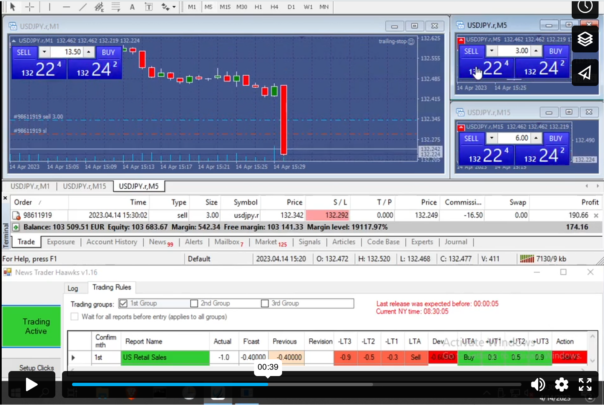

# **Intro**

## **01.02.2024**

It's been a while since I looked at this project because of personal circumstances but I want to give a more concise outline of my system that's quicker to read than the [in-depth explanation](system-explained-en.md) that I wrote last year ([Deutsche Version](system-explained-de.md)).

The system I've developed is quite unique among trading strategies. Very few people in the world are doing this type of trading, and nobody else has publicly released an analysis tool like mine ([Available on Github](https://github.com/spliffli/news-trading-analyzer)).

### TA vs Fundamental & low-latency paradigms

99.99% of trading advice online is about technical analysis or TA, which pretty much always involves something working in the short term but not in the long term because market behaviours change over time and the strategy breaks. The current price is always an after-effect, not a cause. The same is true for technical indicators like RSI, MACD, moving averages, etc. TA is a fallacy and that's why most people lose, since most people use only TA. Smart money always has an edge and they leave basic TA to the masses to provide their liquidity in the market.

With macroeconomic news indicators like [GDP](https://www.investing.com/economic-calendar/gdp-375), [CPI](https://www.investing.com/economic-calendar/cpi-69), [NFP](https://www.investing.com/economic-calendar/nonfarm-payrolls-227), [Unemployment Change](https://www.investing.com/economic-calendar/unemployment-rate-300) & others, they cause the price to move in a predictable way which I measured & analyzed to create a tool which generates trading plans for these events with different triggers based on news deviations, with each trigger having different lot sizes calculated by the probabilites of the event to move the market in an expected direction i.e. the correlation percentage scores which are calculated by looking at historic news figures and cross referencing it with the raw tick data (price data) to see how often the price moves in the expected direction.

I only trade events which have triggers with 75% probability/correlation or more, with 75% being the smallest trade size and 95% being the biggest trades. This means there is a mathematical edge and the main challenge isn't predicting the correct direction since that is relatively easy. The main challenge is instead being fast to enter the trade which requires a low latency news feed such as the one provided by [haawks](https://haawks.com).

The only other succesful low-latency strategy with a mathematical edge that I know of is [latency arbitrage](https://iticsoftware.com/en/blog-posts/ultimate-guide-arbitrage-trading/) i.e. taking advantage of a slow price feed from a broker and being able to glimpse into the future slightly by connecting to a faster price feed like from [Rithmic](https://yyy3.rithmic.com/?page_id=9). 

However, latency arbitrage is against basically every broker's rules since it happens so fast that they often can't send an order to their liquidity providers/ECNs and get filled at the same price which they fill you at. It basically causes slippage on their end and that makes them lose money so they don't like it and it's banned, even if the broker is on a commission model and would otherwise profit no matter if you win or lose like most brokers. This is a similar situation to how counting cards is against a casino's rules despite being legal, although arbitrage & news trading have much higher odds than counting cards. 

News trading isn't banned by brokers and is another way of having a quasi-glimpse into the future by knowing the cause before the effect i.e. the reactions of the price to news events depending on how bullish or bearish the news is compared to its forecast number.Higher deviations/triggers generally mean higher correlation scores like would be common sense but that is not always true from what I measured. 

### Weekly Trading Plans/Schedule

My program generates trading plans by first having calculated the all-time correlation scores in advance, then scraping investing.com for new events and updating the correlation scores, as well as generates ema5, ema10 & ema15 values and taking the lowest value to become the final c3 score. Where an ema was the lowest scores it is marked like in 2023 week 15 for US PPI, although usually the regular non-weighted c3 score is the lowest value.

    

        

        <h3>U.S. Retail Sales MoM</h3>
        <h3>Friday 14/4 @12:30 (GMT)</h3>
        <h3>Friday 14/4 @08:30 (ET)</h3>
        <h3>USDJPY</h3>
        

        

            <h4>LTA: Sell</h4>
            <h4>UTA: Buy</h4>
             
            

            

                <h4>-LT1:</h4>
                <h5>c3: 96.2</h5>
                <h5>data pts: 15</h5>
                <h5>dev: -0.3</h5>
                <h5>lots/€1k: 4.5</h5>
                <h5>lots: 13.5</h5>
            

            

                <h4>-LT2:</h4>
                <h5>c3: 77.4</h5>
                <h5>data pts: 17</h5>
                <h5>dev: -0.5</h5>
                <h5>lots/€1k: 1</h5>
                <h5>lots: 3.0</h5>
            

            

                <h4>-LT3:</h4>
                <h5>c3: 83.5</h5>
                <h5>data pts: 22</h5>
                <h5>dev: -0.9</h5>
                <h5>lots/€1k: 2</h5>
                <h5>lots: 6.0</h5>
            

            

             
            

            

            <h4>+UT1:</h4>
                <h5>c3: 96.2</h5>
                <h5>data pts: 15</h5>
                <h5>dev: 0.3</h5>
                <h5>lots/€1k: 4.5</h5>
                <h5>lots: 13.5</h5>
            

            

            <h4>+UT2:</h4>
                <h5>c3: 77.4</h5>
                <h5>data pts: 17</h5>
                <h5>dev: 0.5</h5>
                <h5>lots/€1k: 1</h5>
                <h5>lots: 3.0</h5>
            

            

            <h4>+UT3:</h4>
                <h5>c3: 83.5</h5>
                <h5>data pts: 22</h5>
                <h5>dev: 0.9</h5>
                <h5>lots/€1k: 2</h5>
                <h5>lots: 6.0</h5>
            

            

        

        

        

        <h3>Results</h3>
        

            <h3>Forecast: -0.4%</h3>
            <h3>Actual: -1.0%</h3>
            <h3>Dev: -0.6%</h3>
        

        

            <h3>Trigger: -LT2</h3>
            <h3>Direction: Sell</h3>
        

        <h3>Lots: 3.0</h3>
        <h3>PnL: </h3>
        

            

            <h3>Pips: 7.4</h3>
            <h3>EUR: €135.10</h3>
            <h3>Percent: +3.91%</h3>
            

        

        <h3>Balance: €3592.40</h3>
        <h3>Video of trade:</h3>
        <iframe src="https://player.vimeo.com/video/817730070?h=4dbf02d323" height="200" frameborder="0" allow="autoplay; fullscreen; picture-in-picture" allowfullscreen></iframe>
        

    

You can check out an example of a weekly plan [here (2024 Week 8)](./weekly-schedules/2024/week-08-schedule.md) and the results on a demo account [here (2023 Week 15)](./weekly-schedules/2023/week-15-schedule.md). In the sidebar you can navigate through different weekly schedules.

These schedules include various triggers which are used as inputs for the [haawks] news trader program pictured below in the lower part of the screen (From the same video as above):

In the haawks news trader program, there are 6 inputs:

- +LT1 / +UT1
- +LT2 / +UT2
- +LT3 / +UT3

**'UT'** stands for upper trigger and has 3 triggers. When the calculated deviation between the public forecast figure and the actual news figure, then positive deviations are the upper triggers, and when it's a lower deviation it's the lower triggers or **'LT'**

- '**UTA'** & **'LTA'** stand for **Upper Trigger Action** & **Lower Trigger Action**. This is the action taken i.e. buy or sell depending on if a positive/negative deviation is bullish or bearish. 
- Sometimes, e.g. with unemployment numbers, a positive deviation is bearish and a negative deviation is bullish.
- Other times, it can be the other way around e.g. GDP where a positive deviation is bullish and a negative deviation is bearish.
- This is different for every event, but for every event the expected direction is known beforehand, and I essentially measured how often each event behaves as expected i.e the price went in the correct direction, and that's the basis of the correlation score.

