# **News Trading System erklärt**

## **1. Intro**

In diesem Dokument werde ich das System erläutern, das ich für den Handel mit Wirtschaftsnachrichtenindikatoren auf dem Forexmarkt entwickle. Das Hauptprinzip besteht darin, dass es verschiedene geplante Wirtschaftsstatistiken gibt, die regelmäßig veröffentlicht werden und die sich auf die Kurse des Marktes auswirken. Wenn Sie die veröffentlichten Zahlen kennen, können Sie fundierte Vorhersagen darüber machen, in welche Richtung sich der Preis bewegen wird. Da der Kurs sehr schnell reagiert, ist es wichtig, so schnell wie möglich in den Handel einzusteigen, um die Bewegung zu erfassen.

## **2. Was dieses System nicht ist**

Es ist erwähnenswert, dass die große Mehrheit der Handelsstrategien die technische Analyse (TA) beinhaltet. Das bedeutet im Wesentlichen, dass man sich die Kurscharts ansieht und Indikatoren wie RSI, MACD und andere hinzufügt, um vorherzusagen, in welche Richtung sich der Preis bewegen wird. Die meisten Händler, die sich ausschließlich auf die technische Analyse stützen, verlieren auf lange Sicht. Wahrscheinlich verwenden etwa 95 % der Händler die technische Analyse und etwa 95 % der Händler verlieren. Langfristig kann man auf dem Markt nur gewinnen, wenn man einen Vorteil hat, und das ist mit der technischen Analyse allein unmöglich.

## **3. Wie ich von dieser Strategie erfahren habe**

Wenn Sie auf youtube oder google nach Videos über algorithmische Handelsempfehlungen suchen, geht es praktisch immer um die technische Analyse. Nicht nur das, sondern der allgemeine Ratschlag lautet, den Handelsalgorithmus während Nachrichtenereignissen abzuschalten, weil er "unvorhersehbare" Kursbewegungen verursacht. Unvorhersehbar sind sie jedoch nur durch das Paradigma der technischen Analyse. Nachdem ich das schon oft gesehen habe, hat mich das zum Nachdenken gebracht:

### **Warum bewegt sich der Kurs/Preis immer noch, wenn alle sagen, dass sie ihre Handelsroboter (Trading Bots) während dieser Nachrichtenereignisse abschalten sollen?**

Der Kurs kann sich nur bewegen, wenn gehandelt wird, also gibt es eindeutig einige, die mit den Nachrichten handeln. Aber wer? Wenn Sie versuchen, dies herauszufinden, werden Sie im Internet nicht viele Informationen finden. Daraus lässt sich ableiten, dass es sich bei den Personen, die während der Nachrichten handeln und somit die Kursbewegungen verursachen, höchstwahrscheinlich um institutionelle Händler und nicht um Kleinanleger (retail traders) handelt.

## **4. Welche Art von Nachrichten bewegt den Markt?**

Unter `investing.com/economic-calendar/` finden Sie eine umfangreiche Liste von Ereignissen, die sich auf den Markt auswirken. Diese werden auch als 'Wirtschaftsnachrichtenindikatoren' (Economic news indicators) bezeichnet:

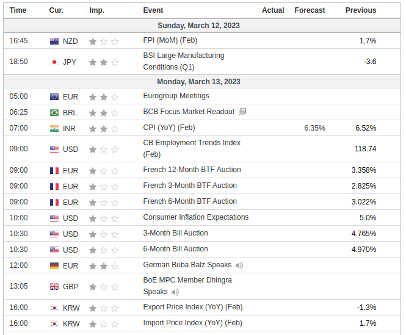

Für die meisten Ereignisse/Events gibt es drei Zahlen: Actual (Tatsächlich), Forecast (Prognose) und Previous (Vorhersage).

- **Actual**
  Dies ist die Zahl, die zur geplanten Freigabezeit freigegeben wird.
- **Forecast**
  Diese Zahl stellt den Durchschnitt/Konsens der Vorhersagen dar, die Wirtschaftswissenschaftler in aller Welt gemacht haben.
- **Previous**
  Dies ist die Zahl aus der vorherigen Veröffentlichung/Release

Die wichtigsten sind die Forecast und die Actual Zahl. Was den Markt tatsächlich in Bewegung bringt, ist, wenn die Actual Zahl von der Forecast abweicht. Betrachten wir als Beispiel das monatliche BIP Kanadas (Canada GDP MoM):
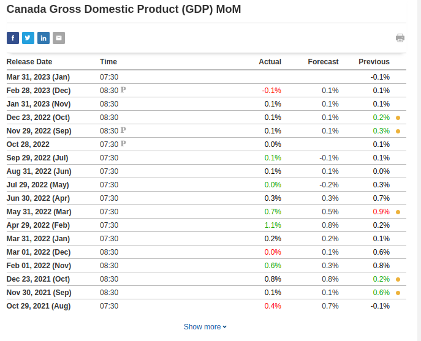

Jedes Mal, wenn die Actual/tatsächliche Zahl höher als die Forecast/Vorhersage war, wird die Zahl in grün angezeigt. Jedes Mal, wenn sie niedriger war als die Vorhersage, wird sie in rot angezeigt.

Beim BIP (GDP) ist eine höher als erwartete Zahl positiv, d.h. "bullish" für die zugrunde liegende Währung, in diesem Fall den Kanadischen Dollar (CAD). Daher sollte eine höhere Abweichung den CAD-Kurs steigen lassen, und eine niedriger als erwartete Zahl ist negativ, d. h. "bearish", was den Kurs fallen lassen sollte. Wenn es keine Abweichung gibt, d.h. wenn die tatsächliche Zahl mit der Prognose übereinstimmt, dann gibt es keinen Handelsaufbau.

Wenn Sie tatsächlich mit diesem Ereignis handeln wollten, wäre das zu verwendende Symbol/Währungspaar (Currency Pair) USDCAD. In jedem Währungspaar gibt es zwei Währungen: die Basiswährung (Base Currency) und die Kurswährung (Quote currency). Manchmal wird zwischen den Währungen ein "/" geschrieben, z. B. USD/CAD.

Die Basiswährung (base currency) ist die erste, die USD in USD/CAD ist, und die Kurswährung (quote currency) ist die zweite, die CAD ist. Der Preis von USDCAD ist die Menge an CAD, die Sie benötigen, um 1 USD zu kaufen.

- Der Wechselkurs (exchange rate) kann von verschiedenen Faktoren beeinflusst werden, z. B. von Änderungen der Zinssätze, Wirtschaftsindikatoren, geopolitischen Ereignissen und der Marktstimmung. Diese Faktoren können die Nachfrage und das Angebot der Währungen des Paares beeinflussen und sich somit auf ihren relativen Wert und den Wechselkurs auswirken.
- Beim Währungspaar USD/JPY ist der USD die Basiswährung (base currency), so dass der Wechselkurs angibt, wie viele JPY Sie benötigen, um 1 USD zu kaufen. Wenn der Wechselkurs 110.00 beträgt, müssen Sie 110 JPY ausgeben, um 1 USD zu kaufen. Positive Nachrichten für den USD können den Wechselkurs steigen lassen, während negative Nachrichten ihn sinken lassen können. Sie können mit USDJPY handeln, indem Sie je nach Ihrer Einschätzung des Marktes long (kaufen/buy) oder short (verkaufen/sell) gehen.
- Beim Währungspaar USD/CAD ist der USD auch die Basiswährung (base currency) und der CAD die Kurswährung (quote currency). Der Wechselkurs gibt also an, wie viel CAD Sie benötigen, um 1 USD zu kaufen. Wenn der Wechselkurs zum Beispiel 1.25 beträgt, müssen Sie 1.25 CAD ausgeben, um 1 USD zu kaufen. Wenn Sie also 100 CAD haben, können Sie nur 80 USD kaufen, wenn der Wechselkurs 0.80 beträgt. Positive Nachrichten für den CAD können den Wechselkurs sinken lassen, während negative Nachrichten ihn steigen lassen können. Wie beim USDJPY können Sie auch beim USDCAD je nach Ihrer Markteinschätzung long oder short gehen.
- Wenn die zugrunde liegende Währung die **Basiswährung (base currency)** des Paares ist (z.B. **USD** in **USD**/JPY) und es gibt:
    - **positive Nachrichten:** der Preis steigt
    - **negative Nachrichten:** der Preis sinkt
- Wenn die zugrunde liegende Währung die **Kurswährung (quote currency)** des Paares ist (z.B. **CAD** in USD/**CAD**) und es gibt:
    - **positive Nachrichten:** der Preis sinkt
    - **negative Nachrichten:** der Preis steigt
- Wenn Sie mit einem Währungspaar handeln, spekulieren Sie auf die Entwicklung des Wechselkurses. Wenn Sie glauben, dass die Basiswährung (base currency) gegenüber der Kurswährung (quote currency) aufwerten wird, können Sie das Paar kaufen (long gehen). Wenn Sie glauben, dass die Basiswährung (base currency) gegenüber der Kurswährung (quote currency) an Wert verlieren wird, können Sie das Paar verkaufen (short gehen). Der Gewinn (profit) oder Verlust (loss), den Sie erzielen, hängt von der Differenz zwischen dem Einstiegs- und dem Ausstiegskurs (Entry & Exit price) (auch bekannt als open & close price) des Handels und dem Umfang Ihrer Position ab (Position bedeutet nur einen offenen Handel/Trade).

## **5. Was der Preis ist und warum er sich bewegt**

Auf dem Forex-Markt wird der aktuelle Kurs eines Währungspaares durch die Bids (Gebote) und Asks (Anfragen) im Orderbuch bestimmt. Das Orderbuch ist eine Echtzeit-Anzeige aller Kauf- und Verkaufsaufträge für ein bestimmtes Währungspaar zu verschiedenen Kursniveaus.

- Wenn ein Händler eine **sell** limit order (Verkauf-Limit-Order) platziert, erstellt er eine **'ask' (Nachfrage)** im Orderbuch, die den niedrigsten Preis darstellt, den er für das Währungspaar zu akzeptieren bereit ist.
- Wenn ein Händler einen **buy** limit order (Kauf-Limit-Order) erteilt, erstellt er ein **'bid' (Gebot)** im Orderbuch (orderbook), das den höchsten Preis darstellt, den er für das Währungspaar zu zahlen bereit ist.

Das Orderbuch enthält alle 'bids' und 'asks' in Echtzeit, geordnet nach Preisniveau. Das beste bid ist der höchste Preis, zu dem ein Käufer bereit ist, das Währungspaar zu kaufen, während die beste ask der niedrigste Preis ist, zu dem ein Verkäufer bereit ist, das Währungspaar zu verkaufen.

Der aktuelle Kurs des Währungspaares basiert immer auf zwei Kursen: dem besten ask und dem besten bid. Der aktuelle Marktpreis, der auf einem Preisticker angezeigt wird, ist in der Regel der Mittelpunkt (mid-point) zwischen dem besten Ask- und dem besten Bidkurs. Dies ist jedoch nicht der Preis, zu dem Ihre Aufträge ausgeführt (filled) werden. Das beste bid stellt den höchsten Preis dar, zu dem jemand bereit ist, das Währungspaar zu kaufen, während die beste ask den niedrigsten Preis darstellt, zu dem jemand bereit ist, das Währungspaar zu verkaufen. Der aktuelle Marktpreis für die tatsächliche Ausführung eines Handels ist also der höchste Preis, den jemand zu zahlen bereit ist (bestes bid), und der niedrigste Preis, den jemand zu einem bestimmten Zeitpunkt zu verkaufen bereit ist (beste ask). Zwischen dem besten ask und dem besten bid klafft in der Regel eine Lücke, die als "Spread" bezeichnet wird.

## **6. Auftragsarten (Order Types)**

- **Market Orders (Marktaufträge)** werden sofort zum besten verfügbaren Preis ausgeführt, entweder zum besten ask für einen Market Buy Order (Marktkaufauftrag) oder zum besten bid für einen Market Sell Order (Marktverkaufsauftrag).
  - Wenn ein Händler einen Marktauftrag zum **Kauf/Buy** des Währungspaares erteilt (***Market Buy Order***), wird sein Auftrag zum aktuell besten **ask** preis ausgeführt.
  - Bei einem ***Market Sell Order*** (Marktauftrag zum **Verkauf/Sell**) wird der Auftrag zum aktuell besten **bid** preis ausgeführt.
- **Limit Orders (Limitaufträge)** werden ausgeführt, wenn der Marktpreis ein bestimmtes Preisniveau erreicht.

Wenn es auf einem bestimmten Kursniveau mehr Käufer als Verkäufer gibt, kann der Kurs des Währungspaares steigen, da die Käufer um den Kauf der Währung konkurrieren. Umgekehrt kann der Preis des Währungspaares fallen, wenn es auf einem bestimmten Preisniveau mehr Verkäufer als Käufer gibt, da die Verkäufer um den Verkauf der Währung konkurrieren.

Zusammenfassend lässt sich sagen, dass der aktuelle Kurs/Preis eines Forex Paar/Symbol durch die bids und der asks im Orderbuch bestimmt wird. Im Orderbuch werden alle Kauf- und Verkaufsaufträge (Buy & Sell orders) für das Währungspaar zu verschiedenen Kursniveaus angezeigt, und das beste bid und die beste ask bestimmen den aktuellen Marktpreis, d. h. den höchsten Preis, den jemand zu zahlen bereit ist (bestes bid), und den niedrigsten Preis, den jemand zu einem bestimmten Zeitpunkt zu verkaufen bereit ist (beste ask).

## **7. Wie der Preis gemessen wird**

Ein Pip (kurz für "percentage in point" oder "price interest point") ist angeblich die kleinste Einheit der Kursbewegung eines Währungspaares. Er entspricht bei den meisten Währungspaaren der vierten Dezimalstelle, außer bei einigen Währungspaaren, die eine andere Dezimalstelle haben.

Wenn das Währungspaar EUR/USD beispielsweise bei 1.2000 gehandelt wird und dann auf 1.2001 steigt, ist dies eine Bewegung von einem Pip. Ähnlich verhält es sich mit dem Währungspaar USD/JPY, das bei 108.00 gehandelt wird und dann auf 107.99 fällt: eine Bewegung von einem Pip.

Pips werden verwendet, um den Gewinn oder Verlust eines Forexhandels zu berechnen. Der Umfang des Handels (Lot size), die Anzahl der gewonnenen oder verlorenen Pips und das gehandelte Währungspaar bestimmen die Höhe des Gewinns oder Verlusts. Daher ist es für Forexhändler wichtig, das Konzept der Pips zu verstehen, um potenzielle Gewinne und Verluste genau zu berechnen.

Es ist jedoch erwähnenswert, dass viele Forex-Broker "Fraktionierte Pips" oder "Pipettes" (auch "Points" ("Punkte") genannt) verwenden, die eine fünfte Dezimalstelle darstellen, um genauere Preise für Währungspaare zu liefern. In diesem Fall ist die wirklich kleinste Einheit der Kursbewegung 1 Point. Zehn Points entsprechen einem Pip.

## **8. Lots**

Für jeden Kauf- oder Verkaufsauftrag muss die Anzahl der Lots (auch 'Lot Size' oder 'Position Size' genannt) angegeben werden. Ein Lot bezieht sich auf die Standardhandelsgröße für ein bestimmtes Währungspaar. Die Größe eines Lots variiert je nach Währungspaar und kann von 1000 Einheiten der Basiswährung bis zu 100,000 Einheiten oder mehr reichen. Ein Standard-Lot für das Währungspaar EUR/USD beträgt zum Beispiel 100,000 Einheiten des Euro.

Die Lot Size, mit der Sie handeln, hat einen direkten Einfluss auf die Höhe des Gewinns oder Verlusts, den Sie mit einer bestimmten Anzahl von Pips erzielen können. Dies liegt daran, dass der Gewinn oder Verlust aus einem Handel auf der Grundlage der Größe der Position, die Sie einnehmen, berechnet wird, die durch die Lot Size bestimmt wird.

Nehmen wir zum Beispiel an, Sie kaufen 1 Lot EUR/USD zu 1.2000 und der Kurs steigt auf 1.2020, was einer Bewegung von 20 Pips entspricht. Wenn Sie den Handel zu diesem Preis schließen, würden Sie einen Gewinn von $200 erzielen, da ein Standardlot von EUR/USD $100,000 wert ist und jeder Pip $10 wert ist. Wenn Sie 0.1 Lots von EUR/USD kaufen und der Kurs sich um 20 Pips bewegt, würden Sie einen Gewinn von $20 erzielen, da jeder Pip $1 wert ist.

Die Lot Size, mit der Sie handeln, ist ein wichtiger Faktor, den Sie bei der Berechnung potenzieller Gewinne und Verluste im Devisenhandel berücksichtigen müssen, da sie sich direkt auf die Höhe des Gewinns oder Verlusts auswirkt, den Sie mit einer bestimmten Anzahl von Pips erzielen können. Händler müssen ihre Lot Size sorgfältig im Verhältnis zu ihrer Handelsstrategie und Risikotoleranz abwägen.

## **9. Spread (Spanne)**

Die Spread im Forexhandel bezieht sich auf die Differenz zwischen dem Bidpreis und dem Askpreis eines Währungspaares. Der Bidpreis ist der Preis, zu dem ein Käufer bereit ist, das Währungspaar zu kaufen, während der Askpreis der Preis ist, zu dem ein Verkäufer bereit ist, das Währungspaar zu verkaufen.

Der Spread ist im Wesentlichen die Kosten des Handels und wird in der Regel in Pips gemessen. Der Spread wird von den Liquiditätsanbietern (Liquidity Providers or 'LPs'), wie Banken und anderen Finanzinstituten, festgelegt und von verschiedenen Faktoren wie Marktvolatilität (Market Volatility), Liquidität (Liquidity) sowie Angebot und Nachfrage (Supply & Demand) beeinflusst.

Liegt der Bidpreis für EUR/USD beispielsweise bei 1.2000 und der Askpreis bei 1.2002, beträgt der Spread 2 Pips. Das bedeutet, dass ein Händler, der EUR/USD kaufen möchte, den Askpreis von 1.2002 zahlen muss, während ein Händler, der EUR/USD verkaufen möchte, den Bidpreis von 1.2000 erhält.

Bei Wirtschaftsnachrichten weitet sich die Bid-Ask-Spread häufig aus und die verfügbare Liquidität nimmt ab, da möglicherweise weniger Marktteilnehmer bereit sind, das Währungspaar zu den aktuellen Kursen zu kaufen oder zu verkaufen.

Der Rückgang der Liquidität bei Wirtschaftsnachrichten kann zu erhöhter Volatilität und Slippage führen, da sich die Bid-Ask-Spread ausweitet und es schwieriger wird, Trades zum gewünschten Kursniveau auszuführen. Dies kann es für Händler schwieriger machen, schnell und effizient in Positionen ein- oder auszusteigen, was das Risiko von Verlusten erhöhen kann.

Aus diesem Grund wird bei dieser Strategie ein Trailing-Stoploss von 5 Pips verwendet, d. h. der Kurs muss sich nur um 5 Pips bewegen, um die Gewinnschwelle (break even) zu erreichen, und alles, was darüber liegt, ist Gewinn.

## **10. Liquidity (Liquidität)**

Im Zusammenhang mit dem Forexhandel wirkt sich die Liquidität insbesondere auf das Orderbuch aus, das eine Echtzeitliste der Kauf- und Verkaufsaufträge für ein bestimmtes Währungspaar darstellt. Der Forexmarkt ist mit einem täglichen Handelsvolumen von über 6 Billionen Dollar der liquideste Markt der Welt. Eine hohe Liquidität auf dem Forexmarkt führt zu einem robusten und effizienten Orderbuch, was sich wiederum auf die Handelsbedingungen und die Chancen für die Händler auswirkt.

Auf einem hochliquiden Forexmarkt ist eine große Zahl von Käufern und Verkäufern aktiv am Handel beteiligt. Infolgedessen ist das Orderbuch mit zahlreichen Kauf- und Verkaufsaufträgen (Buy & Sell Orders) auf verschiedenen Kursniveaus gefüllt. Diese Fülle an Aufträgen ermöglicht es den Händlern, problemlos in Positionen ein- und auszusteigen, ohne dass es zu erheblichen Kursbewegungen kommt oder der Marktpreis des Währungspaares beeinflusst wird. Auf einem liquiden Markt sind die Bid-Ask-Spread im Auftragsbuch eng, d. h. die Differenz zwischen dem höchsten Preis, den ein Käufer zu zahlen bereit ist (Bidpreis), und dem niedrigsten Preis, den ein Verkäufer zu akzeptieren bereit ist (Askpreis), ist minimal. Enge Spreads senken die Gesamttransaktionskosten für Händler und machen den Handel kostengünstiger.

Im Gegensatz dazu führt eine geringe Liquidität auf dem Forexmarkt zu einem dünnen Orderbuch mit weniger Kauf- und Verkaufsaufträgen (Buy & Sell Orders). Dies kann zu größeren Bid-Ask-Spreads, erhöhter Slippage (die Differenz zwischen dem erwarteten Preis eines Geschäfts und dem Preis, zu dem es tatsächlich ausgeführt wird) und einer höheren Wahrscheinlichkeit von Kurslücken (plötzliche Sprünge des Marktpreises, ohne dass dazwischen ein Handel stattfindet) führen. Diese Faktoren können die Transaktionskosten erhöhen und zu volatileren Handelsbedingungen führen.

Die Liquidität des Forexmarktes wird von mehreren Faktoren beeinflusst, z. B. von geopolitischen Ereignissen, der Veröffentlichung von Wirtschaftsdaten, der Marktstimmung und den Handelszeiten. Die liquidesten Währungspaare sind die großen Paare wie EUR/USD, USD/JPY und GBP/USD, die im Vergleich zu weniger liquiden Paaren oder exotischen Währungen engere Spreads und stabilere Preise aufweisen. Eine hohe Liquidität auf dem Forexmarkt bietet Händlern letztlich bessere Handelsmöglichkeiten, eine schnellere Ausführung und geringere Preisauswirkungen.

## **11. Stoploss (SL)**

Ein Stop-Loss ist ein Parameter in einem Auftrag, der dazu dient, mögliche Verluste bei einer offenen Position zu begrenzen. Er kann jederzeit festgelegt und aktualisiert werden, wenn der Auftrag offen ist. Er legt ein bestimmtes Kursniveau fest, bei dem der Handel automatisch geschlossen wird, wenn sich der Markt gegen die Position bewegt, und hilft so, Verluste zu minimieren. Es ist ein gängiges Instrument des Risikomanagements, das von Händlern eingesetzt wird, um ihr Kapital zu schützen und das Risiko zu steuern.

### **Trailing Stoploss (TSL)**

Ein Trailing-Stop-Loss ist eine Art von Stop-Loss, der der Kursbewegung eines Vermögenswerts in eine bestimmte Richtung folgt und es Händlern ermöglicht, Gewinne zu sichern und gleichzeitig mögliche Verluste zu begrenzen. Er funktioniert, indem er einen bestimmten Abstand zum aktuellen Marktpreis einhält. Wenn der Preis beginnt, sich gegen die Position zu bewegen, wird der Auftrag ausgelöst und die Position geschlossen. Dies ist ein nützliches Instrument auf schnelllebigen Märkten, auf denen die Kursbewegungen volatil und unvorhersehbar sein können.

Wenn sich der Kurs beispielsweise um 10 Pips bewegt und Sie einen Trailing-Stoploss von 5 Pips haben, dann würde der Stoploss bei 5 Pips vom Einstiegskurs des Handels gesetzt werden. Wenn sich der Kurs um 20 Pips bewegt und Sie einen TSL von 5 Pips haben, dann würde der Stoploss bei 15 Pips vom Einstiegskurs des Handels angesetzt werden.

Der Trailing-Stoploss wird ständig aktualisiert, wenn sich der Kurs weiter vom Einstiegskurs entfernt, bis er sich schließlich umkehrt und der Stoploss nicht mehr aktualisiert wird, und schließlich wird der Auftrag zu dem Kurs geschlossen, auf den der Stoploss gesetzt wurde.

## **12. Volatility (Volatilität)**

Beim Forexhandel bezieht sich die Volatilität auf das Ausmaß der Kursschwankungen eines Währungspaares innerhalb eines bestimmten Zeitraums. Eine hohe Volatilität kann Chancen für größere Gewinne bieten, erhöht aber auch das Verlustrisiko. Eine niedrige Volatilität begrenzt die Handelsmöglichkeiten, verringert aber auch das Verlustrisiko.

Im Vergleich zu Forex ist die Volatilität bei Bitcoin und anderen Kryptowährungen im Allgemeinen höher und unvorhersehbarer. Dies liegt daran, dass der Kryptomarkt noch relativ neu ist und eine geringere Marktkapitalisierung hat, was bedeutet, dass er leichter durch Ereignisse wie regulatorische Änderungen oder die Marktstimmung beeinflusst werden kann.

## **13. Latenz/Geschwindigkeit (Latency/Speed)**

- Da sich der Kurs in der Regel in weniger als einer Sekunde nach der Bekanntgabe dieser Ereignisse bewegt, muss man so schnell wie möglich sein, um in den Handel einzusteigen, bevor sich der Kurs bewegt. Dies kann nur erreicht werden, indem ein Computerprogramm auf einem Server ausgeführt wird, der mit dem Broker, bei dem Sie handeln, 'co-located' ist.
- Von **Co-Location** spricht man, wenn sich Ihr Server physisch im selben Gebäude befindet wie der Server des Brokers. Dies bedeutet, dass die Latenzzeit, d. h. die Zeit, die die Daten für die Übertragung von einem Punkt zum anderen im Internet benötigen, geringer ist.

  - Stellen Sie sich das so vor, als würden Sie einen Brief mit der Post verschicken. Wenn Sie weit entfernt von der Person wohnen, an die Sie den Brief schicken, dauert es länger, bis der Brief ankommt, als wenn die Person nur die Straße runter wohnt. Ähnlich verhält es sich, wenn Sie Daten über das Internet verschicken und der Server, an den Sie die Daten senden, weit entfernt ist: Es dauert länger, bis die Daten ankommen, als wenn der Server in der Nähe steht.
  - Diese Verzögerung bei der Datenübertragung wird als Ping/Latenz bezeichnet. Sie wird in Millisekunden (ms) gemessen und kann durch eine Vielzahl von Faktoren beeinflusst werden, z. B. Entfernung, Netzüberlastung und Qualität der Internetverbindung.
  - Im Zusammenhang mit dem Forexhandel ist eine niedrige Latenzzeit wichtig, da sie es den Händlern ermöglicht, Geschäfte schneller auszuführen und Marktchancen zu nutzen, bevor es andere tun.
  - Die meisten Forex-Broker haben ihre Server in einem der Equinix-Rechenzentren auf der ganzen Welt untergebracht. Die beiden wichtigsten befinden sich in London (Equinix LD4) und New York (Equinix NY4)
- Ein schneller Nachrichten-Feed (news feed) mit niedriger Latenzzeit ist ebenfalls erforderlich, um die Nachrichten schneller zu erhalten, als sich die Kurse bewegen. Ein Dienstleister hierfür ist Haawks, der Abonnements mit niedriger Latenz bei vielen der Institutionen hat, die die Nachrichten in den USA, Kanada und einigen anderen Ländern veröffentlichen, z. B. das US Bureau of Labor Statistics (BLS), Bureau of Economic Analysis (BEA), US Department of Commerce, US Census Bureau, Statistics Canada, Bank of Canada, Statistics Norway, Norges Bank, SCB - Statistics Sweden, und mehr

  - Haawks News-Feed ist auf beiden Equinix-Rechenzentren LD4 und NY4 verfügbar

## **14. Slippage**

Die Kursslippage (price slippage) bezieht sich auf die Differenz zwischen dem erwarteten Preis eines Geschäfts und dem Preis, zu dem das Geschäft tatsächlich ausgeführt wird.

Beim Handel mit geringer Latenz, bei dem Händler Hochgeschwindigkeits-Computeralgorithmen zur schnellen Ausführung von Geschäften verwenden, kann es zu Kursabweichungen kommen, wenn sich die Marktbedingungen schnell ändern oder eine hohe Volatilität vorliegt, z. B. bei Nachrichtenereignissen (news events). Dies kann zu einer Verzögerung zwischen dem Zeitpunkt, an dem der Handel eingeleitet wird, und dem Zeitpunkt seiner Ausführung führen, wobei sich der Marktpreis in dieser Zeit vom erwarteten Preis entfernt haben kann.

Wenn ein Händler beispielsweise einen Auftrag zum Kauf eines Währungspaares zu einem bestimmten Preis erteilt und es zu einer plötzlichen Marktverschiebung kommt, kann der tatsächliche Ausführungskurs höher sein als der erwartete Kurs. Dieser Preisunterschied wird als Slippage bezeichnet.

Beim Handel mit MT4 lässt sich Slippage zwar nicht vollständig vermeiden, aber durch eine Verbindung mit niedriger Latenz zum Server des Brokers (die durch einen Co-Located Server erreicht wird) und eine schnelle Handelsausführung kann es reduziert werden. Im Zusammenhang mit dem Nachrichtenhandel ist ein News-Feed mit niedriger Latenz, wie er von Haawks bereitgestellt wird, unerlässlich, um den Handel so schnell wie möglich auszuführen und Slippage zu vermeiden.

## **15. Forex Brokers**

Forexmakler (Forex Brokers) sind Unternehmen, die Händlern Zugang zum Forexmarkt verschaffen, wo Währungen gekauft und verkauft werden. Diese Broker fungieren als Vermittler zwischen den Händlern und dem Markt, führen in ihrem Namen Geschäfte aus und bieten ihnen eine Plattform für den Zugang zum Markt.

Forex-Broker sind aus mehreren Gründen notwendig:

1. ***Zugang zum Markt (Access to the market):*** Forex-Broker bieten Händlern eine Plattform für den Zugang zum Forexmarkt, die Einzelhändlern (Retail Traders) sonst nicht zur Verfügung steht. Ohne einen Broker hätten die Händler keinen direkten Zugang zum Markt.
2. ***Ausführung von Geschäften (Trade Execution):*** Forex-Broker führen die Geschäfte im Namen der Händler aus. Wenn ein Händler ein Währungspaar kaufen oder verkaufen möchte, erteilt er seinem Broker einen Auftrag, der den Handel dann auf dem Markt ausführt. Der Broker sorgt dafür, dass der Handel zum bestmöglichen Preis und rechtzeitig ausgeführt wird.
3. ***Hebelwirkung (Leverage):*** Forex-Broker bieten eine Hebelwirkung an, die es Händlern ermöglicht, mit einem relativ kleinen Kapitalbetrag eine große Position zu kontrollieren. Da größere Lot Size möglich sind, kann dies den Wert eines Pips erhöhen und somit den Gewinn und Verlust jedes Pips steigern. Auf diese Weise können Händler potenziell größere Gewinne erzielen, als es ihnen mit ihrem eigenen Kapital möglich wäre. Es ist jedoch zu beachten, dass die Leverage auch das potenzielle Verlustrisiko erhöhen kann.

Insgesamt sind Forex Brokers für Händler notwendig, um Zugang zum Forexmarkt zu erhalten und Geschäfte abzuschließen. Sie stellen eine Plattform zur Verfügung, führen den Handel aus und bieten Leverage.

### **Arten von Brokers**

Es gibt drei Haupttypen von Gewinnmodellen für Forex-Broker: STP, ECN und Market Maker.

1. **Straight Through Processing (STP):**
    - Ein STP-Broker ist eine Art von Forex-Broker, der seinen Kunden direkten Marktzugang (Direct Market Access or DMA) bietet. Das bedeutet, dass der Broker nicht als Market Maker fungiert, sondern die Kundenaufträge direkt an Liquiditätsanbieter weiterleitet. Ein Liquiditätsanbieter ist in der Regel ein großes Finanzinstitut, z. B. eine Bank oder ein anderer Broker, der Preise und Liquidität auf dem Forexmarkt bereitstellt.
    - Wenn ein Kunde einen Auftrag an einen STP-Broker erteilt, leitet dieser den Auftrag an einen Liquiditätsanbieter weiter, der zu diesem Zeitpunkt den besten verfügbaren Preis bietet. Dies ermöglicht dem Kunden eine wettbewerbsfähige Preisgestaltung und Ausführung, da er Zugang zum realen Markt hat. Der Broker verdient seinen Gewinn, indem er eine Provision oder einen Aufschlag auf den Spread erhebt.
    - Liegt der Bidpreis für EUR/USD beispielsweise bei 1.1000 und der Askpreis bei 1.1001, beträgt der Spread 1 Pip. Wenn ein Kunde einen Auftrag an einen STP-Broker erteilt, schlägt der Broker in der Regel einen kleinen Aufschlag auf die Spread (Spanne) auf, um einen Gewinn zu erzielen. Der Aufschlag ist in der Regel transparent und wird dem Kunden vor der Ausführung des Geschäfts mitgeteilt.

2. **Electronic Communication Network (ECN):**
    - Ein ECN-Broker ist einem STP-Broker insofern ähnlich, als er seinen Kunden direkten Marktzugang bietet. Allerdings erlaubt ein ECN-Broker seinen Kunden auch, miteinander zu handeln. Das bedeutet, dass die Kunden sowohl als Käufer als auch als Verkäufer auf dem Markt auftreten können und der Broker nicht als Gegenpartei bei ihren Geschäften auftritt. Wie beim STP verdient der Broker auch hier seinen Gewinn, indem er für jeden Handel eine Provision verlangt.

3. **Market Maker:**
    - Ein Market Maker ist eine Art von Broker, der für seine Kunden einen Markt schafft, indem er die Gegenseite ihrer Geschäfte übernimmt. Das heißt, wenn ein Kunde ein Währungspaar kauft, verkauft der Broker dasselbe Währungspaar an den Kunden und umgekehrt. Der Broker erzielt seinen Gewinn, indem er die Differenz zwischen dem Bid und dem Ask, auch bekannt als Spread, in die Tasche steckt. Market Maker können auch andere Handelspraktiken anwenden, um ihr Risiko zu steuern, wie z. B. die Absicherung ihrer Positionen auf dem Interbankenmarkt.

Zusammenfassend bieten STP- und ECN-Broker Kunden direkten Marktzugang und ihre Gewinne, indem sie eine Provision oder einen Aufschlag auf den Spread erheben. Market Maker hingegen schaffen einen Markt für ihre Kunden, indem sie die Gegenseite ihrer Trades aufnehmen und ihre Gewinne erzielen, indem sie den Spread einstecken.

Beim Market-Maker-Modell funktioniert der Broker die Gegenseite der Trades seiner Kunden, was bedeutet, dass der Broker von den Verlusten seiner Kunden profitiert. Dies schafft einen potenziellen Interessenkonflikt zwischen dem Broker und seinen Kunden, da der Broker Anreize erhalten kann, Preise zu manipulieren oder Maßnahmen zu ergreifen, die eher dem Endergebnis des Brokers als den besten Interessen des Kunden zugute kommen. Zum Beispiel kann ein Market Maker den Spread erweitern oder die Auftragsausführung verzögern, um seine Gewinne zu steigern.

Im Gegensatz dazu bieten STP- und ECN-Modelle den Kunden direkten Marktzugang (Direct Market Access oder DMA), was bedeutet, dass der Broker nicht die Gegenseite der Geschäfte seiner Kunden einnimmt. Stattdessen tritt der Broker als Vermittler auf und gibt die Aufträge an Liquiditätsanbieter oder andere Händler am Markt weiter. Dadurch wird der potenzielle Interessenkonflikt zwischen dem Broker und seinen Kunden beseitigt, da der Broker nicht von den Verlusten seiner Kunden profitiert.

Die STP- und ECN-Modelle gelten im Allgemeinen als transparenter, da sie es den Kunden ermöglichen, die tatsächliche Markttiefe zu sehen und an der Preisfindung teilzunehmen. Das bedeutet, dass Kunden die Bid- und Askpreis anderer Marktteilnehmer sehen und ihre Aufträge entsprechend platzieren können, was zu einer fairen Preisgestaltung beitragen und Preismanipulationen verhindern kann.

## **16. Trading Software (Handelssoftware)**

### **MetaTrader 4**

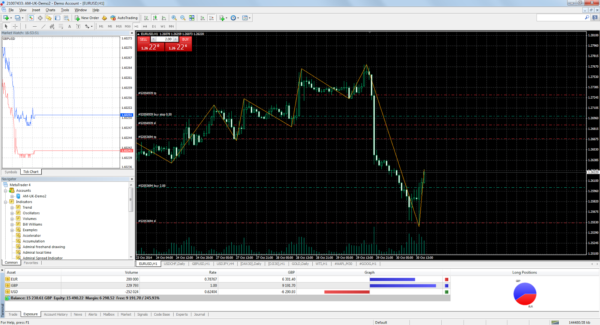
MetaTrader 4 (MT4) ist eine beliebte Handelsplattform, die von Händlern für den Zugang zu und den Handel mit Finanzmärkten verwendet wird. Es wurde von MetaQuotes Software entwickelt und 2005 veröffentlicht.

MT4 bietet Händlern eine Reihe von Tools und Funktionen, die ihnen helfen, die Märkte zu analysieren, Handelsstrategien zu entwickeln und auszuführen und ihre Trades zu verwalten. Einige der wichtigsten Funktionen von MT4 sind:

- **Charting- und technische Analysetools:** MT4 bietet Händlern eine Reihe von Charttools und Indikatoren, die ihnen bei der Analyse von Markttrends helfen.
- **Automatisierter Handel:** MT4 ermöglicht es Händlern, ihre Handelsstrategien mithilfe von Expert Advisors (EAs) zu entwickeln und zu automatisieren, bei denen es sich um Computerprogramme handelt, die in der Lage sind, Trades auf der Grundlage vordefinierter Regeln und Bedingungen auszuführen.
- **Mobiler Handel**: MT4 ist als mobile App verfügbar, die es Händlern ermöglicht, auf ihre Konten zuzugreifen und unterwegs zu handeln.

### **Haawks News Trader**

  <iframe width="1265" height="496" src="https://www.youtube.com/embed/ZevwBfZjp6g" title="US Consumer Price Index (CPI) 10 November 2022 - Haawks G4A Low-Latency News Trading Data Feed" frameborder="0" allow="accelerometer; autoplay; clipboard-write; encrypted-media; gyroscope; picture-in-picture; web-share" allowfullscreen></iframe>

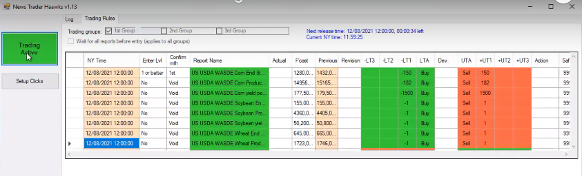

Die Haawks News Trader-Software wird mit dem Haawks-Abonnement geliefert. Es stellt eine Verbindung zum Hawks-Newsfeed her und gibt Trades (Market Orders) in MetaTrader 4 ein, wenn bestimmte Bedingungen erfüllt sind, die vom Benutzer festgelegt werden.

Für jedes Ereignis gibt es 6 Triggerpegel, die konfiguriert werden können:

- **-LT1**
- **-LT2**
- **-LT3**
- **+UT1**
- **+UT2**
- **+UT3**
- '**LT**' steht für '**Lower Trigger**' und wird ausgelöst, wenn die tatsächliche (Actual) Zahl niedriger ist als die prognostizierte (Forecast) Zahl.
- '**UT**' steht für '**Upper Trigger**' und wird ausgelöst, wenn die tatsächliche (Actual) Zahl höher ist als die prognostizierte (Forecast) Zahl.
- Es gibt auch '**LTA**' und '**UTA**', was für '**Lower Trigger Action**' und '**Upper Trigger Action**' steht. Diese können entweder auf '**Buy**' oder '**Sell**' eingestellt werden, je nachdem, ob eine höhere Abweichung bullish oder bearish ist.

  - Beispielsweise ist für US Nonfarm Payrolls eine höhere Nachrichtenabweichung (news deviation) bullish (positiv) für USDJPY und eine niedrigere Nachrichtenabweichung bearish (negativ) für USDJPY. Daher würden Sie 'LTA' auf 'Sell' und 'UTA' auf 'Buy' setzen.
  - Für das Canadian GDP (kanadische BIP) ist eine höhere Nachrichtenabweichung für USDCAD rückläufig (negativ) und eine niedrigere Nachrichtenabweichung für USDCAD zinsbullisch (positiv). Daher würden Sie 'LTA' auf 'Buy' und 'UTA' auf 'Sell' setzen.
- '-LT1', '-LT2', '-LT3', '+UT1', '+UT2' & '+UT3' haben jeweils ihre eigenen Abweichungsstufen (Deviation levels) und Lot Sizes, die eingestellt werden können. Das bedeutet, dass der Haawks-News-Trader die Abweichung berechnet, wenn der tatsächliche Preis bekannt wird, indem er die prognostizierte (Forecast) Zahl von der tatsächlichen (Actual) Zahl subtrahiert. Dann überprüft es alle Ihre Trigger, um zu sehen, mit welchem es übereinstimmt. Wenn es mit einem Ihrer Auslöser übereinstimmt, wird ein neuer Trade in MetaTrader 4 in der durch 'LTA' und 'UTA' angegebenen Richtung eröffnet, wobei die für diesen Auslöser angegebene Lot Size verwendet wird.

  - Für den Handel mit Canada GDP MoM (kanadische BIP monatlich) könnten die Trigger beispielsweise wie folgt festgelegt werden:
    - -LT1: -0.1  |  0.5 lots
    - -LT2: -0.2  |  1 lot
    - -LT3: -0.3  |  1.5 lots
    - +UT1: +0.1  |  0.5 lots
    - +UT2: +0.2  |  1 lot
    - +UT3: +0.3  |  1.5 lots
    - Nehmen wir dann an, die Prognose ist 0.1 und die tatsächliche Zahl ist -0.1. Dies würde zu einer Abweichung von -0.2 führen, sodass '-LT2' ausgelöst und ein Handel von 1 Lot in Kaufrichtung eröffnet würde, da 'LTA' für das  Canadian GDP auf 'Buy' eingestellt ist
  - In einem anderen Beispiel für den Handel mit US Nonfarm Payrolls könnten die Trigger wie folgt gesetzt werden:
  - -LT1: -25  |  0.5 lots
  - -LT2: -50  |  1 lot
  - -LT3: -90  |  1.5 lots
  - +UT1: +25  |  0.5 lots
  - +UT2: +50  |  1 lot
  - +UT3: +90  |  1.5 lots
  - Nehmen wir dann an, die Prognose ist 205 und die tatsächliche Zahl ist 311. Das würde eine Abweichung von +106 ergeben, also würde '+UT3' ausgelöst und es würde einen Handel von 1.5 Lots in Kaufrichtung eröffnen, weil 'UTA' gesetzt ist zum 'Buy' für US Nonfarm Payrolls.

## **17. Historische Datenanalyse (Historic Data Analysis)**

Um einen fundierteren und robusteren Handelsplan zu haben, habe ich ein Datenanalyseprogramm erstellt, das die historischen Nachrichtenzahlen von investing.com erhält und dann die historischen Preisdaten (Ticks) für das relevante Handelspaar zum genauen Zeitpunkt jeder Nachricht erhält Veröffentlichung bis zu 15 Minuten nach jeder Veröffentlichung und generiert dann Metriken/Statistiken wie:

- die mittleren durchschnittlichen (mean average) Pip-Bewegungen
- die Median durchschnittlichen (median average) Pip-Bewegungen
- der Bereich (range) der Pip-Bewegungen
- Drei Korrelationswerte (Correlation scores: c_1, c_2 & c_3)

Es generiert dann einen PDF-Bericht für diesen Indikator (z. B. Nonfarm Payrolls oder Canada GDP) und das Handelssymbol (z. B. USDJPY oder USDCAD).

Hier sind Screenshots des PDF-Berichts, der für das kanadische BIP MoM (Monat über Monat / Month over Month) erstellt wurde:

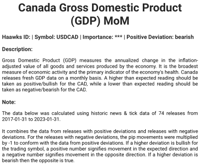

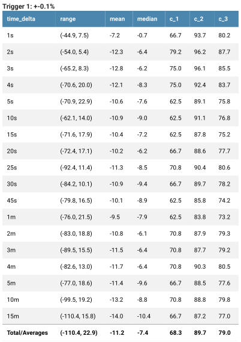

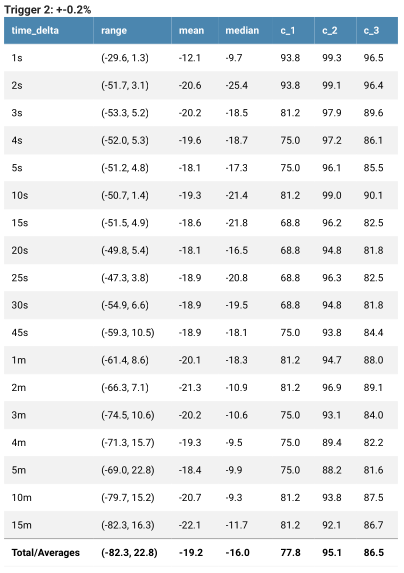

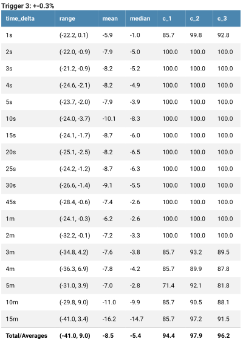

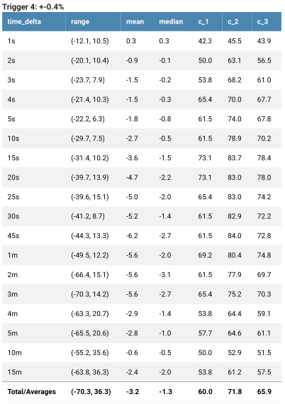

Normalerweise wird der Korrelationswert (Correlation Score) höher, wenn die Abweichung (Deviation) größer wird. Die Berechnungen für jeden Trigger funktionieren wie folgt:

1. Das Programm erhält die historischen Nachrichtendaten von investing.com ab Januar 2017 und danach
2. Für jedes Veröffentlichungsdatum und jede Veröffentlichungszeit (Release date & time) lädt es dann historische Preisdaten (Tick-Daten) von 5 Minuten vor der Veröffentlichung bis 15 Minuten nach der Veröffentlichung herunter. Tick-Daten kosten normalerweise Geld, aber es gibt einen Forex-Broker namens Dukascopy, der sie kostenlos zur Verfügung stellt, woher dieses Programm die Daten bezieht. Es zeigt die Ask- und Bid-Preise zu Zeitstempeln für jede Preisbewegung an, die normalerweise mehrmals pro Sekunde erfolgt. Dies kommt als .csv-Datei, die eine Tabelle ist:
   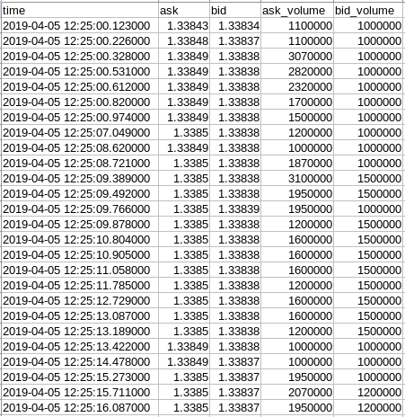
3. Für bestimmte Zeiten nach jeder Freigabe (Zeitdeltas/time deltas), d. h.
    - 1 Sekunde
    - 2 Sekunden
    - 3 Sekunden
    - 4 Sekunden
    - 5 Sekunden
    - 10 Sekunden
    - 15 Sekunden
    - 20 Sekunden
    - 25 Sekunden
    - 30 Sekunden
    - 45 Sekunden
    - 1 Minute
    - 2 Minuten
    - 3 Minuten
    - 4 Minuten
    - 5 Minuten
    - 10 Minuten
    - 15 Minuten   
    - Das Programm ruft die Ask & Bid-Preise zu diesen Zeiten nach jeder Veröffentlichung ab und berechnet dann die Pip-Bewegungen relativ zum Preis zum Zeitpunkt der Veröffentlichung.

4. Für jede Freigabe (Release) prüft es, zu welchem Triggerlevel es passt.
    - Wenn die Abweichung (Deviation) über einem vordefinierten Wert liegt (z. B. trigger_1: +-0,1 %) und unter dem darüber liegenden Trigger (z. B. trigger_2: +-0,2 %), wird sie zu den Eingabedaten für diesen Trigger (trigger_1) hinzugefügt.
    - Wenn es der letzte Trigger z.B. trigger_4, dann werden alle darüber liegenden Daten zu den Eingabedaten für diesen Trigger hinzugefügt

5. Für jedes Zeitdelta/time_delta (z. B. 1s, 2s, 3s usw.) wird Folgendes berechnet:
    - Der **Bereich (Range)** aller Pip-Bewegungen zu diesem Zeitpunkt (z. B. von -5 Pips bis +45 Pips)
    - Der **mittlere (Mean)** Durchschnitt aller Pip-Bewegungen zu diesem Zeitpunkt (z. B. 15 Pips). Berechnet, indem alle Pip-Bewegungen für jede Freigabe im aktuellen Trigger addiert und dann durch deren Anzahl dividiert werden.
    - Der **Median**-Durchschnitt. Berechnet, indem alle Pip-Bewegungen von der niedrigsten zur höchsten sortiert werden und dann genau diejenige in der Mitte gefunden wird.
    - **Korrelation 1 Score (c_1)**
        - Der Prozentsatz der Male, in denen sich der Preis in die erwartete Richtung bewegt hat.
        - `Positiv_Zählung` = Wie oft die Preisbewegung (Pip) größer oder gleich Null ist.
        - `Negativ_Zählung` = Wie oft die Preisbewegung kleiner als Null ist
        - Jeder Indikator hat eine erwartete Richtung basierend darauf, ob es bullische (positive) oder bearishe (negative) Nachrichten gibt. Diese Informationen wurden zuvor von investing.com gespeichert.
          - Wenn erwartet wird, dass die Preisbewegung **positiv** ist, dann:
            `c_1 = Positiv_Zählung ÷ (Positiv_Zählung + Negativ_Zählung)`
          - Wenn die Preisbewegung voraussichtlich **negativ** sein wird:
            `c_1 = Negativ_Zählung ÷ (Nositiv_Zählung + Negativ_Zählung)`
    - **Korrelation 2 Score (c_2)**
        - Der Prozentsatz der Pips, die sich in die erwartete Richtung bewegt haben.
        - `Positiv_Summe` = Alle Pips, die sich in eine positive Richtung bewegen, werden zusammengezählt
        - `Negativ_Summe` = Alle Pips, die sich in eine negative Richtung bewegt haben, werden zusammengezählt. Da diese Zahl negativ ist, wird sie mit -1 multipliziert, um eine positive Zahl zu werden, sodass sie mit der folgenden Gleichung funktioniert.
        - Wenn der Preis voraussichtlich **positiv** ist, dann:
          `c_2 = Positiv_Summe ÷ (Positiv_Summe + Negativ_Summe )`
        - Wenn der Preis voraussichtlich **negativ** sein wird:
          `c_2 = Negativ_Summe ÷ (Positiv_Summe + Negativ_Summe)`
    - **Korrelation 3 Score (c_3)**
        - Dies ist der mittlere Durchschnitt (mean average) von c_1 & c_2
        - `c_3 = (c_1 + c_2) ÷ 2`

6. Die Summe/Durchschnittswerte werden dann für jeden Trigger berechnet:
    - **Bereich (Range):** die niedrigste Zahl für eines der Zeitdeltas bis zur höchsten Zahl für eines der Zeitdeltas
    - **Mittelwert (Mean):** Addiere die Mittelwerte für jedes Zeitdelta und dividiere dann durch die Anzahl der Zeitdeltas (18)
    - **Median:** Addiere die Medianwerte für jedes Zeitdelta und dividiere dann durch 18
    - **c_1:** Addiere die c_1-Werte für jedes Zeitdelta und dividiere dann durch 18
    - **c_2:** Addieren Sie die c_2-Werte für jedes Zeitdelta und dividieren Sie sie dann durch 18
    - **c_3:** Addiere die c_3-Werte für jedes Zeitdelta und dividiere dann durch 18

## **18. Ordnen Sie jeden Indikator ein (Ranking every indicator)**

Nachdem ich in der Lage war, diese Analyse für einzelne Indikatoren zu erstellen, entschied ich mich, sie für jeden Indikator von Haawks auszuführen, der Nachrichtendaten auf investing.com und Tick-Daten von Dukascopy zur Verfügung stellt. Das sind insgesamt 95 Indikatoren, was nicht alle sind, aber immer noch eine ganze Menge.

Ich habe ein Skript/Programm in Python namens `ranker.py` geschrieben, das die Analyse für jeden Indikator durchführt und dann den besten Trigger für jeden von ihnen findet, d Ergebnisse in eine Excel-Datei namens `ranker_results.xlsx`.

Dann habe ich sie vom höchsten c_3 zum niedrigsten c_3 geordnet. Es gibt:

- 15 Indikatoren mit einem c_3 über 90
- 23 Indikatoren mit einem c_3 zwischen 80-90
- 23 Indikatoren mit einem c_3 zwischen 70-80
- 30 Indikatoren mit einem c_3 unter 70

Die Korrelationswerte (c_3) können als Darstellungen dafür angesehen werden, wie vorhersagbar jede Abweichung für jeden Indikator historisch war (basierend auf Daten von Januar 2017 bis Februar 2023). Dies impliziert, dass der Indikator eine höhere Wahrscheinlichkeit hat, sich in die erwartete Richtung zu bewegen, wenn der c_3-Wert höher ist. Das ist sowieso die Hypothese, die aber nur durch das Testen der Strategie bestätigt werden kann.

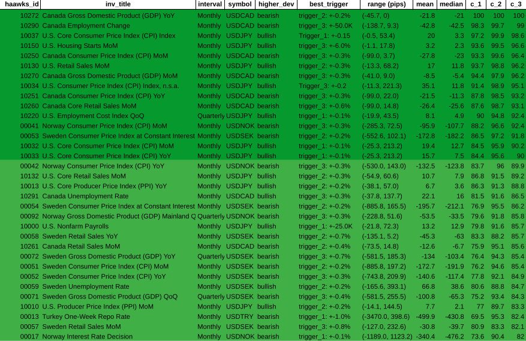
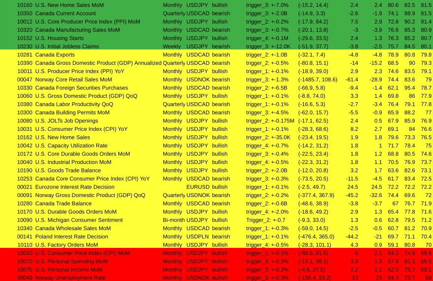
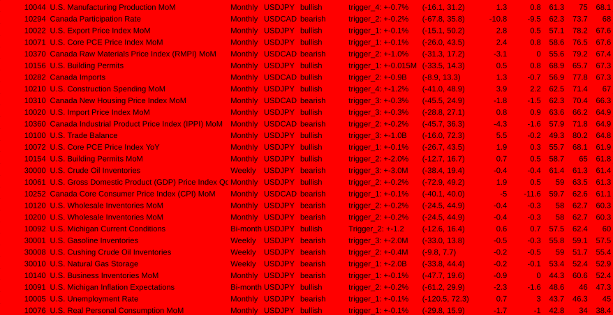

## **19. Handelspläne erstellen (Generating trading plans)**

Da der c_3-Wert wie ein Vorhersagbarkeitswert ist, ist es sinnvoll, größere Trades zu platzieren, wenn größere Lot Sizes verwendet werden, wenn der c_3-Wert höher ist. Ich habe die folgenden Lot Sizes für jede c_3-Punktzahl ermittelt:

- zwischen **80** und **85**: **0,5** Lots pro $1000 Kontostand
- zwischen **85** und **90**: **0,75** Lots pro $1000
- zwischen **90** und **95**: **1** Lot pro $1000
- über **90**: **1,5** Lots pro $1000

Ich habe ein weiteres Skript geschrieben, das die Ranking-Ergebnisse für alle Indikatoren mit einem c_3-Wert über 80 betrachtet und dann den Wirtschaftskalender von investing.com überprüft, um zu sehen, ob einer davon in der nächsten Woche veröffentlicht werden soll.

Dann generiert es für jeden Indikator, der in der nächsten Woche veröffentlicht wird, empfohlene Triggerabweichungen und Lot Sizes als Eingaben für das Haawks-News-Trader-Programm wie folgt:

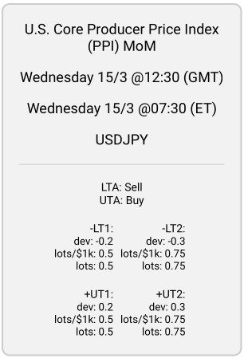

Der Wochenplan besteht also aus einer Reihe von Trigger-Empfehlungen wie der obigen:

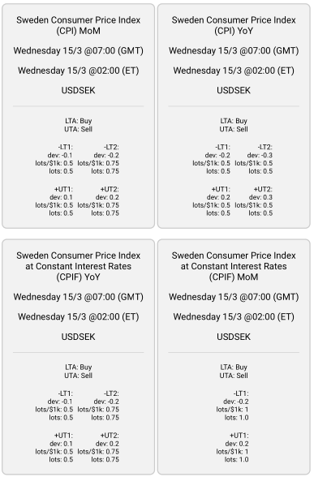

Im obigen Beispiel sind '**lots/$1k**' und '**lots**' identisch, da ein Kontostand von $1000 angenommen wurde. Wenn der Kontostand $2000 beträgt, sind die '**lots**' doppelt so hoch wie '**lots/$1k**'.

# **20. Abschluss**

Da bin ich mit der Entwicklung dieses Projektes im Wesentlichen (Stand 19.03.2023). Ich glaube, dass der Handel mit diesen Ereignissen mit Lot Sizes proportional zum Korrelationsergebnis Gewinn bringen sollte.

Es gibt jedoch noch einige Dinge, die verbessert werden können. Zum Beispiel habe ich dem Schöpfer des Haawks-News-Trader-Programms, der seit Jahren mit Nachrichten handelt, eine E-Mail geschickt. Er war an meiner Arbeit interessiert, sagte aber, dass sich die Zuverlässigkeit/Vorhersagbarkeit (Reliability/Predictability) von Indikatoren im Laufe der Zeit ändern kann. Das Beispiel, das er gab, war der schwedische CPI, der seiner Meinung nach vor etwa 3 Jahren gut zu handeln war, aber jetzt unzuverlässig ist.

Um dieses Problem zu lösen, plane ich, eine andere Score-Korrelation zu erstellen, die stärker auf die jüngsten Ereignisse ausgerichtet ist, anstatt wie jetzt alle Ereignisse von 2017 bis 2023 gleich gewichtet. Das würde bedeuten, dass, wenn der Korrelationswert aller Zeiten (was ich derzeit habe) hoch ist, der Korrelationswert für neuere Ereignisse jedoch niedriger ist, eine kleinere Lot Size verwendet werden würde.

Dies kann durch die Verwendung eines EMA (exponentieller gleitender Durchschnitt oder exponential moving average) erreicht werden. Gleitende Durchschnitte werden in der technischen Analyse verwendet, indem sie auf Preisdaten angewendet werden.

Es gibt verschiedene Arten von gleitenden Durchschnitten (Moving Averages):

- **SMA (Simple Moving Average)** ist ein häufig verwendeter technischer Indikator im Devisenhandel, der den Durchschnittspreis eines Vermögenswerts über einen bestimmten Zeitraum berechnet. Es wird "simple" (einfach) genannt, weil es jedem Datenpunkt in der Berechnung das gleiche Gewicht gibt. Händler verwenden SMAs, um Trends und potenzielle Einstiegs- und Ausstiegspunkte für Trades zu identifizieren.
- **EMA (Exponential Moving Average)** ist auch ein häufig verwendeter technischer Indikator im Forexhandel, der den Durchschnittspreis eines Vermögenswerts über einen bestimmten Zeitraum berechnet. Im Gegensatz zum SMA misst der EMA jedoch den jüngsten Preisdatenpunkten mehr Gewicht bei, wodurch er empfindlicher auf jüngste Preisänderungen reagiert. Dies bedeutet, dass der EMA im Vergleich zum SMA möglicherweise schneller auf Veränderungen am Markt reagiert. Infolgedessen verwenden Händler häufig EMAs für kurzfristigere Handelsstrategien, während SMAs normalerweise für längerfristige Analysen verwendet werden.
- Beide Typen haben eine Eingabe, die "**Periode**" genannt wird und angibt, wie viele vorherige Datenpunkte in die Berechnung einfließen. Ein SMA oder EMA mit einer Periode von 10 würde zum Beispiel die letzten 10 Datenpunkte betrachten (z. B. die letzten 10 Preisniveaus für die technische Analyse oder in unserem Fall die c_3-Bewertungen für die letzten 10 Veröffentlichungen/Releases für jeden Auslöser/Trigger).

Hier ist ein Video, das den Unterschied zwischen SMAs und EMAs zeigt (auf Englisch, aber Sie können Deutsche Untertitel einfügen):

<iframe width="560" height="315" src="https://www.youtube.com/embed/Ijheqz9OHZU" title="YouTube video player" frameborder="0" allow="accelerometer; autoplay; clipboard-write; encrypted-media; gyroscope; picture-in-picture; web-share" allowfullscreen></iframe>

Obwohl EMAs häufig für Preisanalysen, d. h. technische Analysen (Wie in dem Video oben), verwendet werden, werde ich sie stattdessen auf die Korrelationen der Ergebnisse für jeden Auslöser anwenden. Dadurch wird der Korrelationswert empfindlicher gegenüber jüngsten Ereignissen und sollte besser widerspiegeln, wie sich der Indikator in letzter Zeit entwickelt hat.

Darüber hinaus sagte mir der Schöpfer des Haawks-News-Trader-Programms, dass er sein Programm so modifizieren kann, dass es Trigger aus einer Datenbank akzeptiert. Das würde bedeuten, dass dies vollständig automatisiert werden kann. Der aktuelle Arbeitsablauf besteht darin, einen wöchentlichen PDF-Bericht mit den empfohlenen Auslösern/Triggers zu erstellen und diese dann manuell in sein Programm einzugeben. Mit einer Datenbank könnte dies jedoch automatisch erfolgen.

Eine andere Sache, die geändert werden muss, ist, dass die empfohlenen Auslöser (Triggers) manchmal höhere Abweichungen (Deviations) mit niedrigeren Korrelationswerten aufweisen:

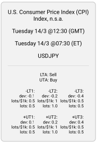

Im obigen Beispiel sehen Sie, dass -LT3 & +UT3 eine geringere Lot Size haben als die Trigger mit geringeren Abweichungen (-LT2 & +UT2). Dies liegt daran, dass die Korrelationswerte für diese Auslöser/Trigger trotz größerer Abweichung/Deviation tatsächlich niedriger waren.

In diesem Fall sollten diese Trigger weggelassen werden, sodass in diesem Beispiel nur -LT1, -LT2, +UT1 und +UT2 angezeigt werden.

Um diesem komischen Verhalten Rechnung zu tragen, dass größere Abweichungen (Deviations) manchmal zu niedrigeren Korrelationswerten führen (der gesunde Menschenverstand würde sagen, dass dies nicht passieren sollte, aber es passiert doch), könnte ich auch den Ersteller des Haawks News Trader-Programms dafür bezahlen, sein Programm so zu ändern, dass die Abweichung zwischen zwei Werten liegen kann und nicht nur über oder unter einem Wert.

Wenn sein Programm diese Parameter akzeptieren könnte, dann wäre es möglich, nur dann einen Handel zu tätigen, wenn die Abweichung zwischen -0.2 und -0.4 für -LT2 liegt, anstatt alles unter 0.4. Für +UT2 wäre es alles zwischen +0.2 und +0.4.

Das deckt so ziemlich alles ab, was mir zu dieser Handelsstrategie einfiel (aber vielleicht habe ich auch etwas vergessen, also fragen Sie mich ruhig). Ich denke, sie ist bereit, mit dem Handel zu beginnen, aber sobald ich den EMA auf die Korrelationswerte anwende, wird sie noch besser sein. Die Dinge können sich im Laufe der Zeit weiterentwickeln, und es wird wichtig sein, zu beobachten, wie sie sich entwickelt, und sie bei Bedarf anzupassen.
