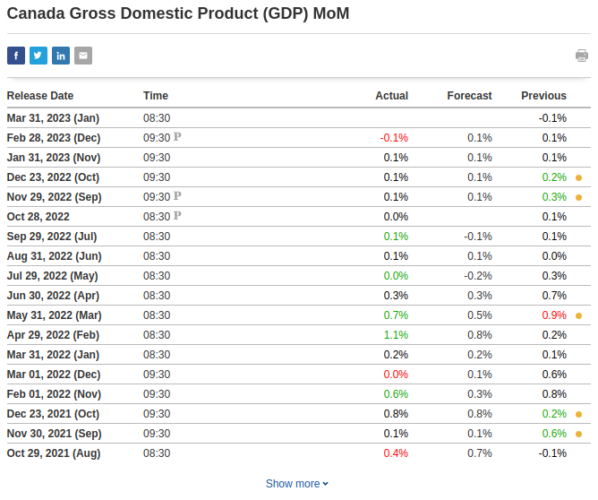

# News Trading System erklärt

## Intro

In diesem Dokument werde ich das System erläutern, das ich für den Handel mit Wirtschaftsnachrichtenindikatoren auf dem Forexmarkt entwickle. Das Hauptprinzip besteht darin, dass es verschiedene geplante Wirtschaftsstatistiken gibt, die regelmäßig veröffentlicht werden und die sich auf die Kurse des Marktes auswirken. Wenn Sie die veröffentlichten Zahlen kennen, können Sie fundierte Vorhersagen darüber machen, in welche Richtung sich der Preis bewegen wird. Da der Kurs sehr schnell reagiert, ist es wichtig, so schnell wie möglich in den Handel einzusteigen, um die Bewegung zu erfassen.

## Was dieses System nicht ist

Es ist erwähnenswert, dass die große Mehrheit der Handelsstrategien die technische Analyse (TA) beinhaltet. Das bedeutet im Wesentlichen, dass man sich die Kurscharts ansieht und Indikatoren wie RSI, MACD und andere hinzufügt, um vorherzusagen, in welche Richtung sich der Preis bewegen wird. Die meisten Händler, die sich ausschließlich auf die technische Analyse stützen, verlieren auf lange Sicht. Wahrscheinlich verwenden etwa 95 % der Händler die technische Analyse und etwa 95 % der Händler verlieren. Langfristig kann man auf dem Markt nur gewinnen, wenn man einen Vorteil hat, und das ist mit der technischen Analyse allein unmöglich.

## Wie ich von dieser Strategie erfahren habe

Wenn Sie auf youtube oder google nach Videos über algorithmische Handelsempfehlungen suchen, geht es praktisch immer um die technische Analyse. Nicht nur das, sondern der allgemeine Ratschlag lautet, den Handelsalgorithmus während Nachrichtenereignissen abzuschalten, weil er "unvorhersehbare" Kursbewegungen verursacht. Unvorhersehbar sind sie jedoch nur durch das Paradigma der technischen Analyse. Nachdem ich das schon oft gesehen habe, hat mich das zum Nachdenken gebracht:

### Warum bewegt sich der Kurs immer noch, wenn alle sagen, dass sie während dieser Nachrichtenereignisse den Handel ausschalten sollen?

Der Kurs kann sich nur bewegen, wenn gehandelt wird, also gibt es eindeutig einige, die mit den Nachrichten handeln. Aber wer? Wenn Sie versuchen, dies herauszufinden, werden Sie im Internet nicht viele Informationen finden. Daraus lässt sich ableiten, dass es sich bei den Personen, die während der Nachrichten handeln und somit die Kursbewegungen verursachen, höchstwahrscheinlich um institutionelle Händler und nicht um Kleinanleger (retail traders) handelt.

## Welche Art von Nachrichten bewegt den Markt?

Unter `investing.com/economic-calendar/` finden Sie eine umfangreiche Liste von Ereignissen, die sich auf den Markt auswirken:

For most events, there are three figures: Actual, Forecast & Previous
Für die meisten Ereignisse gibt es drei Zahlen: Actual (Ist), Forecast (Prognose) und Previous (Vorherige).

- **Actual**
  Dies ist die Zahl, die zur geplanten Freigabezeit freigegeben wird.
- **Forecast**
  Diese Zahl stellt den Durchschnitt/Konsens der Vorhersagen dar, die Wirtschaftswissenschaftler in aller Welt gemacht haben.
- **Previous**
  Dies ist die Zahl aus der vorherigen Version

Die wichtigsten sind die Forecast und die Actual Zahl. Was den Markt tatsächlich in Bewegung bringt, ist, wenn die Actual Zahl von der Forecast abweicht. Betrachten wir als Beispiel das monatliche BIP Kanadas (Canada GDP MoM):

Jedes Mal, wenn die Actual/tatsächliche Zahl höher als die Forecast/Vorhersage war, wird die Zahl in grün angezeigt. Jedes Mal, wenn sie niedriger war als die Vorhersage, wird sie in rot angezeigt.

Beim BIP (GDP) ist eine höher als erwartete Zahl positiv, d.h. "bullish" für die zugrunde liegende Währung, in diesem Fall den Kanadischen Dollar (CAD). Daher sollte eine höhere Abweichung den CAD-Kurs steigen lassen, und eine niedriger als erwartete Zahl ist negativ, d. h. "bärisch", was den Kurs fallen lassen sollte. Wenn es keine Abweichung gibt, d.h. wenn die tatsächliche Zahl mit der Prognose übereinstimmt, dann gibt es keinen Handelsaufbau.

Wenn Sie tatsächlich mit diesem Ereignis handeln wollten, wäre das zu verwendende Symbol/Währungspaar (Currency Pair) USDCAD. In jedem Währungspaar gibt es zwei Währungen: die Basiswährung (Base Currency) und die Kurswährung (Quote currency). Manchmal wird zwischen den Währungen ein "/" geschrieben, z. B. USD/CAD.

Die Basiswährung (base currency) ist die erste, die USD in USD/CAD ist, und die Kurswährung (quote currency) ist die zweite, die CAD ist. Der Preis von USDCAD ist die Menge an CAD, die Sie benötigen, um 1 USD zu kaufen.

* Der Wechselkurs (exchange rate) kann von verschiedenen Faktoren beeinflusst werden, z. B. von Änderungen der Zinssätze, Wirtschaftsindikatoren, geopolitischen Ereignissen und der Marktstimmung. Diese Faktoren können die Nachfrage und das Angebot der Währungen des Paares beeinflussen und sich somit auf ihren relativen Wert und den Wechselkurs auswirken.
* Beim Währungspaar USD/JPY ist der USD die Basiswährung (base currency), so dass der Wechselkurs angibt, wie viele JPY Sie benötigen, um 1 USD zu kaufen. Wenn der Wechselkurs 110.00 beträgt, müssen Sie 110 JPY ausgeben, um 1 USD zu kaufen. Positive Nachrichten für den USD können den Wechselkurs steigen lassen, während negative Nachrichten ihn sinken lassen können. Sie können mit USDJPY handeln, indem Sie je nach Ihrer Einschätzung des Marktes long (kaufen/buy) oder short (verkaufen/sell) gehen.
* Beim Währungspaar USD/CAD ist der USD die Basiswährung (base currency) und der CAD die Kurswährung (quote currency). Der Wechselkurs gibt also an, wie viel CAD Sie benötigen, um 1 USD zu kaufen. Wenn der Wechselkurs zum Beispiel 1.25 beträgt, müssen Sie 1.25 CAD ausgeben, um 1 USD zu kaufen. Wenn Sie also 100 CAD haben, können Sie nur 80 USD kaufen, wenn der Wechselkurs 0.80 beträgt. Positive Nachrichten für den CAD können den Wechselkurs sinken lassen, während negative Nachrichten ihn steigen lassen können. Wie beim USDJPY können Sie auch beim USDCAD je nach Ihrer Markteinschätzung long oder short gehen.
* Wenn die zugrunde liegende Währung die **Basiswährung (base currency)** des Paares ist (z.B. **USD** in **USD**JPY) und es gibt:
  * **positive Nachrichten:** der Preis steigt
  * **negative Nachrichten:** der Preis sinkt
* Wenn die zugrunde liegende Währung die **Kurswährung (quote currency)** des Paares ist (z.B. **CAD** in USD**CAD**) und es gibt:
  * **positive Nachrichten:** der Preis sinkt
  * **negative Nachrichten:** der Preis steigt
* Wenn Sie mit einem Währungspaar handeln, spekulieren Sie auf die Entwicklung des Wechselkurses. Wenn Sie glauben, dass die Basiswährung (base currency) gegenüber der Kurswährung (quote currency) aufwerten wird, können Sie das Paar kaufen (long gehen). Wenn Sie glauben, dass die Basiswährung (base currency) gegenüber der Kurswährung (quote currency) an Wert verlieren wird, können Sie das Paar verkaufen (short gehen). Der Gewinn (profit) oder Verlust (loss), den Sie erzielen, hängt von der Differenz zwischen dem Einstiegs- und dem Ausstiegskurs (Entry & Exit price) (auch bekannt als open & close price) des Handels und dem Umfang Ihrer Position ab (Position bedeutet nur einen offenen Handel/Trade).

## Was der Preis ist und warum er sich bewegt

Auf dem Forex-Markt wird der aktuelle Kurs eines Währungspaares durch die Schnittmenge der Geld- und Briefkurse im Orderbuch bestimmt. Das Orderbuch ist eine Echtzeit-Anzeige aller Kauf- und Verkaufsaufträge für ein bestimmtes Währungspaar zu verschiedenen Kursniveaus.

Wenn ein Händler einen buy limit order (Kauf-Limit-Order) erteilt, erstellt er ein 'bid' (Gebot) im Orderbuch (orderbook), das den höchsten Preis darstellt, den er für das Währungspaar zu zahlen bereit ist. Wenn ein Händler eine sell limit order (Verkauf-Limit-Order) platziert, erstellt er eine 'ask' (Nachfrage) im Orderbuch, die den niedrigsten Preis darstellt, den er für das Währungspaar zu akzeptieren bereit ist.

Das Orderbuch enthält alle 'bids' und 'asks' in Echtzeit, geordnet nach Preisniveau. Das beste bid ist der höchste Preis, zu dem ein Käufer bereit ist, das Währungspaar zu kaufen, während die beste ask der niedrigste Preis ist, zu dem ein Verkäufer bereit ist, das Währungspaar zu verkaufen.

Der aktuelle Kurs des Währungspaares basiert immer auf zwei Kursen: dem besten ask und dem besten bid. Der aktuelle Marktpreis, der auf einem Preisticker angezeigt wird, ist in der Regel der Mittelpunkt (mid-point) zwischen dem besten Brief- und dem besten Geldkurs. Dies ist jedoch nicht der Preis, zu dem Ihre Aufträge ausgeführt (filled) werden. Das beste bid stellt den höchsten Preis dar, zu dem jemand bereit ist, das Währungspaar zu kaufen, während die beste ask den niedrigsten Preis darstellt, zu dem jemand bereit ist, das Währungspaar zu verkaufen. Der aktuelle Marktpreis für die tatsächliche Ausführung eines Handels ist also der höchste Preis, den jemand zu zahlen bereit ist (bestes bid), und der niedrigste Preis, den jemand zu einem bestimmten Zeitpunkt zu verkaufen bereit ist (beste ask). Zwischen dem besten ask und dem besten bid klafft in der Regel eine Lücke, die als "Spread" bezeichnet wird.

### Auftragsarten (Order Types)

- **Market Orders (Marktaufträge)** werden sofort zum besten verfügbaren Preis ausgeführt, entweder zum besten ask für einen Market Buy Order (Marktkaufauftrag) oder zum besten bid für einen Market Sell Order (Marktverkaufsauftrag). 
  - Wenn ein Händler einen Marktauftrag zum **Buy (Kauf)** des Währungspaares erteilt (Market Buy Order), wird sein Auftrag zum aktuell besten **ask** preis ausgeführt.
  - Bei einem market **sell** order (Marktauftrag **Verkauf**) wird der Auftrag zum aktuell besten **bid** preis ausgeführt.
- **Limit Orders (Limitaufträge)** werden ausgeführt, wenn der Marktpreis ein bestimmtes Preisniveau erreicht.

Wenn es auf einem bestimmten Kursniveau mehr Käufer als Verkäufer gibt, kann der Kurs des Währungspaares steigen, da die Käufer um den Kauf der Währung konkurrieren. Umgekehrt kann der Preis des Währungspaares fallen, wenn es auf einem bestimmten Preisniveau mehr Verkäufer als Käufer gibt, da die Verkäufer um den Verkauf der Währung konkurrieren.

Zusammenfassend lässt sich sagen, dass der aktuelle Kurs eines Forex Paar/Symbol durch die Schnittmenge der bids und der asks im Orderbuch bestimmt wird. Im Orderbuch werden alle Kauf- und Verkaufsaufträge (Buy & Sell orders) für das Währungspaar zu verschiedenen Kursniveaus angezeigt, und das beste bid und die beste ask bestimmen den aktuellen Marktpreis, d. h. den höchsten Preis, den jemand zu zahlen bereit ist (bestes bid), und den niedrigsten Preis, den jemand zu einem bestimmten Zeitpunkt zu verkaufen bereit ist (beste ask).

### Wie der Preis gemessen wird

Ein Pip (kurz für "percentage in point" oder "price interest point") ist angeblich die kleinste Einheit der Kursbewegung eines Währungspaares. Er entspricht bei den meisten Währungspaaren der vierten Dezimalstelle, außer bei einigen Währungspaaren, die eine andere Dezimalstelle haben.

Wenn das Währungspaar EUR/USD beispielsweise bei 1.2000 gehandelt wird und dann auf 1.2001 steigt, ist dies eine Bewegung von einem Pip. Ähnlich verhält es sich mit dem Währungspaar USD/JPY, das bei 108.00 gehandelt wird und dann auf 107.99 fällt: eine Bewegung von einem Pip.

Pips werden verwendet, um den Gewinn oder Verlust eines Forexhandels zu berechnen. Der Umfang des Handels (Lot size), die Anzahl der gewonnenen oder verlorenen Pips und das gehandelte Währungspaar bestimmen die Höhe des Gewinns oder Verlusts. Daher ist es für Forexhändler wichtig, das Konzept der Pips zu verstehen, um potenzielle Gewinne und Verluste genau zu berechnen.

Es ist jedoch erwähnenswert, dass viele Forex-Broker "Fraktionierte Pips" oder "Pipettes" (auch "Points" ("Punkte") genannt) verwenden, die eine fünfte Dezimalstelle darstellen, um genauere Preise für Währungspaare zu liefern. In diesem Fall ist die wirklich kleinste Einheit der Kursbewegung 1 Point. Zehn Points entsprechen einem Pip.

### Lots

Für jeden Kauf- oder Verkaufsauftrag muss die Anzahl der Lots (auch 'Lot Size' oder 'Position Size' genannt) angegeben werden. Ein Lot bezieht sich auf die Standardhandelsgröße für ein bestimmtes Währungspaar. Die Größe eines Lots variiert je nach Währungspaar und kann von 1000 Einheiten der Basiswährung bis zu 100,000 Einheiten oder mehr reichen. Ein Standard-Lot für das Währungspaar EUR/USD beträgt zum Beispiel 100,000 Einheiten des Euro.

Die Lot Size, mit der Sie handeln, hat einen direkten Einfluss auf die Höhe des Gewinns oder Verlusts, den Sie mit einer bestimmten Anzahl von Pips erzielen können. Dies liegt daran, dass der Gewinn oder Verlust aus einem Handel auf der Grundlage der Größe der Position, die Sie einnehmen, berechnet wird, die durch die Lot Size bestimmt wird.

Nehmen wir zum Beispiel an, Sie kaufen 1 Lot EUR/USD zu 1.2000 und der Kurs steigt auf 1.2020, was einer Bewegung von 20 Pips entspricht. Wenn Sie den Handel zu diesem Preis schließen, würden Sie einen Gewinn von $200 erzielen, da ein Standardlot von EUR/USD $100,000 wert ist und jeder Pip $10 wert ist. Wenn Sie 0.1 Lots von EUR/USD kaufen und der Kurs sich um 20 Pips bewegt, würden Sie einen Gewinn von $20 erzielen, da jeder Pip $1 wert ist.

Die Lot Size, mit der Sie handeln, ist ein wichtiger Faktor, den Sie bei der Berechnung potenzieller Gewinne und Verluste im Devisenhandel berücksichtigen müssen, da sie sich direkt auf die Höhe des Gewinns oder Verlusts auswirkt, den Sie mit einer bestimmten Anzahl von Pips erzielen können. Händler müssen ihre Lot Size sorgfältig im Verhältnis zu ihrer Handelsstrategie und Risikotoleranz abwägen.

### Spread (Spanne)

Die Spread im Forexhandel bezieht sich auf die Differenz zwischen dem Bidpreis und dem Askpreis eines Währungspaares. Der Bidpreis ist der Preis, zu dem ein Käufer bereit ist, das Währungspaar zu kaufen, während der Askpreis der Preis ist, zu dem ein Verkäufer bereit ist, das Währungspaar zu verkaufen.

Der Spread ist im Wesentlichen die Kosten des Handels und wird in der Regel in Pips gemessen. Der Spread wird von den Liquiditätsanbietern (Liquidity Providers or 'LPs'), wie Banken und anderen Finanzinstituten, festgelegt und von verschiedenen Faktoren wie Marktvolatilität (Market Volatility), Liquidität (Liquidity) sowie Angebot und Nachfrage (Supply & Demand) beeinflusst.

Liegt der Bidpreis für EUR/USD beispielsweise bei 1.2000 und der Askpreis bei 1.2002, beträgt der Spread 2 Pips. Das bedeutet, dass ein Händler, der EUR/USD kaufen möchte, den Askpreis von 1.2002 zahlen muss, während ein Händler, der EUR/USD verkaufen möchte, den Bidpreis von 1.2000 erhält.

Bei Wirtschaftsnachrichten weitet sich die Bid-Ask-Spread häufig aus und die verfügbare Liquidität nimmt ab, da möglicherweise weniger Marktteilnehmer bereit sind, das Währungspaar zu den aktuellen Kursen zu kaufen oder zu verkaufen.

Der Rückgang der Liquidität bei Wirtschaftsnachrichten kann zu erhöhter Volatilität und Slippage führen, da sich die Bid-Ask-Spread ausweitet und es schwieriger wird, Trades zum gewünschten Kursniveau auszuführen. Dies kann es für Händler schwieriger machen, schnell und effizient in Positionen ein- oder auszusteigen, was das Risiko von Verlusten erhöhen kann.

Aus diesem Grund wird bei dieser Strategie ein Trailing-Stoploss von 5 Pips verwendet, d. h. der Kurs muss sich nur um 5 Pips bewegen, um die Gewinnschwelle (break even) zu erreichen, und alles, was darüber liegt, ist Gewinn.

### Liquidity (Liquidität)

Im Zusammenhang mit dem Forexhandel wirkt sich die Liquidität insbesondere auf das Orderbuch aus, das eine Echtzeitliste der Kauf- und Verkaufsaufträge für ein bestimmtes Währungspaar darstellt. Der Forexmarkt ist mit einem täglichen Handelsvolumen von über 6 Billionen Dollar der liquideste Markt der Welt. Eine hohe Liquidität auf dem Forexmarkt führt zu einem robusten und effizienten Orderbuch, was sich wiederum auf die Handelsbedingungen und die Chancen für die Händler auswirkt.

Auf einem hochliquiden Forexmarkt ist eine große Zahl von Käufern und Verkäufern aktiv am Handel beteiligt. Infolgedessen ist das Orderbuch mit zahlreichen Kauf- und Verkaufsaufträgen (Buy & Sell Orders) auf verschiedenen Kursniveaus gefüllt. Diese Fülle an Aufträgen ermöglicht es den Händlern, problemlos in Positionen ein- und auszusteigen, ohne dass es zu erheblichen Kursbewegungen kommt oder der Marktpreis des Währungspaares beeinflusst wird. Auf einem liquiden Markt sind die Bid-Ask-Spread im Auftragsbuch eng, d. h. die Differenz zwischen dem höchsten Preis, den ein Käufer zu zahlen bereit ist (Bidpreis), und dem niedrigsten Preis, den ein Verkäufer zu akzeptieren bereit ist (Askpreis), ist minimal. Enge Spreads senken die Gesamttransaktionskosten für Händler und machen den Handel kostengünstiger.

Im Gegensatz dazu führt eine geringe Liquidität auf dem Forexmarkt zu einem dünnen Orderbuch mit weniger Kauf- und Verkaufsaufträgen (Buy & Sell Orders). Dies kann zu größeren Bid-Ask-Spreads, erhöhter Slippage (die Differenz zwischen dem erwarteten Preis eines Geschäfts und dem Preis, zu dem es tatsächlich ausgeführt wird) und einer höheren Wahrscheinlichkeit von Kurslücken (plötzliche Sprünge des Marktpreises, ohne dass dazwischen ein Handel stattfindet) führen. Diese Faktoren können die Transaktionskosten erhöhen und zu volatileren Handelsbedingungen führen.

Die Liquidität des Forexmarktes wird von mehreren Faktoren beeinflusst, z. B. von geopolitischen Ereignissen, der Veröffentlichung von Wirtschaftsdaten, der Marktstimmung und den Handelszeiten. Die liquidesten Währungspaare sind die großen Paare wie EUR/USD, USD/JPY und GBP/USD, die im Vergleich zu weniger liquiden Paaren oder exotischen Währungen engere Spreads und stabilere Preise aufweisen. Eine hohe Liquidität auf dem Forexmarkt bietet Händlern letztlich bessere Handelsmöglichkeiten, eine schnellere Ausführung und geringere Preisauswirkungen.

### Stoploss (SL)

Ein Stop-Loss ist ein Parameter in einem Auftrag, der dazu dient, mögliche Verluste bei einer offenen Position zu begrenzen. Er kann jederzeit festgelegt und aktualisiert werden, wenn der Auftrag offen ist. Er legt ein bestimmtes Kursniveau fest, bei dem der Handel automatisch geschlossen wird, wenn sich der Markt gegen die Position bewegt, und hilft so, Verluste zu minimieren. Es ist ein gängiges Instrument des Risikomanagements, das von Händlern eingesetzt wird, um ihr Kapital zu schützen und das Risiko zu steuern.

### Trailing Stoploss (TSL)

Ein Trailing-Stop-Loss ist eine Art von Stop-Loss, der der Kursbewegung eines Vermögenswerts in eine bestimmte Richtung folgt und es Händlern ermöglicht, Gewinne zu sichern und gleichzeitig mögliche Verluste zu begrenzen. Er funktioniert, indem er einen bestimmten Abstand zum aktuellen Marktpreis einhält. Wenn der Preis beginnt, sich gegen die Position zu bewegen, wird der Auftrag ausgelöst und die Position geschlossen. Dies ist ein nützliches Instrument auf schnelllebigen Märkten, auf denen die Kursbewegungen volatil und unvorhersehbar sein können.

Wenn sich der Kurs beispielsweise um 10 Pips bewegt und Sie einen Trailing-Stoploss von 5 Pips haben, dann würde der Stoploss bei 5 Pips vom Einstiegskurs des Handels gesetzt werden. Wenn sich der Kurs um 20 Pips bewegt und Sie einen TSL von 5 Pips haben, dann würde der Stoploss bei 15 Pips vom Einstiegskurs des Handels angesetzt werden.

Der Trailing-Stoploss wird ständig aktualisiert, wenn sich der Kurs weiter vom Einstiegskurs entfernt, bis er sich schließlich umkehrt und der Stoploss nicht mehr aktualisiert wird, und schließlich wird der Auftrag zu dem Kurs geschlossen, auf den der Stoploss gesetzt wurde.

### Volatility (Volatilität)

Beim Forexhandel bezieht sich die Volatilität auf das Ausmaß der Kursschwankungen eines Währungspaares innerhalb eines bestimmten Zeitraums. Eine hohe Volatilität kann Chancen für größere Gewinne bieten, erhöht aber auch das Verlustrisiko. Eine niedrige Volatilität begrenzt die Handelsmöglichkeiten, verringert aber auch das Verlustrisiko.

Im Vergleich zu Forex ist die Volatilität bei Bitcoin und anderen Kryptowährungen im Allgemeinen höher und unvorhersehbarer. Dies liegt daran, dass der Kryptomarkt noch relativ neu ist und eine geringere Marktkapitalisierung hat, was bedeutet, dass er leichter durch Ereignisse wie regulatorische Änderungen oder die Marktstimmung beeinflusst werden kann.

## Latency/Speed (Latenz/Geschwindigkeit)

- Da sich der Kurs in der Regel in weniger als einer Sekunde nach der Bekanntgabe dieser Ereignisse bewegt, muss man so schnell wie möglich sein, um in den Handel einzusteigen, bevor sich der Kurs bewegt. Dies kann nur erreicht werden, indem ein Computerprogramm auf einem Server ausgeführt wird, der mit dem Broker, bei dem Sie handeln, 'co-located' ist.
- Von Co-Location spricht man, wenn sich Ihr Server physisch im selben Gebäude befindet wie der Server des Brokers. Dies bedeutet, dass die Latenzzeit, d. h. die Zeit, die die Daten für die Übertragung von einem Punkt zum anderen im Internet benötigen, geringer ist.

  - Stellen Sie sich das so vor, als würden Sie einen Brief mit der Post verschicken. Wenn Sie weit entfernt von der Person wohnen, an die Sie den Brief schicken, dauert es länger, bis der Brief ankommt, als wenn die Person nur die Straße runter wohnt. Ähnlich verhält es sich, wenn Sie Daten über das Internet verschicken und der Server, an den Sie die Daten senden, weit entfernt ist: Es dauert länger, bis die Daten ankommen, als wenn der Server in der Nähe steht.
  - Diese Verzögerung bei der Datenübertragung wird als Ping/Latenz bezeichnet. Sie wird in Millisekunden (ms) gemessen und kann durch eine Vielzahl von Faktoren beeinflusst werden, z. B. Entfernung, Netzüberlastung und Qualität der Internetverbindung.
  - Im Zusammenhang mit dem Forexhandel ist eine niedrige Latenzzeit wichtig, da sie es den Händlern ermöglicht, Geschäfte schneller auszuführen und Marktchancen zu nutzen, bevor es andere tun.
  - Die meisten Forex-Broker haben ihre Server in einem der Equinix-Rechenzentren auf der ganzen Welt untergebracht. Die beiden wichtigsten befinden sich in London (Equinix LD4) und New York (Equinix NY4)
- Ein schneller Nachrichten-Feed (news feed) mit niedriger Latenzzeit ist ebenfalls erforderlich, um die Nachrichten schneller zu erhalten, als sich die Kurse bewegen. Ein Dienstleister hierfür ist Haawks, der Abonnements mit niedriger Latenz bei vielen der Institutionen hat, die die Nachrichten in den USA, Kanada und einigen anderen Ländern veröffentlichen, z. B. das US Bureau of Labor Statistics (BLS), Bureau of Economic Analysis (BEA), US Department of Commerce, US Census Bureau, Statistics Canada, Bank of Canada, Statistics Norway, Norges Bank, SCB - Statistics Sweden, und mehr

  - Haawks News-Feed ist auf beiden Equinix-Rechenzentren LD4 und NY4 verfügbar

### Slippage

Die Kursslippage (price slippage) bezieht sich auf die Differenz zwischen dem erwarteten Preis eines Geschäfts und dem Preis, zu dem das Geschäft tatsächlich ausgeführt wird.

Beim Handel mit geringer Latenz, bei dem Händler Hochgeschwindigkeits-Computeralgorithmen zur schnellen Ausführung von Geschäften verwenden, kann es zu Kursabweichungen kommen, wenn sich die Marktbedingungen schnell ändern oder eine hohe Volatilität vorliegt, z. B. bei Nachrichtenereignissen (news events). Dies kann zu einer Verzögerung zwischen dem Zeitpunkt, an dem der Handel eingeleitet wird, und dem Zeitpunkt seiner Ausführung führen, wobei sich der Marktpreis in dieser Zeit vom erwarteten Preis entfernt haben kann.

Wenn ein Händler beispielsweise einen Auftrag zum Kauf eines Währungspaares zu einem bestimmten Preis erteilt und es zu einer plötzlichen Marktverschiebung kommt, kann der tatsächliche Ausführungskurs höher sein als der erwartete Kurs. Dieser Preisunterschied wird als Slippage bezeichnet.

Beim Handel mit MT4 lässt sich Slippage zwar nicht vollständig vermeiden, aber durch eine Verbindung mit niedriger Latenz zum Server des Brokers (die durch einen Co-Located Server erreicht wird) und eine schnelle Handelsausführung kann es reduziert werden. Im Zusammenhang mit dem Nachrichtenhandel ist ein News-Feed mit niedriger Latenz, wie er von Haawks bereitgestellt wird, unerlässlich, um den Handel so schnell wie möglich auszuführen und Slippage zu vermeiden.

## Forex Brokers

Forexmakler (Forex Brokers) sind Unternehmen, die Händlern Zugang zum Forexmarkt verschaffen, wo Währungen gekauft und verkauft werden. Diese Broker fungieren als Vermittler zwischen den Händlern und dem Markt, führen in ihrem Namen Geschäfte aus und bieten ihnen eine Plattform für den Zugang zum Markt.

Forex-Broker sind aus mehreren Gründen notwendig:

1. Zugang zum Markt: Forex-Broker bieten Händlern eine Plattform für den Zugang zum Forexmarkt, die Einzelhändlern (Retail Traders) sonst nicht zur Verfügung steht. Ohne einen Broker hätten die Händler keinen direkten Zugang zum Markt.
2. Ausführung von Geschäften (Trade Execution): Forex-Broker führen die Geschäfte im Namen der Händler aus. Wenn ein Händler ein Währungspaar kaufen oder verkaufen möchte, erteilt er seinem Broker einen Auftrag, der den Handel dann auf dem Markt ausführt. Der Broker sorgt dafür, dass der Handel zum bestmöglichen Preis und rechtzeitig ausgeführt wird.
3. Leverage (Hebelwirkung): Forex-Broker bieten eine Hebelwirkung an, die es Händlern ermöglicht, mit einem relativ kleinen Kapitalbetrag eine große Position zu kontrollieren. Da größere Lot Size möglich sind, kann dies den Wert eines Pips erhöhen und somit den Gewinn und Verlust jedes Pips steigern. Auf diese Weise können Händler potenziell größere Gewinne erzielen, als es ihnen mit ihrem eigenen Kapital möglich wäre. Es ist jedoch zu beachten, dass die Leverage auch das potenzielle Verlustrisiko erhöhen kann.

Insgesamt sind Forex Brokers für Händler notwendig, um Zugang zum Forexmarkt zu erhalten und Geschäfte abzuschließen. Sie stellen eine Plattform zur Verfügung, führen den Handel aus und bieten Leverage.

### Arten von Brokers

Es gibt drei Haupttypen von Gewinnmodellen für Forex-Broker: STP, ECN und Market Maker.

1. Straight Through Processing (STP):
  - Ein STP-Broker ist eine Art von Forex-Broker, der seinen Kunden direkten Marktzugang (Direct Market Access or DMA) bietet. Das bedeutet, dass der Broker nicht als Market Maker fungiert, sondern die Kundenaufträge direkt an Liquiditätsanbieter weiterleitet. Ein Liquiditätsanbieter ist in der Regel ein großes Finanzinstitut, z. B. eine Bank oder ein anderer Broker, der Preise und Liquidität auf dem Forexmarkt bereitstellt.

  - Wenn ein Kunde einen Auftrag an einen STP-Broker erteilt, leitet dieser den Auftrag an einen Liquiditätsanbieter weiter, der zu diesem Zeitpunkt den besten verfügbaren Preis bietet. Dies ermöglicht dem Kunden eine wettbewerbsfähige Preisgestaltung und Ausführung, da er Zugang zum realen Markt hat. Der Broker verdient seinen Gewinn, indem er eine Provision oder einen Aufschlag auf den Spread erhebt.
  - Liegt der Bidpreis für EUR/USD beispielsweise bei 1.1000 und der Askpreis bei 1.1001, beträgt der Spread 1 Pip. Wenn ein Kunde einen Auftrag an einen STP-Broker erteilt, schlägt der Broker in der Regel einen kleinen Aufschlag auf die Spanne auf, um einen Gewinn zu erzielen. Der Aufschlag ist in der Regel transparent und wird dem Kunden vor der Ausführung des Geschäfts mitgeteilt.

2. Electronic Communication Network (ECN):
  - Ein ECN-Broker ist einem STP-Broker insofern ähnlich, als er seinen Kunden direkten Marktzugang bietet. Allerdings erlaubt ein ECN-Broker seinen Kunden auch, miteinander zu handeln. Das bedeutet, dass die Kunden sowohl als Käufer als auch als Verkäufer auf dem Markt auftreten können und der Broker nicht als Gegenpartei bei ihren Geschäften auftritt. Der Broker erwirtschaftet seinen Gewinn, indem er für jeden Handel eine Provision erhebt.
3. Market Maker:
  - Ein Market Maker ist eine Art von Broker, der für seine Kunden einen Markt schafft, indem er die Gegenseite ihrer Geschäfte übernimmt. Das heißt, wenn ein Kunde ein Währungspaar kauft, verkauft der Broker dasselbe Währungspaar an den Kunden und umgekehrt. Der Broker erzielt seinen Gewinn, indem er die Differenz zwischen dem Bid und dem Ask, auch bekannt als Spread, in die Tasche steckt. Market Maker können auch andere Handelspraktiken anwenden, um ihr Risiko zu steuern, wie z. B. die Absicherung ihrer Positionen auf dem Interbankenmarkt.

Zusammenfassend bieten STP- und ECN-Broker Kunden direkten Marktzugang und ihre Gewinne, indem sie eine Provision oder einen Aufschlag auf den Spread erheben. Market Maker hingegen schaffen einen Markt für ihre Kunden, indem sie die Gegenseite ihrer Trades aufnehmen und ihre Gewinne erzielen, indem sie den Spread einstecken.

Beim Market-Maker-Modell funktioniert der Broker die Gegenseite der Trades seiner Kunden, was bedeutet, dass der Broker von den Verlusten seiner Kunden profitiert. Dies schafft einen potenziellen Interessenkonflikt zwischen dem Broker und seinen Kunden, da der Broker Anreize erhalten kann, Preise zu manipulieren oder Maßnahmen zu ergreifen, die eher dem Endergebnis des Brokers als den besten Interessen des Kunden zugute kommen. Zum Beispiel kann ein Market Maker den Spread erweitern oder die Auftragsausführung verzögern, um seine Gewinne zu steigern.

Im Gegensatz dazu bieten STP- und ECN-Modelle den Kunden direkten Marktzugang (Direct Market Access oder DMA), was bedeutet, dass der Broker nicht die Gegenseite der Geschäfte seiner Kunden einnimmt. Stattdessen tritt der Broker als Vermittler auf und gibt die Aufträge an Liquiditätsanbieter oder andere Händler am Markt weiter. Dadurch wird der potenzielle Interessenkonflikt zwischen dem Broker und seinen Kunden beseitigt, da der Broker nicht von den Verlusten seiner Kunden profitiert.

Die STP- und ECN-Modelle gelten im Allgemeinen als transparenter, da sie es den Kunden ermöglichen, die tatsächliche Markttiefe zu sehen und an der Preisfindung teilzunehmen. Das bedeutet, dass Kunden die Bid- und Askpreis anderer Marktteilnehmer sehen und ihre Aufträge entsprechend platzieren können, was zu einer fairen Preisgestaltung beitragen und Preismanipulationen verhindern kann.

## Trading Software (Handelssoftware)

### MetaTrader 4

MetaTrader 4 (MT4) ist eine beliebte Handelsplattform, die von Händlern für den Zugang zu und den Handel mit Finanzmärkten verwendet wird. Es wurde von MetaQuotes Software entwickelt und 2005 veröffentlicht.

MT4 bietet Händlern eine Reihe von Tools und Funktionen, die ihnen helfen, die Märkte zu analysieren, Handelsstrategien zu entwickeln und auszuführen und ihre Trades zu verwalten. Einige der wichtigsten Funktionen von MT4 sind:

- **Charting- und technische Analysetools:** MT4 bietet Händlern eine Reihe von Charttools und Indikatoren, die ihnen bei der Analyse von Markttrends helfen.
- **Automatisierter Handel:** MT4 ermöglicht es Händlern, ihre Handelsstrategien mithilfe von Expert Advisors (EAs) zu entwickeln und zu automatisieren, bei denen es sich um Computerprogramme handelt, die in der Lage sind, Trades auf der Grundlage vordefinierter Regeln und Bedingungen auszuführen.
- **Mobiler Handel**: MT4 ist als mobile App verfügbar, die es Händlern ermöglicht, auf ihre Konten zuzugreifen und unterwegs zu handeln.

### Haawks News Trader

  <iframe width="1265" height="496" src="https://www.youtube.com/embed/ZevwBfZjp6g" title="US Consumer Price Index (CPI) 10 November 2022 - Haawks G4A Low-Latency News Trading Data Feed" frameborder="0" allow="accelerometer; autoplay; clipboard-write; encrypted-media; gyroscope; picture-in-picture; web-share" allowfullscreen></iframe>

Die Haawks News Trader-Software wird mit dem Haawks-Abonnement geliefert. Es stellt eine Verbindung zum Hawks-Newsfeed her und gibt Trades in MetaTrader 4 ein, wenn bestimmte Bedingungen erfüllt sind, die vom Benutzer festgelegt werden.

Für jedes Ereignis gibt es 6 Triggerpegel, die konfiguriert werden können:

- -LT1
- -LT2
- -LT3
- +UT1
- +UT2
- +UT3
- 'LT' steht für 'Lower Trigger' und wird ausgelöst, wenn die tatsächliche (Actual) Zahl niedriger ist als die prognostizierte (Forecast) Zahl.
- 'UT' stands for 'Upper Trigger' and is triggered when the actual number is higher than the forecast number.
- There is also 'LTA' & 'UTA' which stands for Lower Trigger Action & Upper Trigger Action. These can be set to either 'Buy' or 'Sell' depending on whether a higher deviation is bullish or bearish.

  - For example, for US Nonfarm Payrolls, a higher news deviation is bullish (positive) for USDJPY and a lower news deviation is bearish (negative) for USDJPY. Therefore, you would set 'LTA' to 'Sell' and 'UTA' to 'Buy'
  - For Canada GDP, a higher news deviation is bearish (negative) for USDCAD and a lower news deviation is bullish (positive) for USDCAD. Therefore you would set 'LTA' to 'Buy' and 'UTA' to Sell
- '-LT1', '-LT2', '-LT3', '+UT1', '+UT2' & '+UT3' each have their own deviation levels and lot sizes which can be set. This means that when the actual price comes out, the haawks news trader will calculate the deviation by subtracting the forecast number from the actual number. Then, it checks all of your triggers to see which one it matches. If it matches one of your triggers, it will open a new trade in MetaTrader 4 in the direction specified by 'LTA' & 'UTA', using the lot size specified for that trigger.

  - For example, for trading Canada GDP MoM, the triggers could be set like this:
    - -LT1: -0.1  |  0.5 lots
    - -LT2: -0.2  |  1 lot
    - -LT3: -0.3  |  1.5 lots
    - +UT1: +0.1  |  0.5 lots
    - +UT2: +0.2  |  1 lot
    - +UT3: +0.3  |  1.5 lots
      Then, let's say the forecast is 0.1 and the actual number is -0.1. This would make a deviation of -0.2 so '-LT2' would be triggered and it would open a trade of 1 lot in the buy direction because 'LTA' is set to 'Buy' for Canada GDP
  - In another example for trading US Nonfarm Payrolls,the triggers could be set like this:
    - -LT1: -25  |  0.5 lots
    - -LT2: -50  |  1 lot
    - -LT3: -90  |  1.5 lots
    - +UT1: +25  |  0.5 lots
    - +UT2: +50  |  1 lot
    - +UT3: +90  |  1.5 lots
      Then, let's say the forecast is 205 and the actual number is 311. That would make a deviation of +106 so '+UT3' would be triggered and it would open a trade of 1.5 lots in the buy direction because 'UTA' is set to 'Buy' for US Nonfarm Payrolls.

## Historic Data Analysis

In order to have a more informed and robust trading plan, I created a data analysis program which gets the historic news figures from investing.com, then gets the historic price (tick) data for the relevent trading pair at the exact time of each news release up to 15 minutes after each release, then generates metrics/statistics such as:

- the mean average pip movements
- the median pip movements
- the range of pip movements
- Three correlation scores (c_1, c_2 & c_3)

It then generates a pdf report for that indicator (e.g. Nonfarm Payrolls or Canada GDP)cand trading symbol (e.g. USDJPY or USDCAD).

Here are screenshots of the pdf report generated for Canada GDP MoM (Month over month):

Normally the correlation score gets higher as the deviation gets higher. The calculations for each trigger works like this:

1. Get the historic news data from investing.com for January 2017 and after
2. For each release date & time, download historic price data (tick data) from 5 minutes before release time until 15 minutes after release time. It shows the ask and bid prices at timestamps for every time the price moved which is usually many times per second. This comes as a .csv file which is a table:
   
3. For specified times after each release (time deltas) i.e.

- 1 second
- 2 seconds
- 3 seconds
- 4 seconds
- 5 seconds
- 10 seconds
- 15 seconds
- 20 seconds
- 25 seconds
- 30 seconds
- 45 seconds
- 1 minute
- 2 minutes
- 3 minutes
- 4 minutes
- 5 minutes
- 10 minutes
- 15 minutes
  the program gets the ask & bid prices at those times after each release, then calculates the pip movements relative to the price at the time of the release.

4. For each release, check which trigger level it matches.

- If the deviation is above a pre-defined level (e.g. trigger_1: +-0.1%) and below the trigger above it (e.g. trigger_2: +-0.2%) then it is added to the input data for that trigger (trigger_1).
- If it the last trigger e.g. trigger_4, then any data above that is added to the input data for that trigger

5. For each time delta (e.g. 1s, 2s, 3s, etc) calculate:

- The **range** of all pip movements at that time (e.g. from -5 pips to +45 pips)
- The **mean** average of all pip movements at that time (e.g. 15 pips). Calculated by adding up all of pip movements for each release in the current trigger, then dividing by the amount of them.
- The **median** average. Calculated by sorting all the pip movements from lowest to highest, then finding the one exactly in the middle.
- **Correlation 1 Score (c_1)**
  - The percentage of times the price moved in the expected direction.
  - `positive_count` = How many times the price (pip) movement is more than or equal to zero.
  - `negative_count` = How many times the price movement is less than zero
  - Every indicator has an expected direction based on whether there's bullish (positive) or bearish (negative) news. This information was saved earlier from investing.com.
    - If the price is expected to be **positive** then:
      `c_1 = positive_count ÷ (positive_count + negative_count)`
    - If the price is expected to be **negative** then:
      `c_1 = negative_count ÷ (positive_count + negative_count)`
- **Correlation 2 Score (c_2)**
  - The percentage of pips which moved in the expected direction.
  - `positive_sum` = All pips which moved in a positive direction added up
  - `negative_sum` = All pips which moved in a negative direction added up. Because this number is negative, it is multiplied by -1 to become a positive number so that it works with the equation below.
  - If the price is expected to be **positive** then:
    `c_2 = positive_sum ÷ (positive_sum + negative_sum )`
  - If the price is expected to be **negative** then:
    `c_2 = negative_sum ÷ (positive_sum + negative_sum)`
- **Correlation 3 Score (c_3)**
  - This is the mean average of c_1 & c_2
  - `c_3 = (c_1 + c_2) ÷ 2`

6. Calculate the total/averages for each trigger:

- **range:** the lowest number for any of the time deltas to the highest number for any of the time deltas
- **mean:** Add up the mean values for every time delta then divide by the number of time deltas (18)
- **median:** Add up the median values for every time delta then divide by 18
- **c_1:** Add up the c_1 values for every time delta then divide by 18
- **c_2:** Add up the c_2 values for every time delta then divide by 18
- **c_3:** Add up the c_3 Aftvalues for every time delta then divide by 18

## Ranking every indicator

Once I was able to create this analysis for individual indicators, then I decided to run the it on every indicator from haawks which has news data on investing.com and tick data from dukascopy available. That totals to 95 indicators which isn't all of them but it's still quite a lot.

I wrote a script in python called `ranker.py` which runs the analysis on each indicator and then finds the best trigger for each of them i.e. the trigger with the highest total/average c_3 score, then adds that to a list and outputs the results to an excel file called `ranker_results.xlsx`.

Then, I ordered them from highest c_3 to lowest c_3. There are:

- 15 indicators with a c_3 above 90
- 23 indicators with a c_3 between 80-90
- 23 indicators with a c_3 between 70-80
- 30 indicators with a c_3 below 70

The correlation (c_3) score can be thought of as a representation of how predictable each indicator has been historically (Based on data from January 2017 to February 2023). This implies that the indicator has a higher probability of moving in the expected direction when the c_3 score is higher. That is the hypothesis anyway, but this can only be confirmed by testing the strategy.

## Generating trading plans

Since the c_3 score is like a predictablity score, it makes sense to place larger trades when which uses larger lot sizes when the c_3 score is higher. I came up with the following lot sizes for each c_3 score:

- between **80** and **85**: **0.5** lots per $1000 account balance
- between **85** and **90**: **0.75** lots per $1000
- between **90** and **95**: **1** lot per $1000
- above **90**: **1.5** lots per $1000

I wrote another script which looks at the ranker results for any indicators with a c_3 score above 80, then checks the investing.com economic calendar to see if any of those are scheduled to be released in the next week.

Then, for each indicator which will be released in the next week, it generates recommended trigger deviations and lot sizes as inputs for the haawks news trader program like this:

So the weekly schedule will be a bunch of trigger recommendations like the one above:

In the above example, 'lots/$1k' and 'lots' are the same because it assumed an account balance of $1000. If the account balance was $2000, then the 'lots' would be double the amount of 'lots/$1k'

# Conclusion
That is essentially where I'm at with this project. I believe that trading these events with lot sizes proportional to the correlation score should make profit.

However, there are still some things which can be improved. For example, I have been emailing the creator of the haawks news trader program who has been trading the news for years. He was interested in my work, but one thing he said is that the reliability/predictability of indicators can change over time. The example he gave was Sweden's CPI, which according to him was good to trade about 3 years ago but now it's unreliable.

To solve this problem, I am planning to create another correlation score which is weighted more towards recent events instead of how it is now with all the events from 2017-2023 equally weighted. That would mean that if the all-time correlation score (what I currently have) is high, but for more recent events, the correlation score is lower, then it would use a smaller lot size.

This can be achieved by using an EMA (exponential moving average). Moving averages are used in technical analysis by applying them to price data.

There are different types of moving averages:
- SMA (Simple Moving Average) is a commonly used technical indicator in forex trading that calculates the average price of an asset over a specific period of time. It is called "simple" because it gives equal weight to each data point in the calculation. Traders use SMAs to identify trends and potential entry and exit points for trades.
- EMA (Exponential Moving Average) is also a commonly used technical indicator in forex trading that calculates the average price of an asset over a specific period of time. However, unlike the SMA, the EMA gives more weight to recent price data points, making it more sensitive to recent price changes. This means that the EMA may respond more quickly to changes in the market compared to the SMA. As a result, traders often use EMAs for shorter-term trading strategies, while SMAs are typically used for longer-term analysis.

Although EMAs are commonly used for price analysis, I will instead be applying it to the correlation scores for each trigger. This will make the correlation score more sensitive to recent events and should better reflect how the indicator has performed recently.

Beyond that, the creator of the haawks news trader program also told me he can modify his program to accept triggers from a database. That would mean this can be fully automated. The current workflow is to generate a weekly pdf report with the recommended triggers, and then manually input them into his program. However, with a database this could be done automatically.

Another thing to change is how the recommended triggers sometimes have higher deviations with lower correlation scores:

In the above example, you can see that -LT3 & +UT3 have a lower lot size than the triggers with lower deviations (-LT2 & +UT2). This is because despite the deviation being bigger, the correlation scores were actually lower for those triggers.

When this happens, it should ommit those triggers, so in this example it would only show -LT1, -LT2, +UT1 & +UT2.

To account for this weird behaviour of bigger deviations sometimes having lower correlation scores (common sense would say that this shouldn't happen but it does), I might also pay the creator of the haawks news trader program to modify his program so that the deviation has to be between two values instead of just above or below one value.

If his program could accept those parameters, then it would be possible to only make a trade when the deviation is between -0.2 and -0.4 for -LT2 instead of anything below 0.4. For +UT2 it would be anything between +0.2 and +0.4.

That pretty much covers everything I could think of which relates to this trading strategy. I think once I apply the EMA to the correlation scores, it will be ready to start trading with. Things may evolve over time and it will be important to observe how it performs and adjust as needed