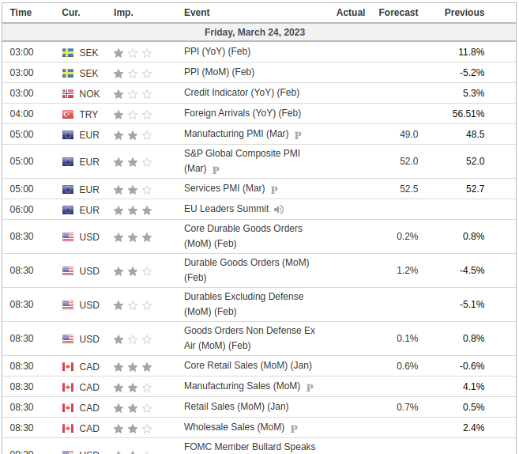
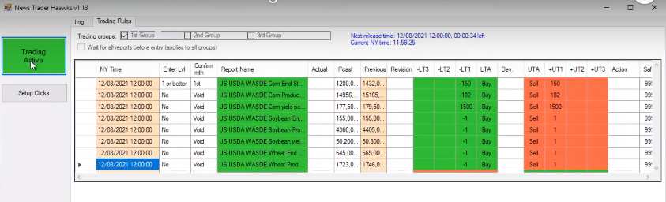

# **News Trading System erklärt**

## **1. Intro**

In diesem Dokument werde ich das System erläutern, das ich für den Handel mit Wirtschaftsnachrichtenindikatoren auf dem Forexmarkt entwickle. Das Hauptprinzip besteht darin, dass es verschiedene geplante Wirtschaftsstatistiken gibt, die regelmäßig veröffentlicht werden und die sich auf die Kurse des Marktes auswirken. Wenn Sie die veröffentlichten Zahlen kennen, können Sie fundierte Vorhersagen darüber machen, in welche Richtung sich der Preis bewegen wird. Da der Kurs sehr schnell reagiert, ist es wichtig, so schnell wie möglich in den Handel einzusteigen, um die Bewegung zu erfassen.

## **2. Was dieses System nicht ist**

Es ist erwähnenswert, dass die große Mehrheit der Handelsstrategien die technische Analyse (TA) beinhaltet. Das bedeutet im Wesentlichen, dass man sich die Kurscharts ansieht und Indikatoren wie RSI, MACD und andere hinzufügt, um vorherzusagen, in welche Richtung sich der Preis bewegen wird. Die meisten Händler, die sich ausschließlich auf die technische Analyse stützen, verlieren auf lange Sicht. Wahrscheinlich verwenden etwa 95 % der Händler die technische Analyse und etwa 95 % der Händler verlieren. Langfristig kann man auf dem Markt nur gewinnen, wenn man einen Vorteil hat, und das ist mit der technischen Analyse allein unmöglich.

## **3. Wie ich von dieser Strategie erfahren habe**

Wenn Sie auf youtube oder google nach Videos über algorithmische Handelsempfehlungen suchen, geht es praktisch immer um die technische Analyse. Nicht nur das, sondern der allgemeine Ratschlag lautet, den Handelsalgorithmus während Nachrichtenereignissen abzuschalten, weil er "unvorhersehbare" Kursbewegungen verursacht. Unvorhersehbar sind sie jedoch nur durch das Paradigma der technischen Analyse. Nachdem ich das schon oft gesehen habe, hat mich das zum Nachdenken gebracht:

### **Warum bewegt sich der Kurs/Preis immer noch, wenn alle sagen, dass sie ihre Handelsroboter (Trading Bots) während dieser Nachrichtenereignisse abschalten sollen?**

Der Kurs kann sich nur bewegen, wenn gehandelt wird, also gibt es eindeutig einige, die mit den Nachrichten handeln. Aber wer? Wenn Sie versuchen, dies herauszufinden, werden Sie im Internet nicht viele Informationen finden. Daraus lässt sich ableiten, dass es sich bei den Personen, die während der Nachrichten handeln und somit die Kursbewegungen verursachen, höchstwahrscheinlich um institutionelle Händler und nicht um Kleinanleger (retail traders) handelt.

## **4. Welche Art von Nachrichten bewegt den Markt?**

Marktbewegende Nachrichten bestehen in der Regel aus Wirtschaftsindikatoren, die auf Websites wie `investing.com/economic-calendar/` zu finden sind.

Die wichtigsten Zahlen sind die tatsächlichen (Actual) und die prognostizierten (Forecast) Zahlen, wobei es zu Marktbewegungen kommt, wenn die tatsächliche Zahl von der prognostizierten abweicht. Bei den monatlichen GDP (BIP)-Zahlen Kanadas beispielsweise ist eine höher als erwartete Ist-Zahl positiv für den Kanadischen Dollar (CAD) und führt zu einem Kursanstieg, während eine niedriger als erwartete Zahl negativ ist und zu einem Kursrückgang führt. Bei Währungspaaren wie USD/CAD reagieren die Basiswährung (USD) und die Kurswährung (CAD) unterschiedlich auf Nachrichten: Positive Nachrichten für die Basiswährung führen zu einem Kursanstieg, während negative Nachrichten zu einem Kursrückgang führen; positive Nachrichten für die Kurswährung führen zu einem Kursrückgang, während negative Nachrichten zu einem Kursanstieg führen. 

Beim Handel mit Währungspaaren wird auf die Richtung des Wechselkurses spekuliert, wobei Gewinn oder Verlust durch die Differenz zwischen Einstiegs- und Ausstiegskurs und den Umfang der Position (ein offener Handel) bestimmt werden.

## **5. Was der Preis ist und warum er sich bewegt**

Auf dem Forex-Markt wird der aktuelle Kurs eines Währungspaares durch die Bids (Gebote) und Asks (Anfragen) im Orderbuch bestimmt. Das Orderbuch ist eine Echtzeit-Anzeige aller Kauf- und Verkaufsaufträge für ein bestimmtes Währungspaar zu verschiedenen Kursniveaus.

- Wenn ein Händler eine **sell** limit order (Verkauf-Limit-Order) platziert, erstellt er eine **'ask' (Nachfrage)** im Orderbuch, die den niedrigsten Preis darstellt, den er für das Währungspaar zu akzeptieren bereit ist.
- Wenn ein Händler einen **buy** limit order (Kauf-Limit-Order) erteilt, erstellt er ein **'bid' (Gebot)** im Orderbuch (orderbook), das den höchsten Preis darstellt, den er für das Währungspaar zu zahlen bereit ist.

Das Orderbuch enthält alle 'bids' und 'asks' in Echtzeit, geordnet nach Preisniveau. Das beste bid ist der höchste Preis, zu dem ein Käufer bereit ist, das Währungspaar zu kaufen, während die beste ask der niedrigste Preis ist, zu dem ein Verkäufer bereit ist, das Währungspaar zu verkaufen.

Der aktuelle Kurs des Währungspaares basiert immer auf zwei Kursen: dem besten ask und dem besten bid. Der aktuelle Marktpreis, der auf einem Preisticker angezeigt wird, ist in der Regel der Mittelpunkt (mid-point) zwischen dem besten Ask- und dem besten Bidkurs. Dies ist jedoch nicht der Preis, zu dem Ihre Aufträge ausgeführt (filled) werden. Das beste bid stellt den höchsten Preis dar, zu dem jemand bereit ist, das Währungspaar zu kaufen, während die beste ask den niedrigsten Preis darstellt, zu dem jemand bereit ist, das Währungspaar zu verkaufen. Der aktuelle Marktpreis für die tatsächliche Ausführung eines Handels ist also der höchste Preis, den jemand zu zahlen bereit ist (bestes bid), und der niedrigste Preis, den jemand zu einem bestimmten Zeitpunkt zu verkaufen bereit ist (beste ask). Zwischen dem besten ask und dem besten bid klafft in der Regel eine Lücke, die als "Spread" bezeichnet wird.

## **6. Auftragsarten (Order Types)**

- **Market Orders (Marktaufträge)** werden sofort zum besten verfügbaren Preis ausgeführt, entweder zum besten ask für einen Market Buy Order (Marktkaufauftrag) oder zum besten bid für einen Market Sell Order (Marktverkaufsauftrag).
    - Wenn ein Händler einen Marktauftrag zum **Kauf/Buy** des Währungspaares erteilt (***Market Buy Order***), wird sein Auftrag zum aktuell besten **ask** preis ausgeführt.
    - Bei einem ***Market Sell Order*** (Marktauftrag zum **Verkauf/Sell**) wird der Auftrag zum aktuell besten **bid** preis ausgeführt.
- **Limit Orders (Limitaufträge)** werden ausgeführt, wenn der Marktpreis ein bestimmtes Preisniveau erreicht.

Wenn es auf einem bestimmten Kursniveau mehr Käufer als Verkäufer gibt, kann der Kurs des Währungspaares steigen, da die Käufer um den Kauf der Währung konkurrieren. Umgekehrt kann der Preis des Währungspaares fallen, wenn es auf einem bestimmten Preisniveau mehr Verkäufer als Käufer gibt, da die Verkäufer um den Verkauf der Währung konkurrieren.

Zusammenfassend lässt sich sagen, dass der aktuelle Kurs/Preis eines Forex Paar/Symbol durch die bids und der asks im Orderbuch bestimmt wird. Im Orderbuch werden alle Kauf- und Verkaufsaufträge (Buy & Sell orders) für das Währungspaar zu verschiedenen Kursniveaus angezeigt, und das beste bid und die beste ask bestimmen den aktuellen Marktpreis, d. h. den höchsten Preis, den jemand zu zahlen bereit ist (bestes bid), und den niedrigsten Preis, den jemand zu einem bestimmten Zeitpunkt zu verkaufen bereit ist (beste ask).

## **7. Wie der Preis gemessen wird**

Ein Pip (kurz für "percentage in point" oder "price interest point") ist angeblich die kleinste Einheit der Kursbewegung eines Währungspaares. Er entspricht bei den meisten Währungspaaren der vierten Dezimalstelle, außer bei einigen Währungspaaren, die eine andere Dezimalstelle haben.

Wenn das Währungspaar EUR/USD beispielsweise bei 1.2000 gehandelt wird und dann auf 1.2001 steigt, ist dies eine Bewegung von einem Pip. Ähnlich verhält es sich mit dem Währungspaar USD/JPY, das bei 108.00 gehandelt wird und dann auf 107.99 fällt: eine Bewegung von einem Pip.

Pips werden verwendet, um den Gewinn oder Verlust eines Forexhandels zu berechnen. Der Umfang des Handels (Lot size), die Anzahl der gewonnenen oder verlorenen Pips und das gehandelte Währungspaar bestimmen die Höhe des Gewinns oder Verlusts. Daher ist es für Forexhändler wichtig, das Konzept der Pips zu verstehen, um potenzielle Gewinne und Verluste genau zu berechnen.

Es ist jedoch erwähnenswert, dass viele Forex-Broker "Fraktionierte Pips" oder "Pipettes" (auch "Points" ("Punkte") genannt) verwenden, die eine fünfte Dezimalstelle darstellen, um genauere Preise für Währungspaare zu liefern. In diesem Fall ist die wirklich kleinste Einheit der Kursbewegung 1 Point. Zehn Points entsprechen einem Pip.

## **8. Lots**

Die Lot Size (Lotgröße) bzw. Position Size (Positionsgröße) muss für jeden Kauf- oder Verkaufsauftrag im Forex-Handel angegeben werden. Die Lot Size wirkt sich direkt auf den potenziellen Gewinn oder Verlust aus, da sie die Positionsgröße und den Wert jedes Pips bestimmt. Für EUR/USD hat 1 Lot einen Pip-Wert von $10 (Dieser Betrag variiert je nach Währungspaar). Eine Bewegung von 20 Pips bei einem EUR/USD-Handel mit 1 Lot führt also zu einem Gewinn von $200, während die gleiche Bewegung bei einem Handel mit 0.1 Lot (1 Pip = $1) zu einem Gewinn von $20 führen würde. Händler müssen ihre Lotgröße sorgfältig im Verhältnis zu ihrer Strategie und Risikotoleranz abwägen.

## **9. Spread (Spanne)**

Der Spread im Forex-Handel stellt die Differenz zwischen dem Bid und Ask (Geld- und dem Briefkurs) eines Währungspaares dar und dient im Wesentlichen als Kosten für den Handel. Beeinflusst von Faktoren wie Marktvolatilität, Liquidität sowie Angebot und Nachfrage, wird die Spread in der Regel in Pips gemessen und von Liquiditätsanbietern wie Banken und Finanzinstituten festgelegt. Während wirtschaftlicher Nachrichtenereignisse kann sich die Bid-Ask-Spread (Geld-Brief-Spanne) ausweiten und die Liquidität abnehmen, was zu erhöhter Volatilität und Slippage führt, was es für Händler schwierig machen kann, schnell und effizient in Positionen ein- oder auszusteigen, was das Risiko von Verlusten erhöht. Daher kann eine Strategie wie ein 5-Pip-Trailing-Stop-Loss helfen, diese Risiken zu mindern.

## **10. Liquidity (Liquidität)**

Liquidität im Devisenhandel bezieht sich auf die Fülle und Verfügbarkeit von Buy- und Sell-Orders für ein bestimmtes Währungspaar, was effiziente Transaktionen mit minimalen Preisauswirkungen und reduzierten Kosten ermöglicht. Der Devisenmarkt ist mit einem täglichen Handelsvolumen von mehr als 6 Billionen Dollar sehr liquide, was zu einem robusten Auftragsbuch und günstigen Handelsbedingungen führt. Die hohe Liquidität führt zu engen Geld-Brief-Spannen, niedrigeren Transaktionskosten und minimalen Kursbewegungen beim Eingehen oder Verlassen von Positionen. Zu den Faktoren, die die Liquidität beeinflussen, gehören geopolitische Ereignisse, die Veröffentlichung von Wirtschaftsdaten, die Marktstimmung und die Handelszeiten. Wichtige Währungspaare wie EUR/USD, USD/JPY und GBP/USD weisen eine höhere Liquidität auf, die Händlern bessere Handelsmöglichkeiten, eine schnellere Ausführung und geringere Preisauswirkungen bietet.

## **11. Stoploss (SL)**

Ein Stop-Loss ist ein Parameter in einem Auftrag, der dazu dient, mögliche Verluste bei einer offenen Position zu begrenzen. Er kann jederzeit festgelegt und aktualisiert werden, wenn der Auftrag offen ist. Er legt ein bestimmtes Kursniveau fest, bei dem der Handel automatisch geschlossen wird, wenn sich der Markt gegen die Position bewegt, und hilft so, Verluste zu minimieren. Es ist ein gängiges Instrument des Risikomanagements, das von Händlern eingesetzt wird, um ihr Kapital zu schützen und das Risiko zu steuern.

### **Trailing Stoploss (TSL)**

Ein Trailing-Stop-Loss ist eine Art von Stop-Loss, der der Kursbewegung eines Vermögenswerts in eine bestimmte Richtung folgt und es Händlern ermöglicht, Gewinne zu sichern und gleichzeitig mögliche Verluste zu begrenzen. Er funktioniert, indem er einen bestimmten Abstand zum aktuellen Marktpreis einhält. Wenn der Preis beginnt, sich gegen die Position zu bewegen, wird der Auftrag ausgelöst und die Position geschlossen. Dies ist ein nützliches Instrument auf schnelllebigen Märkten, auf denen die Kursbewegungen volatil und unvorhersehbar sein können.

Wenn sich der Kurs beispielsweise um 10 Pips bewegt und Sie einen Trailing-Stoploss von 5 Pips haben, dann würde der Stoploss bei 5 Pips vom Einstiegskurs des Handels gesetzt werden. Wenn sich der Kurs um 20 Pips bewegt und Sie einen TSL von 5 Pips haben, dann würde der Stoploss bei 15 Pips vom Einstiegskurs des Handels angesetzt werden.

Der Trailing-Stoploss wird ständig aktualisiert, wenn sich der Kurs weiter vom Einstiegskurs entfernt, bis er sich schließlich umkehrt und der Stoploss nicht mehr aktualisiert wird, und schließlich wird der Auftrag zu dem Kurs geschlossen, auf den der Stoploss gesetzt wurde.

## **12. Volatility (Volatilität)**

Beim Forexhandel bezieht sich die Volatilität auf das Ausmaß der Kursschwankungen eines Währungspaares innerhalb eines bestimmten Zeitraums. Eine hohe Volatilität kann Chancen für größere Gewinne bieten, erhöht aber auch das Verlustrisiko. Eine niedrige Volatilität begrenzt die Handelsmöglichkeiten, verringert aber auch das Verlustrisiko.

Im Vergleich zu Forex ist die Volatilität bei Bitcoin und anderen Kryptowährungen im Allgemeinen höher und unvorhersehbarer. Dies liegt daran, dass der Kryptomarkt noch relativ neu ist und eine geringere Marktkapitalisierung hat, was bedeutet, dass er leichter durch Ereignisse wie regulatorische Änderungen oder die Marktstimmung beeinflusst werden kann.

## **13. Latenz/Geschwindigkeit (Latency/Speed)**

- Da sich der Kurs in der Regel in weniger als einer Sekunde nach der Bekanntgabe dieser Ereignisse bewegt, muss man so schnell wie möglich sein, um in den Handel einzusteigen, bevor sich der Kurs bewegt. Dies kann nur erreicht werden, indem ein Computerprogramm auf einem Server ausgeführt wird, der mit dem Broker, bei dem Sie handeln, 'co-located' ist.
- Von **Co-Location** spricht man, wenn sich Ihr Server physisch im selben Gebäude befindet wie der Server des Brokers. Dies bedeutet, dass die Latenzzeit, d. h. die Zeit, die die Daten für die Übertragung von einem Punkt zum anderen im Internet benötigen, geringer ist.

  - Stellen Sie sich das so vor, als würden Sie einen Brief mit der Post verschicken. Wenn Sie weit entfernt von der Person wohnen, an die Sie den Brief schicken, dauert es länger, bis der Brief ankommt, als wenn die Person nur die Straße runter wohnt. Ähnlich verhält es sich, wenn Sie Daten über das Internet verschicken und der Server, an den Sie die Daten senden, weit entfernt ist: Es dauert länger, bis die Daten ankommen, als wenn der Server in der Nähe steht.
  - Diese Verzögerung bei der Datenübertragung wird als Ping/Latenz bezeichnet. Sie wird in Millisekunden (ms) gemessen und kann durch eine Vielzahl von Faktoren beeinflusst werden, z. B. Entfernung, Netzüberlastung und Qualität der Internetverbindung.
  - Im Zusammenhang mit dem Forexhandel ist eine niedrige Latenzzeit wichtig, da sie es den Händlern ermöglicht, Geschäfte schneller auszuführen und Marktchancen zu nutzen, bevor es andere tun.
  - Die meisten Forex-Broker haben ihre Server in einem der Equinix-Rechenzentren auf der ganzen Welt untergebracht. Die beiden wichtigsten befinden sich in London (Equinix LD4) und New York (Equinix NY4)
- Ein schneller Nachrichten-Feed (news feed) mit niedriger Latenzzeit ist ebenfalls erforderlich, um die Nachrichten schneller zu erhalten, als sich die Kurse bewegen. Ein Dienstleister hierfür ist Haawks, der Abonnements mit niedriger Latenz bei vielen der Institutionen hat, die die Nachrichten in den USA, Kanada und einigen anderen Ländern veröffentlichen, z. B. das US Bureau of Labor Statistics (BLS), Bureau of Economic Analysis (BEA), US Department of Commerce, US Census Bureau, Statistics Canada, Bank of Canada, Statistics Norway, Norges Bank, SCB - Statistics Sweden, und mehr

  - Haawks News-Feed ist auf beiden Equinix-Rechenzentren LD4 und NY4 verfügbar

## **14. Slippage**

Slippage tritt auf, wenn es eine Differenz zwischen dem erwarteten Preis eines Geschäfts und dem Preis, zu dem es ausgeführt wird, gibt, was oft durch schnelle Marktveränderungen oder hohe Volatilität bei Ereignissen wie Nachrichtenmeldungen verursacht wird. Beim Handel mit geringer Latenz können Verzögerungen zwischen Handelsbeginn und Ausführung dazu führen, dass sich die Marktpreise vom erwarteten Niveau entfernen. Um Slippage zu minimieren, können Händler eine Verbindung mit niedriger Latenz zum Server ihres Brokers durch Co-Location nutzen und eine schnelle Handelsausführung sicherstellen. Für den Nachrichtenhandel ist ein Nachrichten-Feed mit niedriger Latenz, wie er von haawks bereitgestellt wird, von entscheidender Bedeutung für die schnelle Ausführung von Geschäften und die Reduzierung von Slippage.

## **15. Forex Brokers**

Forex Brokers (Forex-makler) dienen als Vermittler zwischen Händlern und dem Forex-Markt, indem sie Zugang gewähren, Geschäfte ausführen und Leverage anbieten. Sie sind für einzelne Händler notwendig, um Zugang zum Markt zu erhalten und an ihm teilzunehmen. Es gibt drei Haupttypen von Forex-Brokern: Straight Through Processing (STP), Electronic Communication Network (ECN) und Market Maker. STP- und ECN-Broker bieten einen direkten Marktzugang, der es den Kunden ermöglicht, miteinander zu handeln und Aufträge an Liquiditätsanbieter weiterzuleiten. Sie erzielen Gewinne durch Provisionen oder Aufschläge auf die Spreads und sorgen so für eine transparentere und weniger konfliktreiche Beziehung zu den Kunden. Market Maker schaffen einen Markt für die Kunden, indem sie die Gegenseite ihrer Geschäfte übernehmen und vom Spread profitieren. Dieses Modell kann im Vergleich zu STP- und ECN-Brokern zu potenziellen Interessenkonflikten und weniger Transparenz führen.

## **16. Trading Software (Handelssoftware)**

### **MetaTrader 4**

MetaTrader 4 (MT4) ist eine beliebte Handelsplattform, die von Händlern für den Zugang zu und den Handel mit Finanzmärkten verwendet wird. Es wurde von MetaQuotes Software entwickelt und 2005 veröffentlicht.

MT4 bietet Händlern eine Reihe von Tools und Funktionen, die ihnen helfen, die Märkte zu analysieren, Handelsstrategien zu entwickeln und auszuführen und ihre Trades zu verwalten. Einige der wichtigsten Funktionen von MT4 sind:

- **Charting- und technische Analysetools:** MT4 bietet Händlern eine Reihe von Charttools und Indikatoren, die ihnen bei der Analyse von Markttrends helfen.
- **Automatisierter Handel:** MT4 ermöglicht es Händlern, ihre Handelsstrategien mithilfe von Expert Advisors (EAs) zu entwickeln und zu automatisieren, bei denen es sich um Computerprogramme handelt, die in der Lage sind, Trades auf der Grundlage vordefinierter Regeln und Bedingungen auszuführen.
- **Mobiler Handel**: MT4 ist als mobile App verfügbar, die es Händlern ermöglicht, auf ihre Konten zuzugreifen und unterwegs zu handeln.

### **Haawks News Trader**

  <iframe width="1265" height="496" src="https://www.youtube.com/embed/ZevwBfZjp6g" title="US Consumer Price Index (CPI) 10 November 2022 - Haawks G4A Low-Latency News Trading Data Feed" frameborder="0" allow="accelerometer; autoplay; clipboard-write; encrypted-media; gyroscope; picture-in-picture; web-share" allowfullscreen></iframe>

Die Haawks News Trader-Software wird mit dem Haawks-Abonnement geliefert. Es stellt eine Verbindung zum Hawks-Newsfeed her und gibt Trades (Market Orders) in MetaTrader 4 ein, wenn bestimmte Bedingungen erfüllt sind, die vom Benutzer festgelegt werden.

Für jedes Ereignis gibt es 6 Triggerpegel, die konfiguriert werden können:

- **-LT1**
- **-LT2**
- **-LT3**
- **+UT1**
- **+UT2**
- **+UT3**
- '**LT**' steht für '**Lower Trigger**' und wird ausgelöst, wenn die tatsächliche (Actual) Zahl niedriger ist als die prognostizierte (Forecast) Zahl.
- '**UT**' steht für '**Upper Trigger**' und wird ausgelöst, wenn die tatsächliche (Actual) Zahl höher ist als die prognostizierte (Forecast) Zahl.
- Es gibt auch '**LTA**' und '**UTA**', was für '**Lower Trigger Action**' und '**Upper Trigger Action**' steht. Diese können entweder auf '**Buy**' oder '**Sell**' eingestellt werden, je nachdem, ob eine höhere Abweichung bullish oder bearish ist.

  - Beispielsweise ist für US Nonfarm Payrolls eine höhere Nachrichtenabweichung (news deviation) bullish (positiv) für USDJPY und eine niedrigere Nachrichtenabweichung bearish (negativ) für USDJPY. Daher würden Sie 'LTA' auf 'Sell' und 'UTA' auf 'Buy' setzen.
  - Für das Canadian GDP (kanadische BIP) ist eine höhere Nachrichtenabweichung für USDCAD rückläufig (negativ) und eine niedrigere Nachrichtenabweichung für USDCAD zinsbullisch (positiv). Daher würden Sie 'LTA' auf 'Buy' und 'UTA' auf 'Sell' setzen.
- '-LT1', '-LT2', '-LT3', '+UT1', '+UT2' & '+UT3' haben jeweils ihre eigenen Abweichungsstufen (Deviation levels) und Lot Sizes, die eingestellt werden können. Das bedeutet, dass der Haawks-News-Trader die Abweichung berechnet, wenn der tatsächliche Preis bekannt wird, indem er die prognostizierte (Forecast) Zahl von der tatsächlichen (Actual) Zahl subtrahiert. Dann überprüft es alle Ihre Trigger, um zu sehen, mit welchem es übereinstimmt. Wenn es mit einem Ihrer Auslöser übereinstimmt, wird ein neuer Trade in MetaTrader 4 in der durch 'LTA' und 'UTA' angegebenen Richtung eröffnet, wobei die für diesen Auslöser angegebene Lot Size verwendet wird.

  - Für den Handel mit Canada GDP MoM (kanadische BIP monatlich) könnten die Trigger beispielsweise wie folgt festgelegt werden:
    - -LT1: -0.1  |  0.5 lots
    - -LT2: -0.2  |  1 lot
    - -LT3: -0.3  |  1.5 lots
    - +UT1: +0.1  |  0.5 lots
    - +UT2: +0.2  |  1 lot
    - +UT3: +0.3  |  1.5 lots
    - Nehmen wir dann an, die Prognose ist 0.1 und die tatsächliche Zahl ist -0.1. Dies würde zu einer Abweichung von -0.2 führen, sodass '-LT2' ausgelöst und ein Handel von 1 Lot in Kaufrichtung eröffnet würde, da 'LTA' für das  Canadian GDP auf 'Buy' eingestellt ist
  - In einem anderen Beispiel für den Handel mit US Nonfarm Payrolls könnten die Trigger wie folgt gesetzt werden:
  - -LT1: -25  |  0.5 lots
  - -LT2: -50  |  1 lot
  - -LT3: -90  |  1.5 lots
  - +UT1: +25  |  0.5 lots
  - +UT2: +50  |  1 lot
  - +UT3: +90  |  1.5 lots
  - Nehmen wir dann an, die Prognose ist 205 und die tatsächliche Zahl ist 311. Das würde eine Abweichung von +106 ergeben, also würde '+UT3' ausgelöst und es würde einen Handel von 1.5 Lots in Kaufrichtung eröffnen, weil 'UTA' gesetzt ist zum 'Buy' für US Nonfarm Payrolls.

## **17. Historische Datenanalyse (Historic Data Analysis)**

Um einen fundierteren und robusteren Handelsplan zu haben, habe ich ein Datenanalyseprogramm erstellt, das die historischen Nachrichtenzahlen von investing.com erhält und dann die historischen Preisdaten (Ticks) für das relevante Handelspaar zum genauen Zeitpunkt jeder Nachricht erhält Veröffentlichung bis zu 15 Minuten nach jeder Veröffentlichung und generiert dann Metriken/Statistiken wie:

- die mittleren durchschnittlichen (mean average) Pip-Bewegungen
- die Median durchschnittlichen (median average) Pip-Bewegungen
- der Bereich (range) der Pip-Bewegungen
- Drei Korrelationswerte (Correlation scores: c1, c2 & c3)

Es generiert dann einen PDF-Bericht für diesen Indikator (z. B. Nonfarm Payrolls oder Canada GDP) und das Handelssymbol (z. B. USDJPY oder USDCAD).

Hier sind Screenshots des PDF-Berichts, der für das kanadische BIP MoM (Monat über Monat / Month over Month) erstellt wurde:

Normalerweise wird der Korrelationswert (Correlation Score) höher, wenn die Abweichung (Deviation) größer wird. Die Berechnungen für jeden Trigger funktionieren wie folgt:

1. Das Programm erhält die historischen Nachrichtendaten von investing.com ab Januar 2017 und danach
2. Für jedes Veröffentlichungsdatum und jede Veröffentlichungszeit (Release date & time) lädt es dann historische Preisdaten (Tick-Daten) von 5 Minuten vor der Veröffentlichung bis 15 Minuten nach der Veröffentlichung herunter. Tick-Daten kosten normalerweise Geld, aber es gibt einen Forex-Broker namens Dukascopy, der sie kostenlos zur Verfügung stellt, woher dieses Programm die Daten bezieht. Es zeigt die Ask- und Bid-Preise zu Zeitstempeln für jede Preisbewegung an, die normalerweise mehrmals pro Sekunde erfolgt. Dies kommt als .csv-Datei, die eine Tabelle ist:
   
3. Für bestimmte Zeiten nach jeder Freigabe (Zeitdeltas/time deltas), d. h.
    - 1 Sekunde
    - 2 Sekunden
    - 3 Sekunden
    - 4 Sekunden
    - 5 Sekunden
    - 10 Sekunden
    - 15 Sekunden
    - 20 Sekunden
    - 25 Sekunden
    - 30 Sekunden
    - 45 Sekunden
    - 1 Minute
    - 2 Minuten
    - 3 Minuten
    - 4 Minuten
    - 5 Minuten
    - 10 Minuten
    - 15 Minuten   
    - Das Programm ruft die Ask & Bid-Preise zu diesen Zeiten nach jeder Veröffentlichung ab und berechnet dann die Pip-Bewegungen relativ zum Preis zum Zeitpunkt der Veröffentlichung.

4. Für jede Freigabe (Release) prüft es, zu welchem Triggerlevel es passt.
    - Wenn die Abweichung (Deviation) über einem vordefinierten Wert liegt (z. B. trigger_1: +-0,1 %) und unter dem darüber liegenden Trigger (z. B. trigger_2: +-0,2 %), wird sie zu den Eingabedaten für diesen Trigger (trigger_1) hinzugefügt.
    - Wenn es der letzte Trigger z.B. trigger_4, dann werden alle darüber liegenden Daten zu den Eingabedaten für diesen Trigger hinzugefügt

5. Für jedes Zeitdelta/time_delta (z. B. 1s, 2s, 3s usw.) wird Folgendes berechnet:
    - Der **Bereich (Range)** aller Pip-Bewegungen zu diesem Zeitpunkt (z. B. von -5 Pips bis +45 Pips)
    - Der **mittlere (Mean)** Durchschnitt aller Pip-Bewegungen zu diesem Zeitpunkt (z. B. 15 Pips). Berechnet, indem alle Pip-Bewegungen für jede Freigabe im aktuellen Trigger addiert und dann durch deren Anzahl dividiert werden.
    - Der **Median**-Durchschnitt. Berechnet, indem alle Pip-Bewegungen von der niedrigsten zur höchsten sortiert werden und dann genau diejenige in der Mitte gefunden wird.
    - **Korrelation 1 Score (c1)**
        - Der Prozentsatz der Male, in denen sich der Preis in die erwartete Richtung bewegt hat.
        - `Positiv_Zählung` = Wie oft die Preisbewegung (Pip) größer oder gleich Null ist.
        - `Negativ_Zählung` = Wie oft die Preisbewegung kleiner als Null ist
        - Jeder Indikator hat eine erwartete Richtung basierend darauf, ob es bullische (positive) oder bearishe (negative) Nachrichten gibt. Diese Informationen wurden zuvor von investing.com gespeichert.
            - Wenn erwartet wird, dass die Preisbewegung **positiv** ist, dann:
              `c1 = Positiv_Zählung ÷ (Positiv_Zählung + Negativ_Zählung)`
            - Wenn die Preisbewegung voraussichtlich **negativ** sein wird:
              `c1 = Negativ_Zählung ÷ (Nositiv_Zählung + Negativ_Zählung)`
    - **Korrelation 2 Score (c2)**
        - Der Prozentsatz der Pips, die sich in die erwartete Richtung bewegt haben.
        - `Positiv_Summe` = Alle Pips, die sich in eine positive Richtung bewegen, werden zusammengezählt
        - `Negativ_Summe` = Alle Pips, die sich in eine negative Richtung bewegt haben, werden zusammengezählt. Da diese Zahl negativ ist, wird sie mit -1 multipliziert, um eine positive Zahl zu werden, sodass sie mit der folgenden Gleichung funktioniert.
            - Wenn der Preis voraussichtlich **positiv** ist, dann:
              `c2 = Positiv_Summe ÷ (Positiv_Summe + Negativ_Summe )`
            - Wenn der Preis voraussichtlich **negativ** sein wird:
              `c2 = Negativ_Summe ÷ (Positiv_Summe + Negativ_Summe)`
    - **Korrelation 3 Score (c3)**
        - Dies ist der mittlere Durchschnitt (mean average) von c1 & c2
        - `c3 = (c1 + c2) ÷ 2`

6. Die Summe/Durchschnittswerte werden dann für jeden Trigger berechnet:
    - **Bereich (Range):** die niedrigste Zahl für eines der Zeitdeltas bis zur höchsten Zahl für eines der Zeitdeltas
    - **Mittelwert (Mean):** Addiere die Mittelwerte für jedes Zeitdelta und dividiere dann durch die Anzahl der Zeitdeltas (18)
    - **Median:** Addiere die Medianwerte für jedes Zeitdelta und dividiere dann durch 18
    - **c1:** Addiere die c1-Werte für jedes Zeitdelta und dividiere dann durch 18
    - **c2:** Addieren Sie die c2-Werte für jedes Zeitdelta und dividieren Sie sie dann durch 18
    - **c3:** Addiere die c3-Werte für jedes Zeitdelta und dividiere dann durch 18

## **18. Ordnen Sie jeden Indikator ein (Ranking every indicator)**

Nachdem ich in der Lage war, diese Analyse für einzelne Indikatoren zu erstellen, entschied ich mich, sie für jeden Indikator von Haawks auszuführen, der Nachrichtendaten auf investing.com und Tick-Daten von Dukascopy zur Verfügung stellt. Das sind insgesamt 95 Indikatoren, was nicht alle sind, aber immer noch eine ganze Menge.

Ich habe ein Skript/Programm in Python namens `ranker.py` geschrieben, das die Analyse für jeden Indikator durchführt und dann den besten Trigger für jeden von ihnen findet, d Ergebnisse in eine Excel-Datei namens `ranker_results.xlsx`.

Dann habe ich sie vom höchsten c3 zum niedrigsten c3 geordnet. Es gibt:

- 15 Indikatoren mit einem c3 über 90
- 23 Indikatoren mit einem c3 zwischen 80-90
- 23 Indikatoren mit einem c3 zwischen 70-80
- 30 Indikatoren mit einem c3 unter 70

Die Korrelationswerte (c3) können als Darstellungen dafür angesehen werden, wie vorhersagbar jede Abweichung für jeden Indikator historisch war (basierend auf Daten von Januar 2017 bis Februar 2023). Dies impliziert, dass der Indikator eine höhere Wahrscheinlichkeit hat, sich in die erwartete Richtung zu bewegen, wenn der c3-Wert höher ist. Das ist sowieso die Hypothese, die aber nur durch das Testen der Strategie bestätigt werden kann.

## **19. Handelspläne erstellen (Generating trading plans)**

Da der c3-Wert wie ein Vorhersagbarkeitswert ist, ist es sinnvoll, größere Trades zu platzieren, wenn größere Lot Sizes verwendet werden, wenn der c3-Wert höher ist. Ich habe die folgenden Lot Sizes für jede c3-Punktzahl ermittelt:

- zwischen **80** und **85**: **0.5** Lots pro $1000 Kontostand
- zwischen **85** und **90**: **0.75** Lots pro $1000
- zwischen **90** und **95**: **1** Lot pro $1000
- über **90**: **1.5** Lots pro $1000

Ich habe ein weiteres Skript geschrieben, das die Ranking-Ergebnisse für alle Indikatoren mit einem c3-Wert über 80 betrachtet und dann den Wirtschaftskalender von investing.com überprüft, um zu sehen, ob einer davon in der nächsten Woche veröffentlicht werden soll.

Dann generiert es für jeden Indikator, der in der nächsten Woche veröffentlicht wird, empfohlene Triggerabweichungen und Lot Sizes als Eingaben für das Haawks-News-Trader-Programm wie folgt:

Der Wochenplan besteht also aus einer Reihe von Trigger-Empfehlungen wie der obigen:

Im obigen Beispiel sind '**lots/$1k**' und '**lots**' identisch, da ein Kontostand von $1000 angenommen wurde. Wenn der Kontostand $2000 beträgt, sind die '**lots**' doppelt so hoch wie '**lots/$1k**'.

# **20. Abschluss**

Das ist im Wesentlichen der Stand der Entwicklung dieses Projekts (Stand: 19/03/2023). Ich glaube, dass der Handel mit diesen Ereignissen mit Losgrößen, die proportional zum Korrelationswert sind, Gewinn bringen sollte.

Es gibt jedoch noch einige Dinge, die verbessert werden können. Ich habe zum Beispiel den Erfinder des Haawks News Trader Programms angeschrieben, der seit Jahren mit Nachrichten handelt. Er war an meiner Arbeit interessiert, aber er sagte, dass sich die Zuverlässigkeit/Vorhersagbarkeit von Indikatoren im Laufe der Zeit ändern kann. Als Beispiel nannte er den schwedischen Verbraucherpreisindex, der seiner Meinung nach vor etwa 3 Jahren gut zu handeln war, jetzt aber unzuverlässig ist.

Um dieses Problem zu lösen, plane ich, einen anderen Korrelationswert zu erstellen, der stärker nach den jüngsten Ereignissen gewichtet ist als der jetzige, bei dem alle Ereignisse von 2017 bis 2023 gleich gewichtet sind. Das würde bedeuten, dass, wenn der Allzeit-Korrelationswert (den ich derzeit habe) hoch ist, aber für neuere Ereignisse der Korrelationswert niedriger ist, dann würde eine kleinere Lotgröße verwendet.

Dies kann durch die Verwendung eines EMA (exponentieller gleitender Durchschnitt) erreicht werden. Gleitende Durchschnitte, einschließlich des einfachen gleitenden Durchschnitts (Simple Moving Average - SMA) und des exponentiellen gleitenden Durchschnitts (Exponential Moving Average - EMA), sind häufig verwendete technische Indikatoren im Devisenhandel. 
- Sie berechnen den Durchschnittspreis eines Vermögenswerts über einen bestimmten Zeitraum, wobei der SMA jedem Datenpunkt das gleiche Gewicht gibt und der EMA den jüngsten Preisdatenpunkten mehr Gewicht verleiht. 
- Aufgrund dieses Unterschieds reagiert der EMA empfindlicher auf jüngste Kursänderungen und wird häufig für kurzfristige Handelsstrategien verwendet, während der SMA in der Regel für längerfristige Analysen eingesetzt wird.
- Beide Typen haben eine Eingabe, die als "Periode" bezeichnet wird und die Anzahl der vorherigen Datenpunkte angibt, die für ihre Berechnungen verwendet werden, wie z. B. die letzten 10 Kursniveaus für die technische Analyse oder die c3-Bewertungen für die letzten 10 Veröffentlichungen für jeden Auslöser.

Obwohl EMAs üblicherweise für die Preisanalyse verwendet werden (wie im Video oben), werde ich sie stattdessen auf die Korrelationswerte für jeden Auslöser anwenden. Dadurch wird der Korrelationswert empfindlicher auf die jüngsten Ereignisse reagieren und sollte besser widerspiegeln, wie sich der Indikator in letzter Zeit entwickelt hat.

!!! update
    **[31.03.2023]** Jetzt wird der niedrigste Wert aus dem regulären **c3** und auch **c3_ema5**, **c3_ema10** und **c3ema15** verwendet, und die Lotgröße wird auf dieser Grundlage berechnet, wobei höhere Lots verwendet werden, wenn ein höherer Korrelationswert vorliegt.

Der Ersteller des Haawks News Trader-Programms kann das Programm so modifizieren, dass es Trigger aus einer Datenbank akzeptiert, was eine vollständige Automatisierung ermöglicht. Anstatt einen wöchentlichen PDF-Bericht mit empfohlenen Auslösern zu erstellen und diese manuell in das Programm einzugeben, könnte eine Datenbank dies automatisch übernehmen. Allerdings weisen die aktuellen Empfehlungen manchmal höhere Abweichungen mit niedrigeren Korrelationswerten auf, und in diesem Fall wäre es besser, diese Auslöser wegzulassen.

Um diese Inkonsistenz zu beheben, könnte das haawks news trader Programm so modifiziert werden, dass die Abweichungen zwischen zwei Werten liegen können und nicht nur über oder unter einem Wert. Auf diese Weise könnten Geschäfte nur dann getätigt werden, wenn die Abweichungen innerhalb einer bestimmten Spanne liegen. Die Anwendung eines Exponential Moving Average (EMA) auf Korrelationswerte könnte die Handelsstrategie weiter verbessern. Es ist wichtig, die Leistung dieses Ansatzes zu beobachten und bei Bedarf im Laufe der Zeit Anpassungen vorzunehmen.